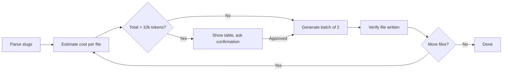

# Cheap Wireframes

## Goal

Convert wireframe files to minimal HTML skeletons with token cost confirmation before each batch.

## Rules

- **No mock data** — use `{# TODO: iterate items #}` placeholders, never fake names or arrays
- **Target 100-200 lines** per file — structure only, not a finished component
- **Max 2 files per agent call** — prevents runaway token consumption
- **Always show cost estimate** before generating — never start without explicit user confirmation
- Extend `base.html`, save to `templates/wireframes/<slug>.html`
- One `{# Section: Name #}` comment per wireframe section

## Workflow



### Step 1: Parse input

Parse `$ARGUMENTS` as a list of slugs, a section name ("Wireframes"), or "all".
Map slugs to source files using the nav in `suddenly/docs/nav.py`.

### Step 2: Estimate cost per file

For each file:
1. Count source lines via `wc -l`
2. Apply: `estimated_tokens ≈ source_lines × 15`
3. Build estimate table

| File | Source lines | ~Tokens output |
|------|-------------|----------------|
| layout | 107 | 1 600 |
| home | 82 | 1 200 |
| … | … | … |
| **Total** | | **X tokens** |

**Confirmation gate**: if total > 10 000 tokens, pause and ask. If ≤ 10 000, proceed.

### Step 3: Generate (2 files per agent)

Spawn iris with the skeleton prompt below. Wait for completion, verify file written, then next batch.

### Step 4: Report

List files written with line count and URL `/docs/w/<slug>/`.

## Iris skeleton prompt

```
Create a SKELETON HTML prototype for wireframe [name].
Goal: templates/wireframes/[slug].html — extend base.html.

STRICT RULES:
- Target 100-200 lines total
- NO mock data (no fake names, no fake datasets)
- For lists: write one commented placeholder {# TODO: iterate items #}
- For cards: write ONE card with placeholder text, comment {# repeat N times #}
- Each wireframe section → one {# Section: Name #} comment block

Design system (use only these shortcuts):
container-app, card, card-hover, card-header, card-body, card-footer,
btn-primary, btn-secondary, btn-ghost, btn-danger, btn-sm,
form-input, form-label, form-help, badge, badge-available, badge-claimed,
badge-adopted, badge-forked, badge-info, badge-pending, badge-pc,
avatar-sm, avatar-md, avatar-lg, avatar-placeholder,
link, link-muted, text-primary, text-secondary, text-muted, text-crimson,
prose-report, bg-surface, bg-card, border-border

Icons: <span class="i-lucide-NAME w-5 h-5"></span>

Source wireframe: read [source_path]

Write the file when done.
```

## Cost reference

| Source lines | Skeleton output | ~Output tokens |
|---|---|---|
| < 100 | ~100 lines | ~1 500 |
| 100-200 | ~150 lines | ~2 000 |
| 200-400 | ~200 lines | ~3 000 |
| > 400 | ~250 lines | ~4 000 |

Full mode (what we did before): multiply × 4. Always use skeleton mode.
