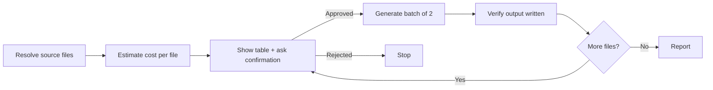

# Cheap Wireframes

## Goal

Convert wireframe files to minimal UI skeletons with mandatory cost confirmation before any generation.

## Rules

- **No mock data** — use visible placeholder elements, never fake names or arrays
- **Target 100-200 lines** per file — structure only
- **Max 2 files per agent call** — prevents runaway token consumption
- **Always show the estimate table and wait for explicit confirmation** — no exceptions
- **Skip existing output files by default** — unless `--overwrite` is passed

## Workflow



### Step 0: Resolve source files

Accept from `$ARGUMENTS`: direct file paths, glob patterns, or project-specific identifiers (slugs, section names).
If the project has a nav/routing config, read it to resolve identifiers to absolute paths.
Build a list: `[(identifier, source_path, output_path)]`.

### Step 1: Estimate cost

For each file:
1. Count source lines
2. `estimated_tokens ≈ source_lines × 15`
3. Check if output file already exists

Show the table — **always, without exception**:

| File | Source lines | ~Output tokens | Status |
|------|-------------|----------------|--------|
| layout | 107 | 1 600 | ❌ generate |
| home | 82 | 1 200 | ✅ skip |
| settings | 210 | 3 150 | ⚠️ overwrite |
| **Total to generate** | | **X tokens** | |

Wait for explicit user confirmation before proceeding.

### Step 2: Generate (max 2 files per agent call)

Before spawning an implementation agent, resolve from project context:
- Output directory
- Template/component inheritance pattern (if any)
- Design system class names or tokens in use
- Comment syntax for section markers

Fill all placeholders in the prompt template below, then spawn an implementation agent.
Wait for completion and verify the output file exists before the next batch.

### Step 3: Report

| File | Lines written | Output path |
|------|--------------|-------------|
| layout | 138 | `[path]` |

## Implementation agent prompt template

Fill all `[PLACEHOLDERS]` from project context before sending.

```
Create a SKELETON UI prototype for wireframe [NAME].
Save to: [OUTPUT_PATH]

STRICT RULES:
- Target 100-200 lines total
- NO mock data (no fake names, no filled datasets)
- For repeated items (lists, cards): write ONE item + comment "repeat N times"
- Mark each wireframe section with a comment

Placeholder format — use a VISIBLE element appropriate to the project's UI:
[e.g. a div with dashed border, a disabled card, a commented block — anything visible when rendered]

[INSERT TEMPLATE BOILERPLATE IF ANY — component imports, inheritance, etc.]

Design system — use ONLY the project's existing shortcuts/tokens:
[INSERT RELEVANT TOKENS]

Source wireframe: read [SOURCE_PATH]

Write the file when done.
```

## Cost reference

| Source lines | Skeleton output | ~Output tokens | Full detail (×4) |
|---|---|---|---|
| < 100 | ~100 lines | ~1 500 | ~6 000 |
| 100-200 | ~150 lines | ~2 000 | ~8 000 |
| 200-400 | ~200 lines | ~3 000 | ~12 000 |
| > 400 | ~250 lines | ~4 000 | ~16 000 |
