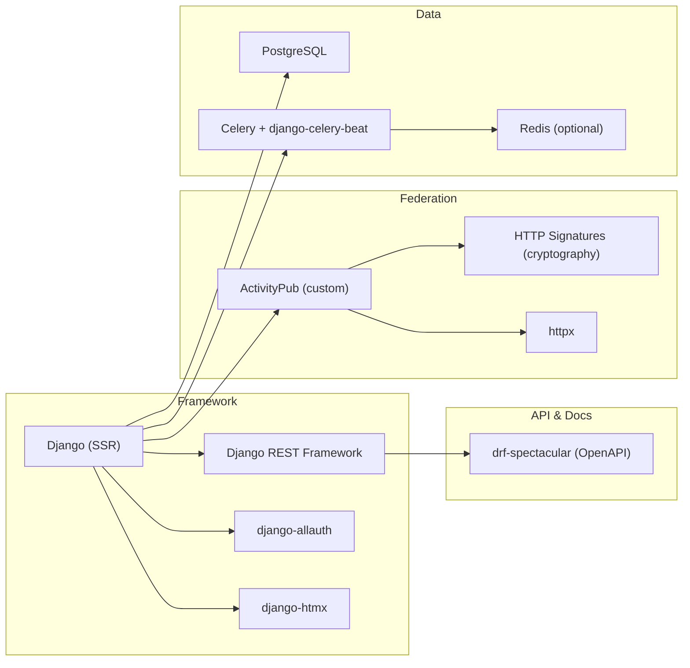
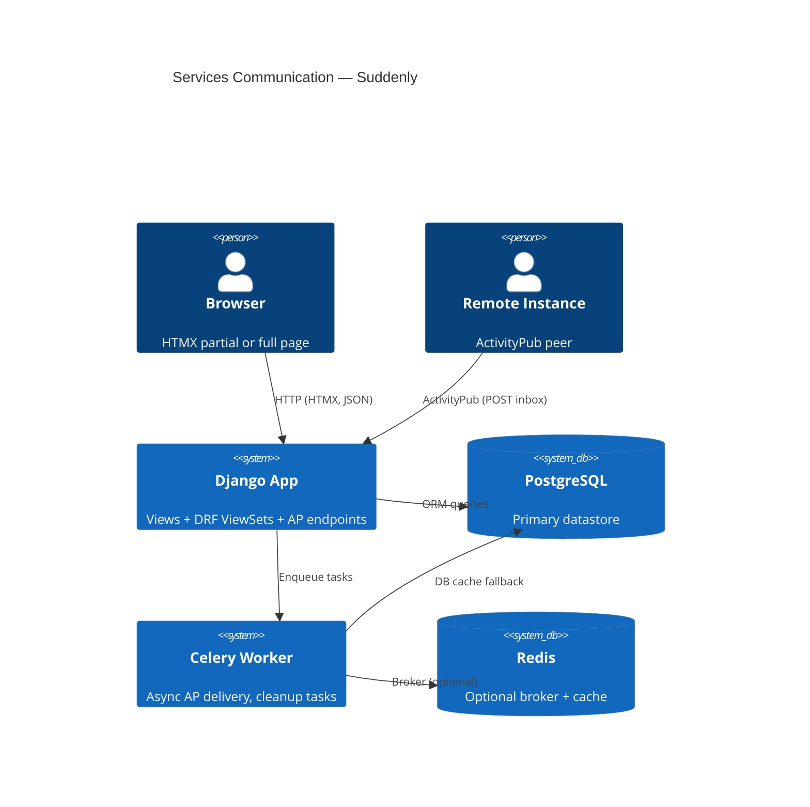

# Architecture

## Language/Framework

```text
@requirements.txt
```



### Naming Conventions

- **Files**: snake_case (`character_service.py`)
- **Classes**: PascalCase (`LinkService`)
- **Functions**: snake_case (`get_user_characters()`)
- **Constants**: SCREAMING_SNAKE (`MAX_THEME_CARDS`)

## Deployment Philosophy

- Django standard app — runs anywhere Python + PostgreSQL are available
- Docker is optional, not required
- Small instance (< 50 users): Django + PostgreSQL only
- Medium (50–500): + Redis recommended
- Large (500+): + Celery for federation delivery

### Dependency Matrix

| Component | Required | Optional | Fallback |
|-----------|----------|----------|---------|
| Python 3.12+ | ✅ | — | — |
| PostgreSQL | ✅ | — | — |
| Redis | — | ✅ | DB cache |
| Celery | — | ✅ | Sync tasks |

## Frontend

- HTMX + Alpine.js + Tailwind CSS (CDN or build)
- No SPA, no build step required
- Total bundle: ~32KB (HTMX 14KB + Alpine 8KB + Tailwind ~10KB purged)

## Security Patterns

### HTTP Signatures
- All outgoing AP requests signed with RSA-SHA256
- Headers signed: `(request-target) host date digest`
- Implemented in `suddenly/activitypub/signatures.py`

### Rate Limiting
- Inbox: 100/h — API: 1000/h — Auth: 10/min
- Simple: Django middleware; Production: Redis + django-ratelimit

## Services communication

### Request flow



### External Services

#### ActivityPub peers

- Remote instances receive activities via HTTP POST to their inbox
- Actor discovery via WebFinger (`/.well-known/webfinger`)
- Instance metadata via NodeInfo (`/.well-known/nodeinfo`)
- HTTP Signatures for request authenticity

#### Redis (optional)

- Celery broker + result backend
- Cache backend
- Fallback: DB cache + synchronous task execution (`CELERY_TASK_ALWAYS_EAGER=True`)

#### PostgreSQL

- Primary database (FTS, JSON fields)
- DB cache fallback when Redis absent
