<!-- migrated from docs – verify with /init -->
# Codebase Structure

```mermaid
---
title: Suddenly App Structure
---
flowchart TD
    subgraph "config/"
        S["settings: base / development / production"]
    end

    subgraph "suddenly/"
        subgraph "core/"
            C["BaseModel · Tag · InstanceSettings · utils · mixins · context_processors"]
            CA["admin panel /gmh/ (admin_views · admin_urls · decorators)"]
            CF["feed_views.py — home/instance/fediverse feeds"]
            CN["notification_views.py — list, badge, mark-all-read"]
            CNS["notification_signals.py — signals wiring notifications"]
            CO["onboarding_views.py — 3-step onboarding flow"]
            CCI["cache_invalidation.py — signal-based cache invalidation"]
            CSV["services.py — explorer queries, signal-based cache"]
            CMW["middleware.py — custom middleware"]
            CT["types.py — type aliases"]
            CV["version.py — version constant"]
            CM["Notification · NotificationType · NotificationPreference"]
            CMR["ContentReport · ReportCategory — moderation US-27"]
            CBS["UserBlock · UserMute — user safety US-33"]
            CDP["DonationPrompt · UserUsageStats — donation prompt"]
        end
        subgraph "users/"
            U["User (AbstractUser + AP fields + language prefs + is_admin)"]
            US["signals: AP actor init on signup (user_signed_up)"]
        end
        subgraph "games/"
            G["Game (tags M2M) · Report (tags M2M) · ReportCast"]
            GS["GameSystem — game system taxonomy (FK in Game)"]
            GR["Rapport — structured segment of Report (kind: DESCRIPTION/ACTION/DISCUSSION/NARRATION)"]
            GRL["RapportLink — parent link between Rapport segments (local FK or remote IRI)"]
            GRM["RapportMarker — structural marker (START/END/CHARACTER_APPEARS/CHARACTER_LEAVES/ORACLE)"]
            GFO["Report fiction order — previous_report/next_reports (self-FK), temporal_kind/temporal_anchor/temporal_label; ReportTemporalKind"]
        end
        subgraph "characters/"
            CH["Character (tags M2M) · CharacterAppearance"]
            CL["LinkRequest · CharacterLink · SharedSequence · Follow"]
            CS["LinkService (claim / adopt / fork)"]
        end
        subgraph "activitypub/"
            AP["views: WebFinger · NodeInfo · actors · inbox · outbox"]
            APS["serializers · signatures · activities · tasks · inbox handler"]
            APM["FederatedServer model"]
        end
    end

    subgraph "tests/"
        T["conftest · factories · test_api · test_models · test_users · test_services · test_activitypub · test_federation"]
    end

    S --> C
    S --> U
    S --> G
    S --> CH
    S --> AP

    C --> U
    C --> G
    C --> CH
    C --> AP

    U --> G
    U --> CH
    G --> CH
    CH --> AP
    U --> AP
    G --> AP

    AP --> PG[("PostgreSQL")]
    CH --> PG
    G --> PG
    U --> PG
```



## Critical Modules

| File | Role | Tests Required |
|------|------|----------------|
| `suddenly/characters/services.py` | Claim/Adopt/Fork logic | Yes |
| `suddenly/activitypub/handlers.py` | Incoming AP activity dispatch | Yes |
| `suddenly/activitypub/signatures.py` | HTTP Signatures verify/sign | Yes |
| `suddenly/activitypub/activities.py` | AP serialization | Yes |
| `suddenly/users/activitypub.py` | User federation | Yes |
| `suddenly/core/models.py` | BaseModel, ActivityPubMixin | Yes |
| `suddenly/core/services.py` | Explorer queries (cached) | Yes |
| `suddenly/core/notification_signals.py` | Notification wiring | Yes |
| `suddenly/core/feed_views.py` | Feed aggregation | Yes |
| `suddenly/games/services.py` | Composer context (public) + protagonist pool | Yes |

## Fiction order (Report reading chain + chronology)

- `games/models.py` : `Report.previous_report`/`next_reports` (self-FK `SET_NULL`), `previous_report_iri`, `branch_order`, `temporal_kind`, `temporal_anchor`/`temporal_anchor_iri`, `temporal_label` ; enum `ReportTemporalKind` ; 2 `CheckConstraint` XOR (`report_previous_local_xor_remote`, `report_anchor_local_xor_remote`)
- `games/services.py` : `validate_fiction_links(report)`, `fiction_thread(game)` (DFS mainline-first, borné), `fiction_continuations(report)`, `set_previous(report, new_previous)`
- `activitypub/serializers.py` : `serialize_report` émet les IRI mous `previousReport`/`temporalKind`/`temporalAnchor`/`temporalLabel` (4 termes ajoutés à `AP_CONTEXT`) ; helper `_report_link_iri`
- `activitypub/inbox.py` : `handle_create` route `Article` → `_handle_create_report` (ingestion idempotente) ; `_resolve_fiction_links`, `_read_ap_term`, `_infer_visibility`
- Templates : `games/_fiction_previously.html` (« ← Précédemment »), `games/_fiction_next.html` (« Suite → ») ; câblés dans `report_detail.html` via `front_views.report_detail`
- Doc humaine : `docs/fiction-order.md`

## Composer & feed services

- `games/services.py` : `build_composer_context`, `build_composer_feed_context`, `build_protagonist_pool(user)` (PJ propres + PNJ maîtrisés) — publics, consommés par le composer **et** la sidebar des 3 flux
- `core/feed_views.py` : `_composer_sidebar_context(request)` peuple la sidebar au 1er chargement seulement (skip si anonyme ou swap HTMX) ; flux rendus en `_scene_card.html` (3 derniers posts via `Prefetch` des `rapports`)
- `characters/services.py` : `suggested_characters_to_link(user)` (candidats claim/adopt/fork sur la page create) ; `LinkService.publish_sequence` (publication de séquence partagée + notifications bilatérales) — reject/cancel délèguent aussi à `LinkService`
- `users/tasks.py` : import de follows offloadé en tâche Celery (fallback inline sur erreur broker)

## App Import Relations

```
core/           ← imported by everything (BaseModel, ActivityPubMixin)
users/          ← imported by games, characters, activitypub
games/          ← imported by characters
characters/     ← imported by activitypub
activitypub/    ← imports users, games, characters (for serialization)
```

**Rule**: No circular imports. `core/` depends on nothing.

## URL / Template Areas

| Prefix | Templates |
|--------|-----------|
| `/feed/` | `templates/feed/` — home, instance, fediverse |
| `/notifications/` | `templates/notifications/` — list |
| `/onboarding/` | `templates/onboarding/` — step1, step2, step3 |
| `/gmh/` | `templates/gmh/` — admin panel pages |
| components | `templates/components/notification_item.html`, `feed_item.html`, etc. |

## Tooling Files

| File | Role |
|------|------|
| `Makefile` | Unified `make check` (lint + typecheck + test + coverage) |
| `.pre-commit-config.yaml` | Pre-commit hooks: ruff + mypy |
| `.github/workflows/ci.yml` | CI pipeline: ruff + mypy + pytest + coverage gate |
| `pyproject.toml` | Project config, pytest addopts with --cov-fail-under=80 |

## Scoped Rules

| Rule file | Scope |
|-----------|-------|
| `.claude/rules/01-standards/1-mermaid.md` | All Mermaid diagrams |
| `.claude/rules/01-standards/file-language-and-style.md` | All project files |
| `.claude/rules/04-tooling/git-main-protection.md` | All git operations on main |
| `.claude/rules/07-quality/dry-refactor.md` | All implementation |
| `.claude/rules/09-other/plan-before-implement.md` | All features/changes |
| `.claude/rules/09-other/challenge-plan.md` | Post-plan phase |
| `.claude/rules/09-other/double-review-after-implement.md` | Post-implement phase |
| `.claude/rules/09-other/harvest-trigger.md` | Task directory maintenance |

## Agents

| Agent | Role |
|-------|------|
| alexia | Autonomous end-to-end implementation |
| iris | Frontend specialist (Figma, UI, journeys) |
| kent | Test-driven development |
| martin | Build/test runner |
| claire | Clarity challenger |
