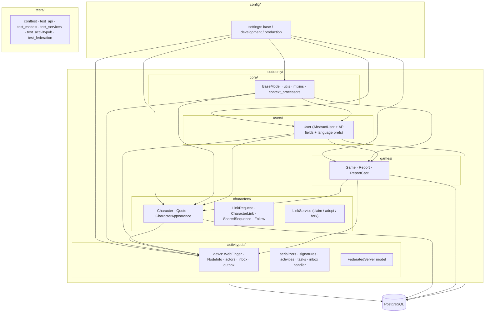

# Codebase Structure

```mermaid
flowchart TD
    subgraph "config/"
        S["settings: base / development / production"]
    end

    subgraph "suddenly/"
        subgraph "core/"
            C["BaseModel · utils · mixins · context_processors"]
        end
        subgraph "users/"
            U["User (AbstractUser + AP fields + language prefs)"]
        end
        subgraph "games/"
            G["Game · Report · ReportCast"]
        end
        subgraph "characters/"
            CH["Character · Quote · CharacterAppearance"]
            CL["LinkRequest · CharacterLink · SharedSequence · Follow"]
            CS["LinkService (claim / adopt / fork)"]
        end
        subgraph "activitypub/"
            AP["views: WebFinger · NodeInfo · actors · inbox · outbox"]
            APS["serializers · signatures · activities · tasks · inbox handler"]
            APM["FederatedServer model"]
        end
    end

    subgraph "tests/"
        T["conftest · test_api · test_models · test_services · test_activitypub · test_federation"]
    end

    S --> C
    S --> U
    S --> G
    S --> CH
    S --> AP

    C --> U
    C --> G
    C --> CH
    C --> AP

    U --> G
    U --> CH
    G --> CH
    CH --> AP
    U --> AP
    G --> AP

    AP --> PG[("PostgreSQL")]
    CH --> PG
    G --> PG
    U --> PG
```
