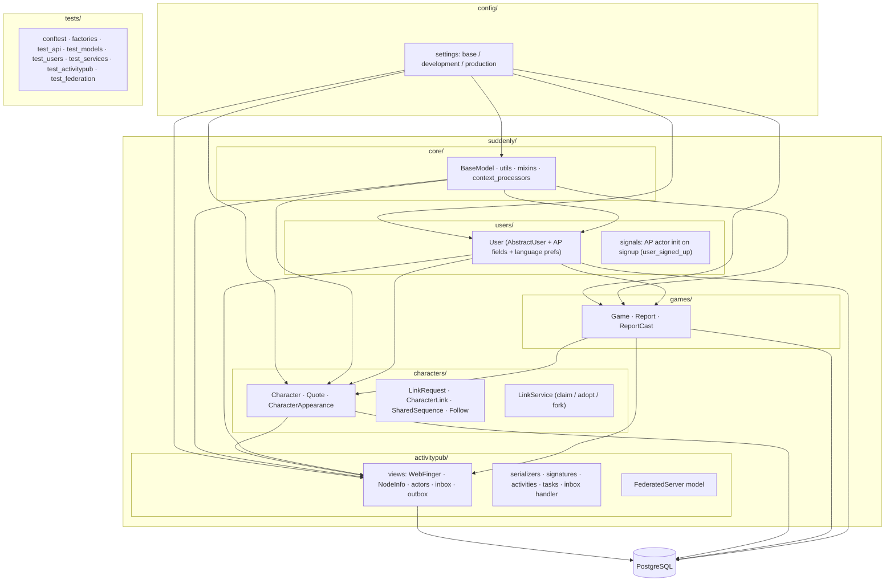

<!-- migrated from docs – verify with /init -->
# Codebase Structure



## Critical Modules

| File | Role | Tests Required |
|------|------|----------------|
| `suddenly/characters/services.py` | Claim/Adopt/Fork logic | Yes |
| `suddenly/activitypub/handlers.py` | Incoming AP activity dispatch | Yes |
| `suddenly/activitypub/signatures.py` | HTTP Signatures verify/sign | Yes |
| `suddenly/activitypub/activities.py` | AP serialization | Yes |
| `suddenly/users/activitypub.py` | User federation | Yes |
| `suddenly/core/models.py` | BaseModel, ActivityPubMixin | Yes |

## App Import Relations

```
core/           ← imported by everything (BaseModel, ActivityPubMixin)
users/          ← imported by games, characters, activitypub
games/          ← imported by characters
characters/     ← imported by activitypub
activitypub/    ← imports users, games, characters (for serialization)
```

**Rule**: No circular imports. `core/` depends on nothing.

## Tooling Files

| File | Role |
|------|------|
| `Makefile` | Unified `make check` (lint + typecheck + test + coverage) |
| `.pre-commit-config.yaml` | Pre-commit hooks: ruff + mypy |
| `.github/workflows/ci.yml` | CI pipeline: ruff + mypy + pytest + coverage gate |
| `pyproject.toml` | Project config, pytest addopts with --cov-fail-under=80 |

## Scoped Rules

| Rule file | Scope |
|-----------|-------|
| `.claude/rules/custom/03-django-models.md` | `suddenly/**/models.py` |
| `.claude/rules/custom/03-django-services.md` | `suddenly/**/services.py` |
| `.claude/rules/custom/03-django-views.md` | `suddenly/**/views.py` |
| `.claude/rules/custom/05-pytest.md` | `tests/**/*.py`, `**/test_*.py` |
| `.claude/rules/custom/08-activitypub.md` | `suddenly/activitypub/**` |
| `.claude/rules/custom/08-characters.md` | `suddenly/characters/**` |

## Agents

| Agent | Role |
|-------|------|
| alexia | Autonomous end-to-end implementation |
| iris | Frontend specialist (Figma, UI, journeys) |
| kent | Test-driven development |
| martin | Build/test runner |
| claire | Clarity challenger |
