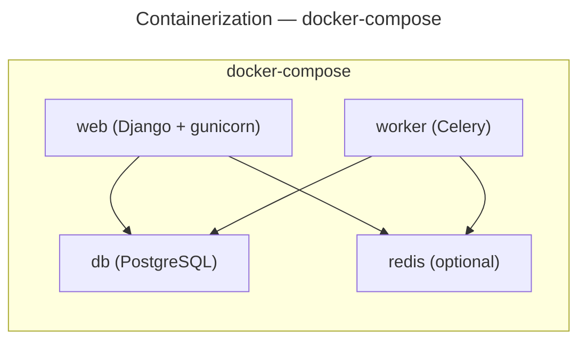

# Deployment

## Deployment Process

- **Steps**:
  1. Set required environment variables
  2. `pip install --upgrade pip && pip install -e '.[federation]'` (not `requirements.txt`; single quotes for bash)
  3. `python manage.py migrate`
  4. `python manage.py createcachetable` (if no Redis)
  5. `python manage.py collectstatic --noinput`
  6. Generate ActivityPub keys: `mkdir -p keys && openssl genrsa -out keys/private.pem 2048 && openssl rsa -in keys/private.pem -pubout -out keys/public.pem`
  7. Run via `gunicorn suddenly.wsgi:application`

- **i18n note**: `.mo` files are versioned in git — no `compilemessages` needed at deploy; recompile from a machine with `gettext` if `.po` files changed locally without recompilation
- **Frontend note**: `static/dist/` is versioned in git — Alwaysdata has no Node/pnpm; any frontend change requires `pnpm run build` + commit of `static/dist/` before deploy; `scripts/deploy-alwaysdata.sh` has no build step intentionally; `.gitignore` must NOT exclude `static/dist/`
- **Static storage**: `STORAGES["staticfiles"]["BACKEND"]` must stay `whitenoise.storage.CompressedManifestStaticFilesStorage`; Whitenoise hashes each collected file and emits `Cache-Control: max-age=31536000, immutable`; reverting to `CompressedStaticFilesStorage` loses `immutable` and forces revalidation
- **Fonts**: self-hosted in `static/fonts/*.woff2`; exposed via `templates/components/_fonts.html` included before ``; never add `fonts.googleapis.com` or `fonts.gstatic.com` to `base.html`

- **Database migration**: Django migrations (`python manage.py migrate`)

## Monitoring & Logging

- **Health check**: `GET /health/` → `{"status": "ok"}`
- **Logging**: Console via Django's `LOGGING` config — INFO in prod, DEBUG in dev
- No external monitoring or log aggregation configured yet

## Post-Deployment Checklist

- [ ] HTTPS works
- [ ] Webfinger responds: `/.well-known/webfinger?resource=acct:admin@domain`
- [ ] NodeInfo accessible: `/.well-known/nodeinfo`
- [ ] Account creation works
- [ ] Media upload works
- [ ] Federation with another instance tested

# Infrastructure

## Deployment Platforms

| Platform | Difficulty | Cost | Best for |
|----------|-----------|------|----------|
| Alwaysdata | Easy | ~10€/mo | Beginners, small instances |
| VPS (Debian/Ubuntu) | Medium | ~5-20€/mo | Full control, medium instances |
| Docker | Medium | Variable | Developers, CI/CD |
| Railway/Heroku | Easy | Variable | Quick start |

**Architecture** : Reverse proxy (Nginx/Caddy/PaaS) → Gunicorn + Django → PostgreSQL + Redis (opt) + Celery (opt)

## Project Structure

```plaintext
suddenly/
├── config/settings/
│   ├── base.py          # Shared settings
│   ├── development.py   # Dev overrides
│   └── production.py    # Prod (env-required, security-hardened)
├── config/asgi.py       # ASGI entry point
├── manage.py
├── requirements.txt
├── docker-compose.yml
├── docker-compose.dev.yml
├── staticfiles/         # Collected static (whitenoise)
└── media/               # User uploads
```

## Environments Variables

### Required

| Variable | Description |
| -------- | ----------- |
| `SECRET_KEY` | Django secret key (64+ chars) |
| `DOMAIN` | Instance domain (e.g. `suddenly.social`) |
| `DATABASE_URL` | PostgreSQL connection URL |

### Optional

| Variable | Default | Description |
| -------- | ------- | ----------- |
| `ALLOWED_HOSTS` | `DOMAIN` | Comma-separated allowed hosts |
| `REDIS_URL` | None | Redis broker/cache (absent = DB cache + sync Celery) |
| `DJANGO_LOG_LEVEL` | `INFO` | Log verbosity |
| `DEBUG` | `False` | Dev only |
| `SECURE_SSL_REDIRECT` | `True` | Prod security |
| `EMAIL_HOST` | None | SMTP server (absent = dummy backend, l'inscription fonctionne sans vérification email) |
| `EMAIL_PORT` | `587` | SMTP port |
| `EMAIL_HOST_USER` | None | SMTP username |
| `EMAIL_HOST_PASSWORD` | None | SMTP password |
| `EMAIL_USE_TLS` | `True` | SMTP TLS |
| `DEFAULT_FROM_EMAIL` | None | Sender address |
| `SENTRY_DSN` | None | Sentry error tracking DSN |
| `AWS_STORAGE_BUCKET_NAME` | None | S3/R2 bucket name — absent = local filesystem media storage (no persistence across deploys on PaaS without a volume) |
| `AWS_S3_ENDPOINT_URL` | None | S3-compatible endpoint (Cloudflare R2 URL) |
| `AWS_S3_REGION_NAME` | `auto` | `auto` is R2-specific; real AWS S3 must set a real region |
| `AWS_ACCESS_KEY_ID` | — | Required if `AWS_STORAGE_BUCKET_NAME` set |
| `AWS_SECRET_ACCESS_KEY` | — | Required if `AWS_STORAGE_BUCKET_NAME` set |

**Media storage (S3/R2)**: `config/settings/production.py` rebinds `STORAGES` to a new dict (`{**STORAGES, "default": {...}}`) rather than mutating `STORAGES["default"]` in place — `from .base import *` binds the same dict object, so item-assignment would corrupt `base.STORAGES` for every settings module sharing the reference. Bucket must be publicly readable (no `querystring_auth`) — remote federated instances cache `icon.url` and can't refresh signed URLs. Pre-existing local avatars are not auto-migrated on switching to S3/R2.

### Generate SECRET_KEY

```bash
python -c "from django.core.management.utils import get_random_secret_key; print(get_random_secret_key())"
```

## URLs

- **Development**: `http://localhost:8000`
- **Production**:
  - `https://suddenly.social` — Instance principale (internationale)
  - `https://soudainement.fr` — Instance française

## Containerization



## Alwaysdata Specific

```
Site → Python WSGI
  Application path  : www/<app>/suddenly/wsgi.py   ← wsgi is in suddenly/, not config/
  Working directory : www/<app>/
  Virtualenv        : www/<app>/venv               ← relative to home, without /home/user/
  Python version    : 3.12
  Env vars          : FOO=bar format, no "export"
  Static paths      : /static/ staticfiles/        ← relative to working directory
                      /media/ media/
```

- Static paths are relative to working directory, not home — do not use absolute path
- `DATABASE_URL`: encode special chars in password with `urllib.parse.quote_plus`
- Panel env vars not available in SSH — export manually for `manage.py`
- No Redis on Alwaysdata → DB cache + `CELERY_TASK_ALWAYS_EAGER=True` (automatic if `REDIS_URL` absent)

**Scheduled tasks** (env vars must be set in each task):
```
0 3 * * *  /home/<user>/www/<app>/venv/bin/python /home/<user>/www/<app>/manage.py clearsessions
0 * * * *  /home/<user>/www/<app>/venv/bin/python /home/<user>/www/<app>/manage.py shell -c "from suddenly.activitypub.tasks import cleanup_expired_quotes; cleanup_expired_quotes()"
```

- SSL: Let's Encrypt via Alwaysdata interface
