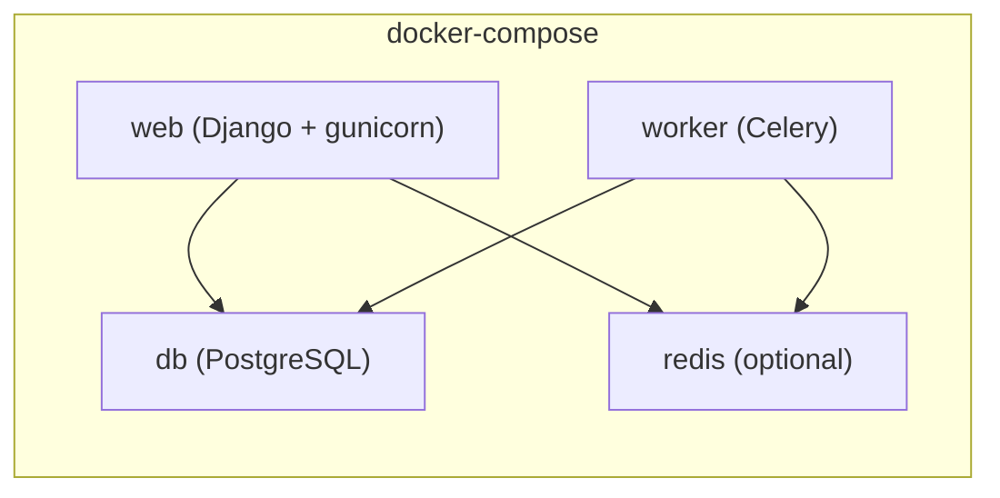

# Deployment

## Deployment Process

- **Steps**:
  1. Set required environment variables
  2. `pip install --upgrade pip && pip install -e ".[federation]"` (pas `requirements.txt`)
  3. `python manage.py migrate`
  4. `python manage.py createcachetable` (si pas de Redis)
  5. `python manage.py collectstatic --noinput`
  6. Générer les clés ActivityPub : `mkdir -p keys && openssl genrsa -out keys/private.pem 2048 && openssl rsa -in keys/private.pem -pubout -out keys/public.pem`
  7. Run via `gunicorn config.wsgi:application`

- **Database migration**: Django migrations (`python manage.py migrate`)

## Monitoring & Logging

- **Health check**: `GET /health/` → `{"status": "ok"}`
- **Logging**: Console via Django's `LOGGING` config — INFO in prod, DEBUG in dev
- No external monitoring or log aggregation configured yet

## Post-Deployment Checklist

- [ ] HTTPS works
- [ ] Webfinger responds: `/.well-known/webfinger?resource=acct:admin@domain`
- [ ] NodeInfo accessible: `/.well-known/nodeinfo`
- [ ] Account creation works
- [ ] Media upload works
- [ ] Federation with another instance tested

# Infrastructure

## Deployment Platforms

| Platform | Difficulty | Cost | Best for |
|----------|-----------|------|----------|
| Alwaysdata | Easy | ~10€/mo | Beginners, small instances |
| VPS (Debian/Ubuntu) | Medium | ~5-20€/mo | Full control, medium instances |
| Docker | Medium | Variable | Developers, CI/CD |
| Railway/Heroku | Easy | Variable | Quick start |

**Architecture** : Reverse proxy (Nginx/Caddy/PaaS) → Gunicorn + Django → PostgreSQL + Redis (opt) + Celery (opt)

## Project Structure

```plaintext
suddenly/
├── config/settings/
│   ├── base.py          # Shared settings
│   ├── development.py   # Dev overrides
│   └── production.py    # Prod (env-required, security-hardened)
├── config/asgi.py       # ASGI entry point
├── manage.py
├── requirements.txt
├── docker-compose.yml
├── docker-compose.dev.yml
├── staticfiles/         # Collected static (whitenoise)
└── media/               # User uploads
```

## Environments Variables

### Required

| Variable | Description |
| -------- | ----------- |
| `SECRET_KEY` | Django secret key (64+ chars) |
| `DOMAIN` | Instance domain (e.g. `suddenly.social`) |
| `DATABASE_URL` | PostgreSQL connection URL |

### Optional

| Variable | Default | Description |
| -------- | ------- | ----------- |
| `ALLOWED_HOSTS` | `DOMAIN` | Comma-separated allowed hosts |
| `REDIS_URL` | None | Redis broker/cache (absent = DB cache + sync Celery) |
| `DJANGO_LOG_LEVEL` | `INFO` | Log verbosity |
| `DEBUG` | `False` | Dev only |
| `SECURE_SSL_REDIRECT` | `True` | Prod security |
| `EMAIL_HOST` | None | SMTP server |
| `EMAIL_PORT` | `587` | SMTP port |
| `EMAIL_HOST_USER` | None | SMTP username |
| `EMAIL_HOST_PASSWORD` | None | SMTP password |
| `EMAIL_USE_TLS` | `True` | SMTP TLS |
| `DEFAULT_FROM_EMAIL` | None | Sender address |
| `SENTRY_DSN` | None | Sentry error tracking DSN |

### Generate SECRET_KEY

```bash
python -c "from django.core.management.utils import get_random_secret_key; print(get_random_secret_key())"
```

## URLs

- **Development**: `http://localhost:8000`
- **Production**:
  - `https://suddenly.social` — Instance principale (internationale)
  - `https://soudainement.fr` — Instance française

## Containerization



## Alwaysdata Specific

```
Site → Python WSGI
  Chemin de l'application : www/<app>/suddenly/wsgi.py   ← wsgi est dans suddenly/, pas config/
  Répertoire de travail   : www/<app>/
  Virtualenv              : www/<app>/venv               ← relatif au home, sans /home/user/
  Version Python          : 3.12
  Variables d'env         : format FOO=bar sans "export"
  Chemins statiques       : /static/ staticfiles/        ← relatif au répertoire de travail
                            /media/ media/
```

**Pièges connus :**
- Les chemins statiques sont relatifs au répertoire de travail (pas au home) — ne pas mettre le chemin absolu
- `DATABASE_URL` : encoder les caractères spéciaux du mot de passe avec `urllib.parse.quote_plus`
- Les variables d'env du panel ne sont pas disponibles en SSH, les exporter manuellement pour `manage.py`
- Pas de Redis sur Alwaysdata → DB cache + `CELERY_TASK_ALWAYS_EAGER=True` (automatique si `REDIS_URL` absent)

**Tâches planifiées** (variables d'env à renseigner dans chaque tâche) :
```
0 3 * * *  /home/<user>/www/<app>/venv/bin/python /home/<user>/www/<app>/manage.py clearsessions
0 * * * *  /home/<user>/www/<app>/venv/bin/python /home/<user>/www/<app>/manage.py shell -c "from suddenly.activitypub.tasks import cleanup_expired_quotes; cleanup_expired_quotes()"
```

- SSL : Let's Encrypt via interface Alwaysdata
