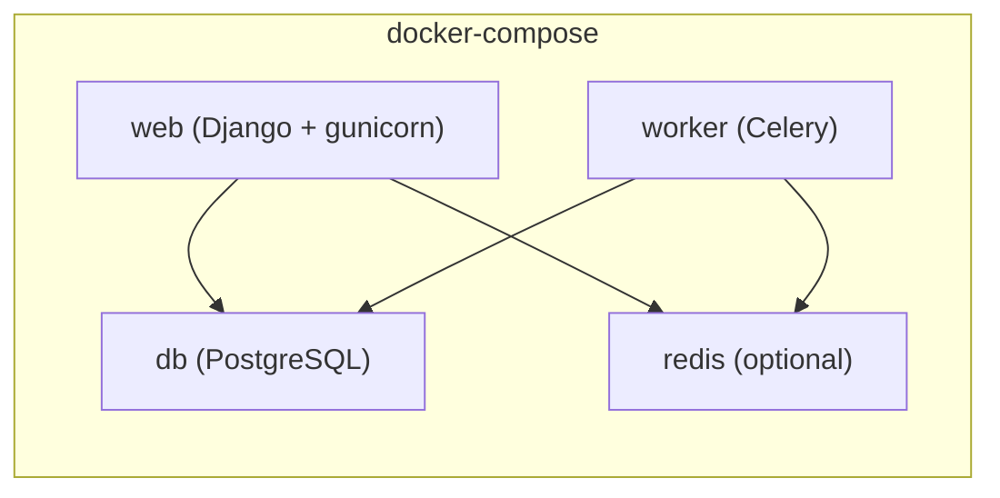

# Deployment

## Deployment Process

- **Steps**:
  1. Set required environment variables
  2. `pip install -r requirements.txt`
  3. `python manage.py migrate`
  4. `python manage.py collectstatic --noinput`
  5. Run via `gunicorn` (WSGI) or `uvicorn` (ASGI)

- **Database migration**: Django migrations (`python manage.py migrate`)

## Monitoring & Logging

- **Health check**: `GET /health/` → `{"status": "ok"}`
- **Logging**: Console via Django's `LOGGING` config — INFO in prod, DEBUG in dev
- No external monitoring or log aggregation configured yet

# Infrastructure

## Project Structure

```plaintext
suddenly/
├── config/settings/
│   ├── base.py          # Shared settings
│   ├── development.py   # Dev overrides
│   └── production.py    # Prod (env-required, security-hardened)
├── config/asgi.py       # ASGI entry point
├── manage.py
├── requirements.txt
├── docker-compose.yml
├── docker-compose.dev.yml
├── staticfiles/         # Collected static (whitenoise)
└── media/               # User uploads
```

## Environments Variables

### Required Environment Variables

| Variable | Description |
| -------- | ----------- |
| `SECRET_KEY` | Django secret key |
| `DOMAIN` | Instance domain (e.g. `suddenly.social`) |
| `DATABASE_URL` | PostgreSQL connection URL |

### Optional

| Variable | Default | Description |
| -------- | ------- | ----------- |
| `ALLOWED_HOSTS` | `DOMAIN` | Comma-separated allowed hosts |
| `REDIS_URL` | None | Redis broker/cache (absent = DB cache + sync Celery) |
| `DJANGO_LOG_LEVEL` | `INFO` | Log verbosity |

## URLs

- **Development**: `http://localhost:8000`
- **Production**:
  - `https://suddenly.social` — Instance principale (internationale)
  - `https://soudainement.fr` — Instance française

## Containerization

Docker Compose available for local dev and deployment (optional — app runs without Docker).


