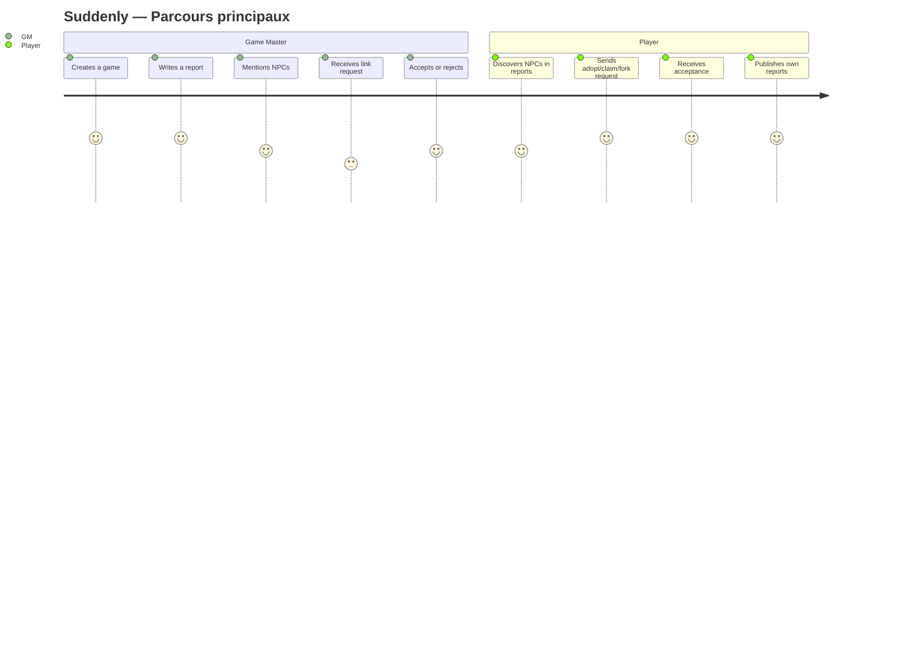
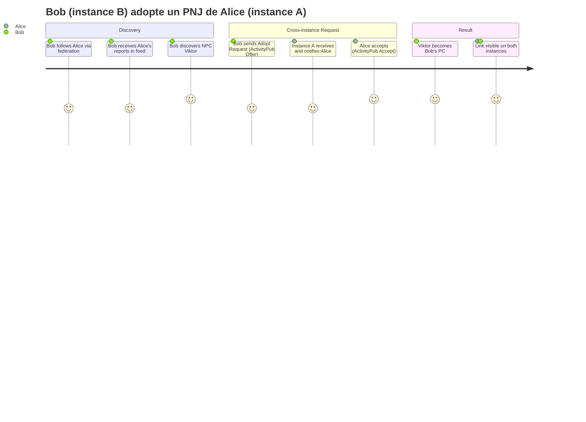

# PROJECT_BRIEF.md

## Executive Summary

- **Project Name**: Suddenly
- **Vision**: Federated network where one player's NPCs become another's PCs
- **Mission**: ActivityPub platform for sharing TTRPG session reports; characters travel across campaigns via claim/adopt/fork mechanics

### Full Description

- Suddenly: federated social network (ActivityPub) for tabletop RPG players
- Players publish session reports (Reports) mentioning characters
- Characters (initially NPCs) can be claimed, adopted, or forked by other players to become their PCs
- **"Suddenly"** = the moment of surprise when a character appears in another story

## Context

### Core Domain

- Federated TTRPG platform; each instance is autonomous, interoperates via ActivityPub (Mastodon-compatible)
- Characters are the link between instances and players

### Ubiquitous Language

| Term | Definition | Synonym |
| ---- | ---------- | ------- |
| PJ | Player Character — owned by a player | PC |
| PNJ | Non-Player Character — created in a report, available for adoption | NPC |
| Partie / Jeu | Ongoing fiction receiving reports | Game, Campaign |
| Compte-rendu | Narrative session log (Markdown) | Report |
| Citation | Memorable character quote (public/private/ephemeral) | Quote |
| Claim | Retcon: the NPC was always the requester's PC | — |
| Adopt | Takeover: NPC becomes requester's new PC | — |
| Fork | Derivation: new PC inspired by NPC, lineage link | — |
| Lien | Relationship between characters after request accepted | CharacterLink |
| Demande de lien | Pending claim/adopt/fork request | LinkRequest |
| Séquence partagée | Co-created content created when a link is established | SharedSequence |
| Apparition | Link between a character and a report | CharacterAppearance |
| Distribution | Cast planned before writing a report | ReportCast |
| Instance | Federated Suddenly server | — |

## Features & Use-cases

- Create and manage games (ongoing fictions) with their reports
- Mention characters in reports (auto-creates NPC)
- Send claim/adopt/fork requests on available NPCs
- Accept/reject requests (NPC creator's role)
- Follow users, games, and characters (local and federated)
- Publish memorable character quotes (configurable visibility)
- Federation via ActivityPub: WebFinger, NodeInfo, inbox/outbox

## User Journey maps



### Game Master

- Primary report author
- Creates NPCs via `@character` mentions in narratives
- Arbitrates claim/adopt/fork requests on their NPCs

#### Create a game and publish a report

Create game → Write report with mentions → Define cast (ReportCast) → Publish → NPCs become available for adoption

### Player

- Plays in campaigns, seeks NPCs to adopt/fork
- Can have multiple PCs from NPCs of different GMs

#### Adopt an NPC

Browse reports → Find NPC → Send adopt request with message → Wait for GM decision → If accepted: NPC becomes their PC

### Cross-instance (Bob on remote instance)

- Follows players from other instances via federation
- Receives reports in feed via ActivityPub
- Sends Adopt Request (ActivityPub Offer) from their instance
- Remote instance notifies Alice → Alice accepts (ActivityPub Accept)
- Viktor becomes Bob's PC, link visible on both instances



## ActivityPub Overview

### Actors (followable, have inbox/outbox)

| Entity | AP Type | Description |
|--------|---------|-------------|
| User | Person | Player account |
| Character | Person | PC or NPC |
| Game | Group | Campaign/game |

### Objects (created, shared)

| Entity | AP Type | Description |
|--------|---------|-------------|
| Report | Article | Session report |
| Quote | Note | Character quote |

### Character Status Transitions

```
NPC → CLAIMED  (retcon: NPC was already the requester's PC from the start)
NPC → ADOPTED  (adoption: NPC becomes requester's new PC)
NPC → FORKED   (derivation: new PC linked to NPC, NPC preserved)
```
