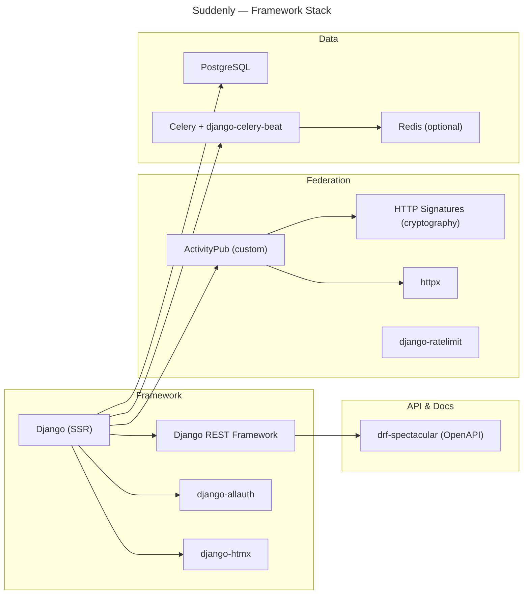
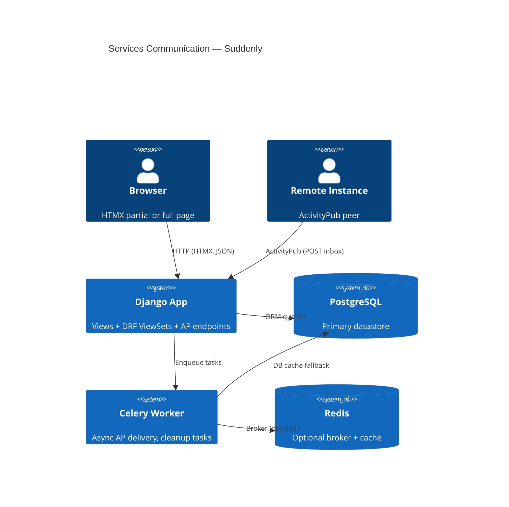

# Architecture

## Language/Framework

```text
@requirements.txt
```



### Naming Conventions

- **Files**: snake_case (`character_service.py`)
- **Classes**: PascalCase (`LinkService`)
- **Functions**: snake_case (`get_user_characters()`)
- **Constants**: SCREAMING_SNAKE (`MAX_THEME_CARDS`)

## Deployment Philosophy

- Django standard app — runs anywhere Python + PostgreSQL are available
- Docker is optional, not required
- Small instance (< 50 users): Django + PostgreSQL only
- Medium (50–500): + Redis recommended
- Large (500+): + Celery for federation delivery

### Dependency Matrix

| Component | Required | Optional | Fallback |
|-----------|----------|----------|---------|
| Python 3.12+ | ✅ | — | — |
| PostgreSQL | ✅ | — | — |
| Redis | — | ✅ | DB cache |
| Celery | — | ✅ | Sync tasks |

## Frontend

- HTMX + Alpine.js + UnoCSS (Vite build)
- No SPA, SSR with Vite for asset bundling
- Total bundle: ~693KB uncompressed (~150KB JS gzipped); HTMX + Alpine + UnoCSS purged

## Tooling & Quality Gates

- **Unified check**: `make check` runs lint + typecheck + tests + coverage
- **Lint**: Ruff (E, F, I, N, W, UP rules)
- **Type check**: mypy strict + django-stubs
- **Coverage**: pytest-cov, fail_under=80%
- **Pre-commit**: ruff (with --fix) + mypy
- **CI**: GitHub Actions — ruff check + mypy + pytest --cov, blocks merge on failure
- **CI database**: PostgreSQL 16 service container for Django test DB

## Account & Content Lifecycle

### Account deletion (Mastodon model)

- Adopted/claimed NPCs survive deletion — they stay with their new owner via existing `CharacterLink`
- Unlinked NPCs created by the deleted user are removed alongside the account
- The user's reports and games are deleted; published `SharedSequence` survives (co-created content)
- A `Tombstone` AP activity is emitted to remote instances on deletion

### Soft-delete for moderated content

- All user-content models carry a `deleted_at` field — never hard-delete moderated content
- Custom managers exclude soft-deleted rows from default querysets; admins can restore
- Author is notified of the deletion with the reason
- A `Delete` AP activity is sent to remote instances when federated content is removed

## Security Patterns

### HTTP Signatures
- All outgoing AP requests signed with RSA-SHA256
- Headers signed: `(request-target) host date digest`
- Implemented in `suddenly/activitypub/signatures.py`

### Rate Limiting
- Inbox: 100/h — API: 1000/h — Auth: 10/min
- Simple: Django middleware; Production: Redis + django-ratelimit

## Services communication

### Request flow



### External Services

#### ActivityPub peers

- Remote instances receive activities via HTTP POST to their inbox
- Actor discovery via WebFinger (`/.well-known/webfinger`)
- Instance metadata via NodeInfo (`/.well-known/nodeinfo`)
- HTTP Signatures for request authenticity

#### Redis (optional)

- Celery broker + result backend
- Cache backend
- Fallback: DB cache + synchronous task execution (`CELERY_TASK_ALWAYS_EAGER=True`)

#### PostgreSQL

- Primary database (FTS, JSON fields)
- DB cache fallback when Redis absent

## Feed System

- 3 feed types: personal (`/feed/`), instance (`/feed/instance/`), fediverse (`/feed/fediverse/`)
- `recommend_report` action at `/feed/recommend/`

## Notification System

- `Notification` model in `core` app
- Types: LINK_REQUEST, LINK_ACCEPTED, LINK_REJECTED, NEW_REPORT, RECOMMENDATION, MENTION, INVITATION, NEW_FOLLOWER, SHARED_SEQUENCE, REVOCATION
- User preferences via `NotificationPreference` model
- Badge count via HTMX polling or signal-triggered update

## Onboarding Flow

- 3-step wizard: `/welcome/`, `/welcome/discover/`, `/welcome/start/`

## Admin Panel

- Custom panel at `/gmh/`, redirects from `/admin-panel/`
- Features: instance dashboard, instance block/unblock, user management, instance settings
- Protected by `is_admin` user flag (not Django `is_staff`)

## Moderation & Safety

- `ContentReport` + `ReportCategory` models — content reporting (US-27)
- `UserBlock` model — user block
- `UserMute` model — user mute (US-33)

## Donation Prompt System

- `DonationPrompt` + `UserUsageStats` models in `core`
- Triggered every N posts (configurable interval via instance settings)
- Suppressed if user donated within current month

## Signal-Based Cache Invalidation

- Explorer service queries cached in `core/services.py`
- Cache invalidated via Django signals in `core/cache_invalidation.py`
- `dispatch_uid` pattern prevents duplicate handlers on dev autoreload and `--reuse-db`

## Report Model Enhancements

- `content_warning` field on `Report`
- `visibility` field: PUBLIC / UNLISTED / FOLLOWERS (US-29)
- `session_date` field on `Report`

## Games App

- `GameSystem` model — game system taxonomy, FK in `Game`

## Rapport System (Structured Report Content)

- `Rapport` model — structured segment within a Report; types: DESCRIPTION / ACTION / DISCUSSION / NARRATION
- `RapportLink` model — directed link between Rapport segments (local or remote IRI)
- `RapportMarker` model — structural events: START / END / CHARACTER_APPEARS / CHARACTER_LEAVES / ORACLE

## Report fiction order (normative)

- Source of truth for reading order = `Report.previous_report` (self-FK, `SET_NULL`, reverse `next_reports`) — a forest, not a total order
- **Never** sort the fiction order in a manager or `Meta.ordering` — `Report.Meta.ordering` stays for admin/flat lists only; fiction order lives **only** in `games.services.fiction_thread(game)` (mainline-first DFS)
- **No business logic in the model** — invariants/reading/mutation in `games/services.py`: `validate_fiction_links`, `fiction_thread`, `fiction_continuations`, `set_previous`
- Chronology axis = `temporal_kind` (`ReportTemporalKind`) + `temporal_anchor`/`temporal_anchor_iri` + `temporal_label`; orthogonal to reading order (a flashback stays in the chain)
- **Never** let a hard FK cross federation: the link travels as a **soft IRI** (`suddenly:previousReport` / `suddenly:temporalAnchor`) emitted by `serialize_report`, ingested by `inbox._handle_create_report`
- XOR local/remote enforced by `CheckConstraint` (`report_previous_local_xor_remote`, `report_anchor_local_xor_remote`): on reception, linking the FK **requires** clearing the matching IRI
- Reception is idempotent by `ap_id` (business dedup in the handler, on top of `ProcessedActivity` transport dedup)
- Human design doc: `docs/fiction-order.md`
