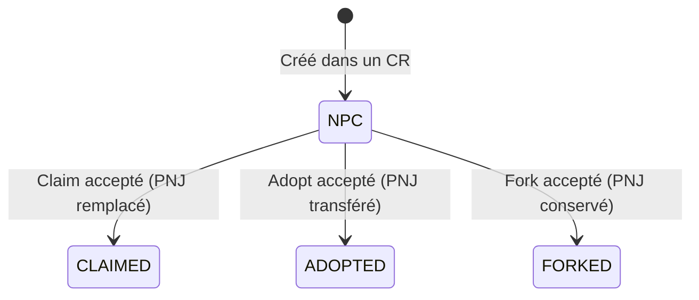
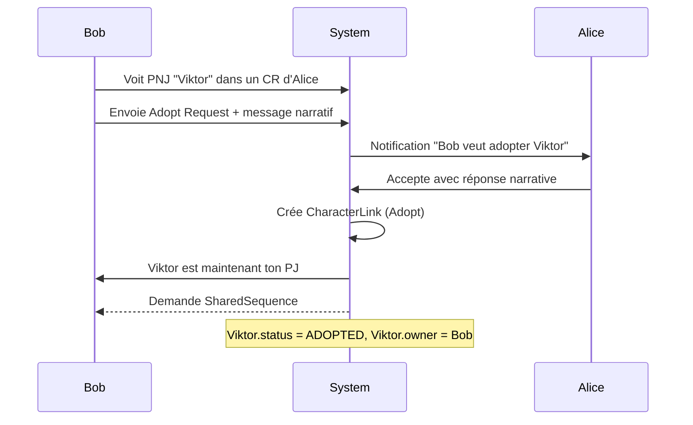
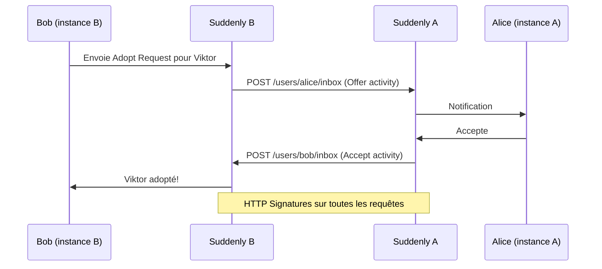

# Flows — Claim / Adopt / Fork

| Type | Signification | Résultat | PNJ original |
|------|--------------|----------|--------------|
| **Claim** | "Ce PNJ était mon PJ depuis le début" — rétcon | PNJ remplacé par le PJ existant | Remplacé |
| **Adopt** | "Je reprends ce PNJ comme mon PJ" — transfert | PNJ devient le PJ du demandeur | Transféré |
| **Fork** | "Mon PJ est inspiré de ce PNJ" — dérivation | Nouveau PJ lié, PNJ reste intact | Conservé |

## Statuts Character



## Flow Adopt



## Flow Cross-Instance (fédération)



## SharedSequence — Règle MVP

**Un lien sans SharedSequence est invalide.**

```
1. Lien accepté → notification aux deux joueurs
2. Initiateur rédige sa partie (Markdown)
3. Accepteur complète la scène
4. Les deux valident → publication sur les deux instances
5. SharedSequence visible dans les deux parties concernées
```
