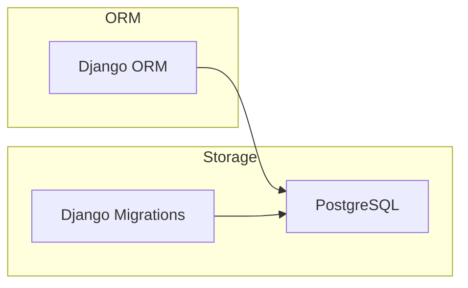
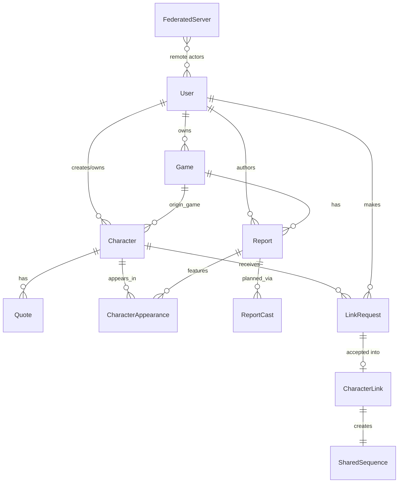

# Database

- **DB**: PostgreSQL (psycopg3)
- **ORM**: Django ORM
- **Connection**: `DATABASE_URL` env var in production

## Main entities and relationships

- `User` owns `Game`s, creates/owns `Character`s, authors `Report`s
- `Game` has many `Report`s and `Character`s (via `origin_game`)
- `Character` has `Quote`s, `CharacterAppearance`s, receives `LinkRequest`s
- `LinkRequest` → accepted → creates `CharacterLink` + `SharedSequence`
- `Follow` is polymorphic (targets `User`, `Character`, or `Game` via `GenericForeignKey`)

## Migrations

Django migrations — `python manage.py migrate`

- Apps with migrations: `users`, `games`, `characters`, `activitypub`
- All models use UUID primary keys

## Seeding

No seeding strategy defined yet.
