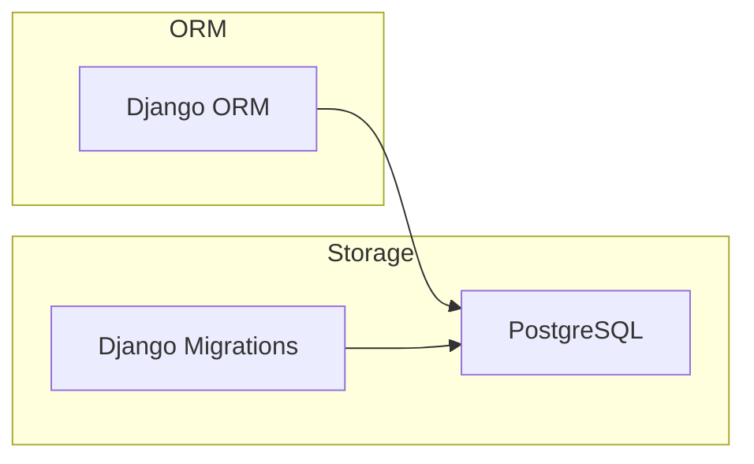
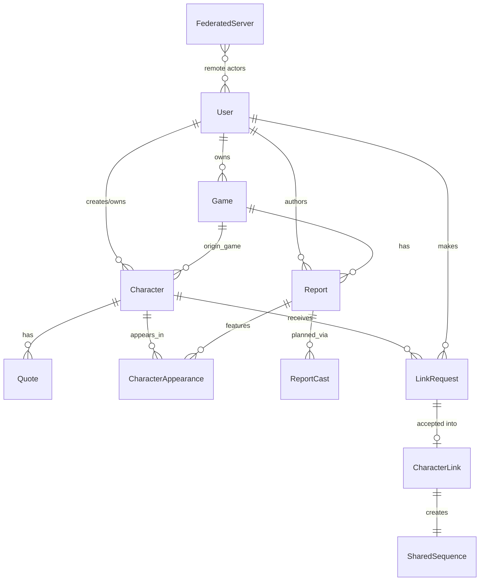

# Database

- **DB**: PostgreSQL (psycopg3)
- **ORM**: Django ORM
- **Connection**: `DATABASE_URL` env var in production



## Main entities and relationships

- `User` owns `Game`s, creates/owns `Character`s, authors `Report`s
- `Game` has many `Report`s and `Character`s (via `origin_game`)
- `Character` has `Quote`s, `CharacterAppearance`s, receives `LinkRequest`s
- `LinkRequest` → accepted → creates `CharacterLink` + `SharedSequence`
- `Follow` is polymorphic (targets `User`, `Character`, or `Game`)



## Base Model

Tous les modèles héritent de `BaseModel` (UUID PK, `created_at`, `updated_at`).
Les modèles fédérables héritent de `ActivityPubMixin` (`ap_id`, `inbox`, `outbox`, `local`).

## Character Status

```
NPC → CLAIMED  (rétcon : le PNJ était le PJ depuis le début)
NPC → ADOPTED  (adoption : le PNJ devient le PJ du demandeur)
NPC → FORKED   (dérivation : nouveau PJ lié, PNJ conservé)
```

## Champs clés par modèle

| Modèle | App | Type AP | Champs critiques |
|--------|-----|---------|-----------------|
| User | users | Person | `username`, `ap_id`, `inbox`, `outbox`, `local`, `public_key`, `preferred_languages` |
| Game | games | Group | `title`, `owner`, `is_public`, `ap_id`, `local` |
| Report | games | Article | `content` (Markdown), `game`, `author`, `status` (DRAFT/PUBLISHED), `language` |
| Character | characters | Person | `name`, `status` (NPC/PC/CLAIMED/ADOPTED/FORKED), `owner`, `creator`, `origin_game`, `parent` |
| Quote | characters | Note | `content`, `character`, `visibility` (EPHEMERAL/PRIVATE/PUBLIC), `language` |
| CharacterAppearance | characters | — | `character`, `report`, `role` (MAIN/SUPPORTING/MENTIONED) |
| ReportCast | games | — | `report`, `character` (nullable), `new_character_name`, `role` |
| LinkRequest | characters | Offer | `link_type` (CLAIM/ADOPT/FORK), `requester`, `target_character`, `status` (PENDING/ACCEPTED/REJECTED/CANCELLED) |
| CharacterLink | characters | — | `link_type`, `source`, `target`, `link_request` |
| SharedSequence | characters | — | `character_link`, `content` (Markdown), `initiator`, `acceptor`, `is_published` |
| FederatedServer | activitypub | — | `server_name`, `application_type`, `status` (UNKNOWN/FEDERATED/BLOCKED) |
| Follow | activitypub | — | `follower`, `target_type` (USER/CHARACTER/GAME), `target_id`, `status` |

## Indexes critiques

- `Character(status)` — lister les PNJ disponibles
- `Character(local, status)` — PNJ locaux disponibles
- `Report(game, status)` — CRs publiés d'une partie
- `Quote(character, visibility)` — citations publiques
- `LinkRequest(status, target_character)` — demandes en attente
- `Follow(follower, target_type, target_id)` — unique

## Contraintes importantes

- Un PNJ (`status=NPC`) ne peut pas avoir d'`owner`
- Un Claim nécessite un `proposed_character`
- Un `ReportCast` doit avoir soit `character` soit `new_character_name`
- `CharacterLink` unique sur `(source, target, link_type)`
- `CharacterLink` → `SharedSequence` obligatoire pour MVP

## Migrations

Django migrations — `python manage.py migrate`

- Apps avec migrations : `users`, `games`, `characters`, `activitypub`
- Ordre : users → activitypub → games → characters

## Seeding

No seeding strategy defined yet.
