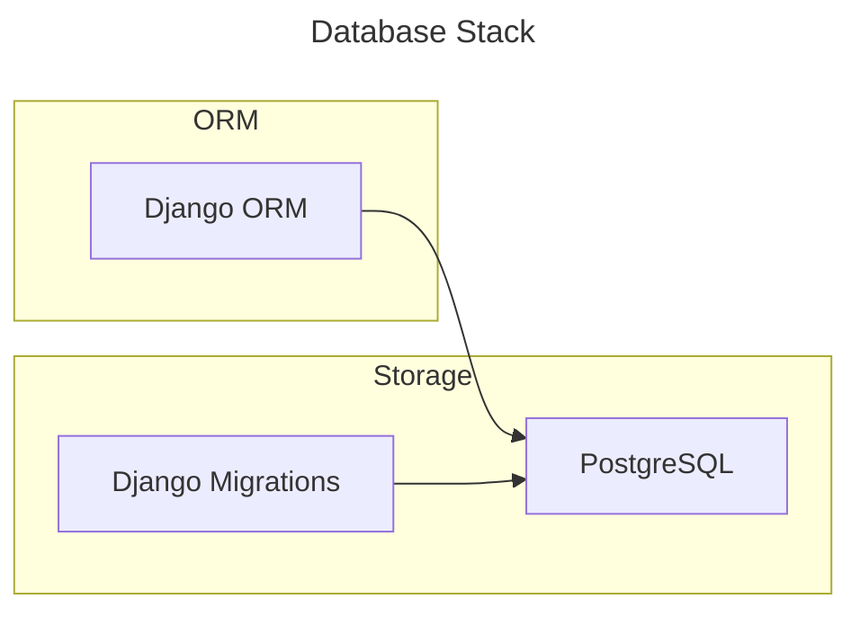
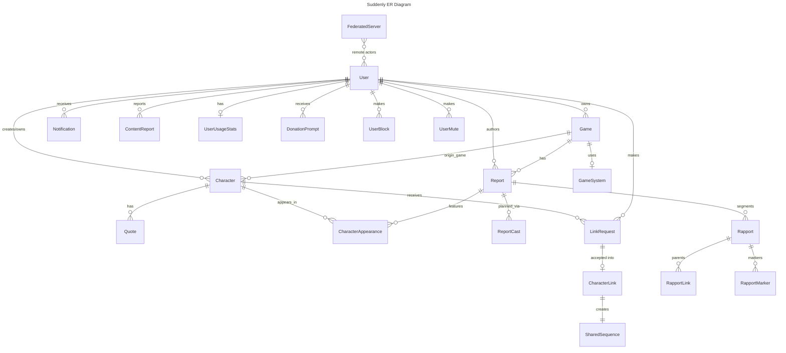

# Database

- **DB**: PostgreSQL (psycopg3)
- **ORM**: Django ORM
- **Connection**: `DATABASE_URL` env var in production



## Main entities and relationships

- `User` owns `Game`s, creates/owns `Character`s, authors `Report`s
- `Game` has many `Report`s and `Character`s (via `origin_game`)
- `Character` has `Quote`s, `CharacterAppearance`s, receives `LinkRequest`s
- `LinkRequest` → accepted → creates `CharacterLink` + `SharedSequence`
- `Follow` is polymorphic (targets `User`, `Character`, or `Game`)



## Base Model

- All models inherit `BaseModel` (UUID PK, `created_at`, `updated_at`)
- Federable models inherit `ActivityPubMixin` (`ap_id`, `inbox`, `outbox`, `local`)

## Character Status

```
NPC → CLAIMED  (retcon: NPC was already the requester's PC from the start)
NPC → ADOPTED  (adoption: NPC becomes requester's new PC)
Fork           (derivation: creates a new PC with parent=NPC; NPC stays NPC — no FORKED status)
```

## Key Fields by Model

| Model | App | AP Type | Critical Fields |
|-------|-----|---------|----------------|
| User | users | Person | `username`, `ap_id`, `inbox`, `outbox`, `local`, `public_key`, `preferred_languages` |
| Game | games | Group | `title`, `owner`, `is_public`, `ap_id`, `local` |
| Report | games | Article | `content` (Markdown), `game`, `author`, `status` (DRAFT/PUBLISHED), `language`, `content_warning` (CharField 500 optional), `visibility` (PUBLIC/UNLISTED/FOLLOWERS), `session_date` (DateField optional) |
| Character | characters | Person | `name`, `status` (NPC/PC/CLAIMED/ADOPTED), `owner`, `creator`, `origin_game`, `parent` (fork lineage) |
| Quote | characters | Note | `content`, `character`, `visibility` (EPHEMERAL/PRIVATE/PUBLIC), `language` |
| CharacterAppearance | characters | — | `character`, `report`, `role` (MAIN/SUPPORTING/MENTIONED) |
| ReportCast | games | — | `report`, `character` (nullable), `new_character_name`, `role` |
| LinkRequest | characters | Offer | `link_type` (CLAIM/ADOPT/FORK), `requester`, `target_character`, `status` (PENDING/ACCEPTED/REJECTED/CANCELLED) |
| CharacterLink | characters | — | `link_type`, `source`, `target`, `link_request` |
| SharedSequence | characters | — | `character_link`, `content` (Markdown), `initiator`, `acceptor`, `is_published` |
| FederatedServer | activitypub | — | `server_name`, `application_type`, `status` (UNKNOWN/FEDERATED/BLOCKED) |
| Follow | activitypub | — | `follower`, `target_type` (USER/CHARACTER/GAME), `target_id`, `status` |
| Notification | core | — | `recipient` (User FK), `notification_type` (NotificationType), `target_content_type` + `target_object_id` (GenericFK), `read` (bool) |
| NotificationPreference | core | — | `user` (OneToOne), preferences per notification type |
| ContentReport | core | — | `reporter` (User FK), `target` (GenericFK via ContentType + UUID), `category` (ReportCategory), `comment`, `resolved`, `resolved_by` |
| UserBlock | core | — | `blocker` + `blocked` (User FKs), unique_together |
| UserMute | core | — | `muter` + `muted` (User FKs), unique_together |
| DonationPrompt | core | — | `user` (FK), `posts_at_prompt`, `donated`, `donated_at`, `amount_suggested` |
| UserUsageStats | core | — | `user` (OneToOne), `total_posts`, `total_quotes`, `total_link_requests`, `posts_since_last_prompt`, `last_donation_date` |
| GameSystem | games | — | `name` (CharField) — game system taxonomy |
| Rapport | games | — | `report` (FK to Report), `kind` (RapportKind: DESCRIPTION/ACTION/DISCUSSION/NARRATION), `content`, `actor` (Character FK nullable — required for DISCUSSION) |
| RapportLink | games | — | `rapport` (FK), `parent_rapport` (FK nullable), `parent_iri` (URLField nullable) — exactly one of local/remote must be set |
| RapportMarker | games | — | `rapport` (FK), `kind` (MarkerKind: START/END/CHARACTER_APPEARS/CHARACTER_LEAVES/ORACLE), `character` (FK nullable — required for CHARACTER_* kinds) |

## Critical Indexes

- `Character(status)` — list available NPCs
- `Character(local, status)` — local available NPCs
- `Report(game, status)` — published reports for a game
- `Quote(character, visibility)` — public quotes
- `LinkRequest(status, target_character)` — pending requests
- `Follow(follower, target_type, target_id)` — unique
- `Notification(recipient, read)` — unread count
- `ContentReport(resolved)` — moderation queue
- `Rapport(report, kind)` — filter segments by type
- `RapportMarker(rapport, kind)` — filter markers

## Key Constraints

- NPC (`status=NPC`) cannot have `owner`
- Claim requires `proposed_character`
- `ReportCast` must have either `character` or `new_character_name`
- `CharacterLink` unique on `(source, target, link_type)`
- `CharacterLink` → `SharedSequence` required for MVP

## Migrations

Django migrations — `python manage.py migrate`

- Apps with migrations: `users`, `games`, `characters`, `activitypub`, `core`
- Order: users → activitypub → core → games → characters

## Seeding

- No seeding strategy defined yet
