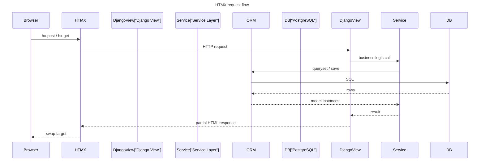

# Communication between backend and frontend

- **API definition**: `/api/schema/` (OpenAPI), Swagger at `/api/docs/`
- **Services**: HTMX for server-rendered partials, DRF REST API for data ops, Django allauth for auth
- **Request Types**: HTMX GET/POST for partials, JSON REST for data, `application/activity+json` for ActivityPub
- **Entities**: `suddenly/{app}/models.py`, serializers in `suddenly/{app}/views.py` or `serializers.py`
- **Data Flow**: Browser → HTMX partial → Django view → Service layer → ORM → PostgreSQL
- **Error Handling**: Django form errors in HTML partials, DRF `{detail}` or `{field: [errors]}` JSON
- **Validation**: Form validation in `*_forms.py`, DRF serializer validation, model `clean()` methods

### Data Flow

