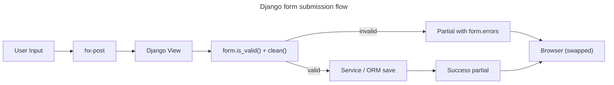

# Forms

- **Form library**: Django forms (`forms.py` per app), rendered server-side
- **Validation**: `form.is_valid()` + model `clean()`, errors via `form.errors` in template
- **State management**: No client state — server-rendered partials replace form on submit
- **HTMX integration**: `hx-post` submits form, response swaps target with updated partial
- **Rich editor**: EasyMDE for Report content (`templates/components/report_editor.html`)
- **Error handling**: Server re-renders form with errors, HTMX swaps partial

## Form Flow

