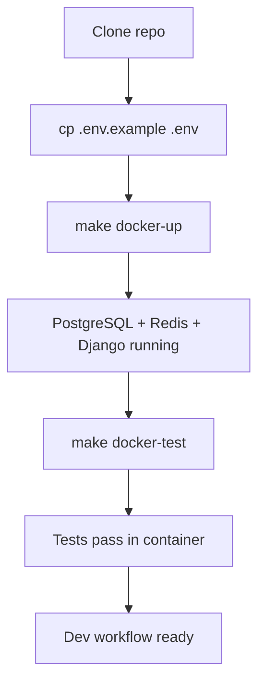

# Instruction: Docker — Fix dev & prod setup

## Feature

- **Summary**: Fix broken Docker setup for both development and production. Align Dockerfile with pyproject.toml, fix docker-compose.dev.yml for local dev workflow, add Make targets for Docker operations.
- **Stack**: `Docker, Docker Compose, Python 3.12, PostgreSQL 16, Redis 7`
- **Branch name**: `chore/docker-setup`
- **Parent Plan**: `none`
- **Sequence**: `standalone`
- Confidence: 9/10
- Time to implement: ~2h

## Existing files

- @Dockerfile
- @docker-compose.yml
- @docker-compose.dev.yml
- @scripts/entrypoint.sh
- @requirements.txt
- @pyproject.toml
- @.env.example
- @.env
- @Makefile
- @config/settings/development.py
- @config/settings/base.py

### New files to create

- none

## User Journey

## Implementation phases

### Phase 0 — Fix Dockerfile

> Align with actual project structure (pyproject.toml, config.wsgi, no frontend build)

1. Remove `frontend-builder` stage — project uses HTMX + CDN, no JS build step
2. Replace `requirements.txt` install with `pyproject.toml`:
   - `COPY pyproject.toml .`
   - `pip install --prefix=/install .` for production
   - Include `[federation]` extras in production image
3. Fix WSGI path: `config.wsgi:application` (not `suddenly.wsgi`)
4. Fix entrypoint path consistency
5. Keep multi-stage build (base → builder → final)

### Phase 1 — Fix docker-compose.dev.yml

> Make local dev work with a single command

1. Remove obsolete `version: "3.8"`
2. Fix web service:
   - Add `DJANGO_SETTINGS_MODULE: config.settings.development` to environment
   - Install Python deps: use a command that installs then runs server, or use a dev Dockerfile target
   - Expose port 8000
3. Ensure DATABASE_URL uses Docker service name `db`
4. Keep celery and mailhog behind profiles (opt-in)

### Phase 2 — Add Make targets for Docker

> Single-command dev workflow

1. Add to `Makefile`:
   - `docker-up`: `docker compose -f docker-compose.dev.yml up -d`
   - `docker-down`: `docker compose -f docker-compose.dev.yml down`
   - `docker-test`: `docker compose -f docker-compose.dev.yml exec web pytest tests/ --tb=short`
   - `docker-check`: `docker compose -f docker-compose.dev.yml exec web make check`
   - `docker-shell`: `docker compose -f docker-compose.dev.yml exec web python manage.py shell`
   - `docker-migrate`: `docker compose -f docker-compose.dev.yml exec web python manage.py migrate`

### Phase 3 — Cleanup and validate

> Fix .env.example, validate Docker build and tests

1. Remove `RAILWAY_TOKEN` from `.env.example`
2. Build Docker image: `docker compose -f docker-compose.dev.yml build`
3. Start services: `make docker-up`
4. Run migrations: `make docker-migrate`
5. Run tests: `make docker-test`
6. Verify all tests pass (including US-01 signup tests that need PostgreSQL)

## Validation flow

1. `docker compose -f docker-compose.dev.yml build` succeeds
2. `make docker-up` starts PostgreSQL + Redis + Django
3. `make docker-migrate` applies all migrations
4. `make docker-test` — all tests pass
5. `make docker-check` — lint + typecheck + tests pass
6. Access `http://localhost:8000` in browser

## Confidence: 9/10

- ✅ Docker files already exist, just need fixes
- ✅ Settings support DATABASE_URL from environment
- ✅ entrypoint.sh exists
- ❌ frontend/ stage may have dependencies elsewhere — need to verify before removing
