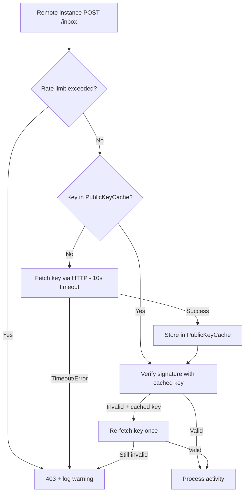

# Instruction: Secure verify_signature() against DoS

## Feature

- **Summary**: Harden ActivityPub signature verification against denial-of-service by adding public key caching with retry, per-instance rate limiting, and unified failure logging.
- **Stack**: `Django 5.x`, `httpx 0.27+`, `django-ratelimit`
- **Branch name**: `fix/secure-verify-signature`
- **Parent Plan**: `none`
- **Sequence**: `standalone`
- Confidence: 9/10
- Time to implement: ~3h

## Existing files

- @suddenly/activitypub/signatures.py
- @suddenly/activitypub/models.py
- @suddenly/activitypub/inbox.py
- @config/settings/base.py
- @pyproject.toml

### New files to create

- `suddenly/activitypub/migrations/0002_publickeyache.py` (auto-generated)

## User Journey

## Implementation phases

### Phase 1: PublicKeyCache model + retry logic

> Add a dedicated cache table for remote actor public keys and integrate retry-on-failure into verify_signature().

1. Create `PublicKeyCache` model in `suddenly/activitypub/models.py`:
   - Fields: `actor_url` (unique, indexed), `public_key_pem` (TextField), `fetched_at` (DateTimeField auto)
   - UUID primary key (project convention)
2. Generate and apply migration
3. Refactor `verify_signature()` in `signatures.py`:
   - Before HTTP fetch, check `PublicKeyCache` for existing key
   - On signature verification failure with cached key: re-fetch key once, update cache, retry verification
   - On successful fetch (new or re-fetch): upsert `PublicKeyCache` entry
   - Keep existing 10s timeout on httpx call
4. Add tests: cache hit, cache miss, retry on stale key, timeout handling

### Phase 2: Rate limiting per instance

> Limit incoming requests per remote instance domain to prevent DoS.

1. Add `django-ratelimit` to `pyproject.toml` federation extras
2. Create rate limiting helper in `suddenly/activitypub/inbox.py`:
   - Extract domain from incoming request (HTTP Signature `keyId` or `Host`)
   - Check if domain exists in `FederatedServer` (known) or not (unknown)
   - Known instances: 100 req/min
   - Unknown instances: 10 req/min
3. Apply rate limit check in `process_inbox()` before `verify_signature()` call
4. Add tests: known instance under/over limit, unknown instance under/over limit

### Phase 3: Unified failure logging

> Ensure all rejection paths return 403 and log a warning with context.

1. Add structured `logger.warning()` calls in `verify_signature()` and `process_inbox()` for:
   - Rate limit exceeded (domain, request count)
   - HTTP timeout on key fetch (actor URL, elapsed time)
   - Invalid signature after retry (actor URL, key ID)
2. Return `HttpResponseForbidden` (403) for all rejection paths
3. Add tests: verify log output for each failure scenario

## Validation flow

1. Start dev server with a clean DB
2. Simulate a valid ActivityPub POST to /inbox with a signed request -> should succeed and cache the key
3. Repeat the same request -> should use cached key (verify no HTTP outbound call)
4. Simulate a request with a rotated key (old cached key fails) -> should re-fetch, cache new key, succeed
5. Simulate 11+ rapid requests from an unknown domain -> 11th should get 403
6. Simulate a request with a keyId pointing to a slow/unresponsive server -> should timeout at 10s and return 403
7. Check logs for warning entries on each failure case
