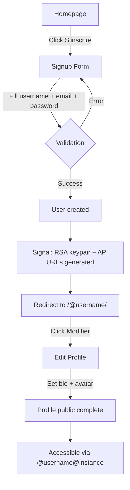

# Instruction: US-01 — Créer mon compte

## Feature

- **Summary**: Enable user registration on a Suddenly instance with public profile accessible via @username@instance, bio and avatar configuration. Includes test tooling bootstrap (factories + E2E).
- **Stack**: `Django 5.0, django-allauth 0.61, Pillow 10.2, cryptography 42.0, pytest-playwright, factory-boy 3.3, Tailwind CSS, HTMX`
- **Branch name**: `feat/us01-create-account`
- **Parent Plan**: `none`
- **Sequence**: `standalone`
- Confidence: 9/10
- Time to implement: ~5h

## Existing files

- @suddenly/users/models.py
- @suddenly/users/views.py
- @suddenly/users/forms.py
- @suddenly/users/urls.py
- @suddenly/users/admin.py
- @suddenly/users/migrations/0001_initial.py
- @suddenly/users/migrations/0002_user_language_prefs.py
- @suddenly/activitypub/signatures.py
- @config/settings/base.py
- @config/settings/development.py
- @templates/users/profile.html
- @templates/users/profile_edit.html
- @templates/components/form_fields.html
- @tests/conftest.py
- @tests/test_users.py
- @pyproject.toml
- @Makefile

### New files to create

- tests/factories.py
- templates/account/signup.html
- templates/account/login.html
- templates/account/logout.html

## User Journey

## Implementation phases

### Phase 0 — Test tooling bootstrap

> Set up factory-boy factories and Playwright E2E infrastructure (DEC-019)

1. Create `tests/factories.py`:
   - `UserFactory` — `username` via `Sequence`, `email` via `LazyAttribute`, `password` via `PostGenerationMethodCall("set_password", ...)`
   - `GameFactory` — `title` via `Sequence`, `owner` via `SubFactory(UserFactory)`
   - `CharacterFactory` — `name` via `Sequence`, `creator` + `origin_game` via SubFactory, `status` default `"npc"`
   - `ReportFactory` — `title` via `Sequence`, `author` + `game` via SubFactory, `status` default `"draft"`
2. Refactor `tests/conftest.py`:
   - Replace all `User.objects.create_user(...)` / `Game.objects.create(...)` with factory calls
   - Keep fixture signatures identical (`user`, `other_user`, `game`, `character`, `pc_character`, `report`, `api_client`, `authenticated_client`)
3. Run `make check` — confirm zero regression on existing 7 test files
4. Add `pytest-playwright` to `[project.optional-dependencies] dev` in `pyproject.toml`
5. Add Playwright config in `pyproject.toml`:
   - `[tool.pytest.ini_options]` markers: `e2e`
   - Default: exclude E2E from normal runs (`addopts = "-m 'not e2e'"`)
6. Install: `pip install -e ".[dev]"`

### Phase 1 — Auth templates (allauth)

> Custom allauth templates styled with Tailwind, consistent with existing profile templates

1. Create `templates/account/signup.html`:
   - Extend base template
   - Fields: username, email, password1, password2
   - Reuse `components/form_fields.html` for field rendering
   - Link to login page
2. Create `templates/account/login.html`:
   - Fields: login (username or email), password
   - Reuse `components/form_fields.html`
   - Links to signup and password reset
3. Create `templates/account/logout.html`:
   - Confirmation message + submit button
4. Verify existing wiring:
   - `path("accounts/", include("allauth.urls"))` in `suddenly/urls.py`
   - `LOGIN_REDIRECT_URL = "/"` in settings — consider changing to `"/@{username}/"` via allauth adapter
   - `ACCOUNT_EMAIL_VERIFICATION = "optional"` — keep as-is for MVP

### Phase 2 — ActivityPub actor initialization

> Generate RSA keypair and set AP URLs on user creation (DEC-018 standards)

1. Use allauth `user_signed_up` signal (preferred over `post_save` — fires once, only for real signups):
   - Call `generate_key_pair()` from `suddenly/activitypub/signatures.py`
   - Set `private_key` and `public_key` on user
   - Set `ap_id = f"{AP_BASE_URL}/users/{username}"`
   - Set `inbox_url = f"{ap_id}/inbox"`
   - Set `outbox_url = f"{ap_id}/outbox"`
   - Save user
2. Guard: skip if `user.remote is True` (defensive, should never happen via allauth)
3. Crypto standards (DEC-018):
   - RSA 2048-bit, PKCS8 private, SPKI public
   - keyId will be `{ap_id}#main-key` (used later in actor serialization, not stored)
4. Signal handler location: `suddenly/users/signals.py` (new file) + wire in `users/apps.py` `ready()`

### Phase 3 — Tests

> Unit tests for signup + AP initialization, E2E test for registration journey

1. **Unit: signup creates user with AP fields**
   - POST to `/accounts/signup/` with valid data
   - Assert user created, `ap_id` populated, `public_key` starts with `-----BEGIN PUBLIC KEY-----`, `private_key` populated
   - Assert `inbox_url` and `outbox_url` follow pattern `{AP_BASE_URL}/users/{username}/{inbox|outbox}`
2. **Unit: signup validation errors**
   - Duplicate username → form error, no user created
   - Duplicate email → form error, no user created
   - Weak password → form error
3. **Unit: remote user has no keys**
   - Create user via `UserFactory(remote=True)` — assert `public_key` and `private_key` remain empty
4. **Unit: factory smoke test**
   - `UserFactory.create_batch(5)` — all have unique usernames and emails
5. **E2E (Playwright): full registration journey**
   - Navigate to `/accounts/signup/`
   - Fill username, email, password, confirm password
   - Submit → verify redirect to profile page
   - Verify profile shows `@username@instance`
   - Navigate to edit profile → set bio → save
   - Verify bio displayed on public profile

## Validation flow

1. `make check` passes (lint + typecheck + tests)
2. Navigate to `/accounts/signup/`, fill form, submit
3. Verify redirect to `/@username/`
4. Verify profile page shows username and `@username@instance` identifier
5. Verify user has RSA keys in database (`manage.py shell`)
6. Navigate to `/@username/edit/`, set bio and avatar, save
7. Verify updated profile displays bio and avatar
8. `pytest tests/ -m e2e` passes

## Confidence: 9/10

- ✅ User model already has all required fields (bio, avatar, AP fields, RSA keys)
- ✅ django-allauth configured and wired in settings/urls
- ✅ `generate_key_pair()` exists in `signatures.py`, validated against Fediverse standards (DEC-018)
- ✅ Profile view and edit already implemented with templates
- ✅ CI pipeline functional (`make check`)
- ❌ `cryptography` is in optional `[federation]` deps — must be installed locally
