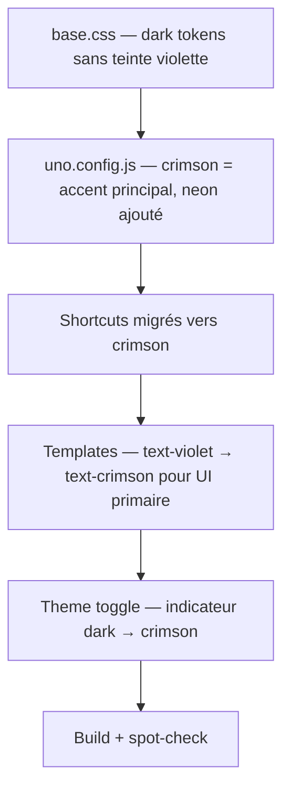

# Cyberpunk Palette — Rouge/Vert Néon

## Feature

- **Summary**: Migrer l'accent primaire UI de violet vers crimson (rouge), retirer la teinte violette du dark mode, ajouter le token neon vert. Violet conservé pour usages per-page uniquement.
- **Stack**: `UnoCSS 0.62`, `Django templates`, `Vite 5.4`
- **Branch name**: `feat/cyberpunk-palette`
- **Parent Plan**: none
- **Sequence**: standalone
- Confidence: 9/10
- Time to implement: 1h

## Existing files

- @frontend/src/base.css
- @frontend/uno.config.js
- @templates/ (20+ fichiers)

### New files to create

- none

## User Journey

## Règle de migration

| Contexte | Ancienne classe | Nouvelle classe |
|----------|-----------------|-----------------|
| Nav active, tabs actifs | `border-violet text-violet` | `border-crimson text-crimson` |
| Liens hover | `hover:text-violet` | `hover:text-crimson` |
| Icônes UI (dashboard, onboarding, home) | `text-violet` | `text-crimson` |
| Badges status (claimed, pending info) | `bg-violet/10 text-violet` | `bg-crimson/10 text-crimson` |
| Info boxes | `bg-violet/10 border-violet/30` | `bg-crimson/10 border-crimson/30` |
| Notifications unread | `bg-violet/10`, `bg-violet` | `bg-crimson/10`, `bg-crimson` |
| Checkboxes | `text-violet` | `text-crimson` |
| HTMX loading bar | `bg-violet` | `bg-crimson` |
| Theme toggle thumb dark | `bg-violet` | `bg-crimson` |
| Theme toggle border dark | `border-violet/50` | `border-crimson/50` |
| Moon icon toggle | `text-violet` | `text-crimson` |
| Logo hover | `hover:text-violet` | `hover:text-crimson` |
| **Conserver** violet | `bg-violet-100 text-violet-600` (Tailwind classique, notification_item:31) | **migrer** → `bg-crimson/10 text-crimson` |
| **Conserver** blockquotes | `border-crimson/40` | inchangé |
| **Conserver** btn-danger | crimson | inchangé |

## Implementation phases

### Phase 1 — Tokens (base.css + uno.config.js)

> Mettre à jour les design tokens dark mode et les shortcuts pour faire de crimson l'accent primaire.

1. `frontend/src/base.css` — mettre à jour `[data-theme="dark"]` :
   - `--c-bg: #0a0a0a`
   - `--c-surface: #111111`
   - `--c-card: #1a1a1a`
   - `--c-card-dark: #222222`
   - `--c-border: #2a2a2a`
   - `--c-primary: #f0f0f0`
   - `--c-secondary: #a0a0a0`
   - `--c-muted: #606060`
   - `--shadow-card: 0 0 24px rgba(224,53,88,0.12), 0 2px 8px rgba(0,0,0,0.4)`
   - `--shadow-card-hover: 0 0 36px rgba(224,53,88,0.22), 0 4px 16px rgba(0,0,0,0.5)`
   - `--body-bg: radial-gradient(ellipse at top, rgba(60,10,20,0.6), #0a0a0a) #0a0a0a`

2. `frontend/uno.config.js` :
   - Ajouter : `neon: { DEFAULT: '#00e676', hover: '#00c853' }`
   - `boxShadow.btn` → `'0 4px 20px rgba(224,53,88,0.35)'` (halo crimson)
   - `btn-primary` → `bg-crimson hover:bg-crimson-hover hover:shadow-btn`
   - `btn-secondary` → `hover:border-crimson hover:text-crimson`
   - `label-overline` → `text-crimson`
   - `link` → `text-crimson hover:text-crimson-hover`
   - `form-dropzone-link` → `text-crimson hover:text-crimson-hover`
   - `badge-claimed` → `bg-crimson/10 text-crimson border-crimson/30`
   - `presetTypography cssExtend` → `a { color: '#e03558' }` (était `#7c3aed`)
   - Safelist : ajouter `text-neon`, `bg-neon/10`, `border-neon/30`, `bg-crimson`, `bg-crimson/10`, `border-crimson`, `border-crimson/30`, `border-crimson/50`, `text-crimson`, `hover:bg-crimson/10`, `text-crimson/80`
   - Safelist : conserver `bg-violet`, `border-violet`, `text-violet`, `hover:text-violet/60` (violet réservé aux usages per-page futurs)

### Phase 2 — Migration templates

> Grep + remplacement ciblé violet → crimson dans les 20+ templates. Ne pas faire de find-replace global — inspecter chaque occurrence.

Fichiers et remplacements à effectuer (basé sur l'audit) :

- `base.html` : logo `hover:text-violet` → `hover:text-crimson` ; moon icon `text-violet` → `text-crimson` ; login/signup links `text-violet` → `text-crimson` ; HTMX bar `bg-violet` → `bg-crimson` ; theme toggle thumb `bg-violet` → `bg-crimson`, border `:class` `border-violet/50` → `border-crimson/50`
- `feed/home.html` : tabs actifs `border-violet text-violet` → `border-crimson text-crimson` (3 occurrences)
- `feed/_feed_items.html` : `hover:text-violet` → `hover:text-crimson` (2 occurrences)
- `characters/link_requests.html` : tabs actifs + badge pending → crimson
- `characters/gm_dashboard.html` : hovers → crimson
- `characters/detail.html` : hover → crimson
- `characters/sequence_edit.html` : `text-violet/80`, `bg-violet/10 border-violet/30` → crimson
- `games/report_create.html` : badge new report + close button → crimson
- `components/feed_item.html` : hovers → crimson (3 occurrences)
- `components/report_card.html` : hovers → crimson (3 occurrences)
- `components/report_editor.html` : badge + close button → crimson
- `components/quote_card.html` : hovers → crimson
- `components/character_card.html` : hover → crimson
- `components/game_card.html` : hover → crimson
- `components/notification_item.html` : unread bg/dot + `bg-violet-100 text-violet-600` → `bg-crimson/10 text-crimson`
- `notifications/_items.html` : unread bg/dot/badge → crimson
- `admin_panel/dashboard.html` : icônes → crimson
- `onboarding/step3.html` : icônes → crimson
- `core/home.html` : SITE_NAME + icônes + `bg-violet/10` → crimson
- `core/about.html` : icônes → crimson
- `users/profile_edit.html` : checkbox → crimson
- `account/login.html` : checkbox → crimson
- `components/form_fields.html` : checkbox → crimson

### Phase 3 — Validation

1. `cd frontend && pnpm run build` — sans erreur
2. Vérifier `#e03558` comme couleur d'accent dans le CSS généré (pas `#7c3aed`)
3. Vérifier `#0a0a0a` comme bg dark (pas `#0a0a12`)
4. `python manage.py runserver` — spot-check :
   - Nav active : rouge crimson ✓
   - Boutons primaires : rouge crimson ✓
   - Hovers sur les cartes : rouge crimson ✓
   - Background dark : noir pur sans teinte violette ✓
   - Toggle switch dark : thumb rouge ✓
   - Logout : toujours rouge/crimson ✓

## Validation flow

1. `pnpm run build` sans erreur
2. `python manage.py runserver` — vérifier les 6 points du spot-check
3. Dark mode + light mode : accents crimson visibles dans les deux
4. Violet absent des éléments globaux (présent uniquement si une page spécifique l'utilise intentionnellement)
