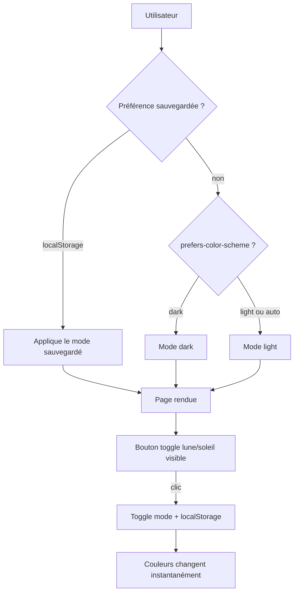

# Dark/Light Mode — Master Plan

## Feature

- **Summary**: Refonte du design system Suddenly avec dark/light mode toggle — "néon dans la nuit" pour le dark, parchemin chaud pour le light. Approche CSS custom properties : zéro changement de template pour les phases 1-2.
- **Stack**: `UnoCSS 0.62`, `Alpine.js 3.14`, `Vite 5.4`, `Django templates`
- **Branch name**: `feat/dark-light-mode`
- **Parent Plan**: none
- **Sequence**: master
- Confidence: 9/10
- Time to implement: 2–3h

## Child plans

- Part 1 — CSS variables + palette: `2026_04_28-dark-light-mode-part-1.md`
- Part 2 — Theme toggle: `2026_04_28-dark-light-mode-part-2.md`
- Part 3 — Accent migration templates: `2026_04_28-dark-light-mode-part-3.md`

## Design tokens (source of truth)

### Mode dark [data-theme="dark"]
| Token CSS | Valeur |
|-----------|--------|
| --c-bg | #0a0a12 |
| --c-surface | #111120 |
| --c-card | #141428 |
| --c-card-dark | #1c1c38 |
| --c-border | #3d3d80 |
| --c-primary | #f0f0ff |
| --c-secondary | #a8a8cc |
| --c-muted | #6868a0 |
| --shadow-card | 0 0 24px rgba(124,58,237,0.18), 0 2px 8px rgba(0,0,0,0.4) |
| --shadow-card-hover | 0 0 36px rgba(124,58,237,0.30), 0 4px 16px rgba(0,0,0,0.5) |
| --body-bg | radial-gradient(ellipse at top, rgba(28,20,60,0.8), #0a0a12) #0a0a12 |

### Mode light :root
| Token CSS | Valeur |
|-----------|--------|
| --c-bg | #faf9f6 |
| --c-surface | #f0ede8 |
| --c-card | #ffffff |
| --c-card-dark | #f5f2ec |
| --c-border | #d4cfe8 |
| --c-primary | #1a1a2e |
| --c-secondary | #4a4a6a |
| --c-muted | #8a8aaa |
| --shadow-card | 0 2px 16px rgba(0,0,0,0.07) |
| --shadow-card-hover | 0 4px 24px rgba(0,0,0,0.12) |
| --body-bg | #faf9f6 |

### Accents (identiques dark et light)
| Token | Valeur |
|-------|--------|
| violet (accent principal) | #7c3aed / hover: #6d28d9 |
| crimson (accent secondaire) | #e03558 / hover: #c82a4a |
| success | #16a34a |
| warning | #d97706 |
| error | #e03558 |
| info | #6366f1 |

## User journey

## Confidence assessment

✅ CSS custom properties = zéro changement template pour phases 1-2
✅ Alpine.js localStorage pattern bien établi
✅ Anti-flash script = expérience sans clignotement
✅ UnoCSS supporte `var(--c-*)` comme valeur de couleur
✅ Phases indépendantes et shippables séparément
❌ Opacity modifiers (`/10`, `/30`) sur couleurs sémantiques ne fonctionnent pas avec CSS variables → les couleurs sémantiques (surface, card, etc.) ne doivent pas utiliser d'opacité modifier dans les templates (déjà le cas)
