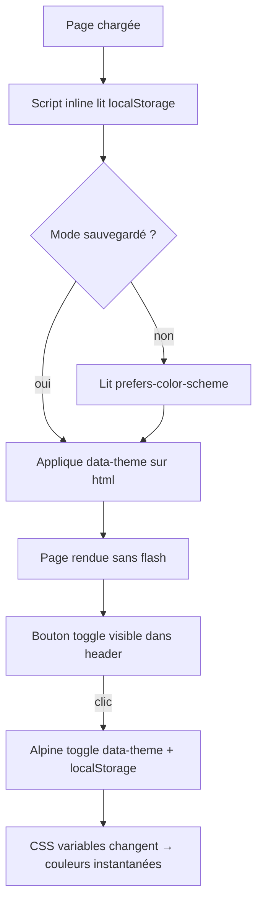

# Dark/Light Mode — Part 2: Theme Toggle

## Feature

- **Summary**: Ajouter le toggle dark/light dans le header via Alpine.js. Persistance localStorage. Initialisation sans flash via script inline dans `<head>`.
- **Stack**: `Alpine.js 3.14`, `Django templates`
- **Branch name**: `feat/dark-light-mode`
- **Parent Plan**: `2026_04_28-dark-light-mode-master.md`
- **Sequence**: `2 of 3`
- Confidence: 9/10
- Time to implement: 30min

## Existing files

- @frontend/src/main.js
- @templates/base.html

### New files to create

- none

## User Journey



## Implementation phases

### Phase 1 — Alpine.js composant `theme`

> Ajouter le composant de gestion du thème dans `frontend/src/main.js`.

1. Ajouter le composant `theme` à Alpine.data :
   ```js
   // Logique :
   // - init() : lit localStorage('theme') ou prefers-color-scheme
   // - applique data-theme sur document.documentElement
   // - toggle() : bascule entre 'dark' et 'light', sauvegarde localStorage
   // - isDark : computed booléen
   ```
2. Le composant gère uniquement `document.documentElement.dataset.theme`
3. Pas de cookie, pas de Django view — localStorage seul suffit

### Phase 2 — Anti-flash script dans base.html

> Script inline AVANT le chargement des CSS pour éviter le flash blanc au chargement en dark mode.

1. Ajouter dans `<head>`, AVANT `` :
   ```html
   <script>
   (function(){
     var t = localStorage.getItem('theme') ||
       (window.matchMedia('(prefers-color-scheme: dark)').matches ? 'dark' : 'light');
     document.documentElement.dataset.theme = t;
   })();
   </script>
   ```
2. Ce script est intentionnellement inline et minifié — pas de fichier externe (évite un aller-réseau)

### Phase 3 — Mise à jour base.html

> Brancher Alpine sur `<html>`, ajouter le bouton toggle dans le header.

1. Mettre à jour la balise `<html>` :
   - Ajouter `x-data="theme"` sur `<html>` (Alpine disponible globalement)
   - Ou sur un wrapper `<div>` englobant si `<html>` pose problème avec Alpine
   - Conserver `lang="{{ LANGUAGE_CODE|default:'en' }}"` et `class="h-full"`

2. Ajouter le bouton toggle dans le header, à droite des liens de navigation, avant le bouton "Log in" :
   ```html
   <button @click="toggle()"
           class="p-2 text-muted hover:text-primary transition-colors"
           :aria-label="isDark ? 'Switch to light mode' : 'Switch to dark mode'">
     <span x-show="isDark" class="i-lucide-sun text-xl"></span>
     <span x-show="!isDark" class="i-lucide-moon text-xl"></span>
   </button>
   ```
3. Ajouter le même bouton dans le menu mobile

## Validation flow

1. `python manage.py runserver` — ouvrir la page
2. Mode light visible par défaut (si prefers-color-scheme: light)
3. Cliquer le bouton → basculement instantané dark/light
4. Rafraîchir la page → le mode est mémorisé (localStorage)
5. Aucun flash blanc/noir au chargement
6. Vérifier en mode incognito → respecte prefers-color-scheme
