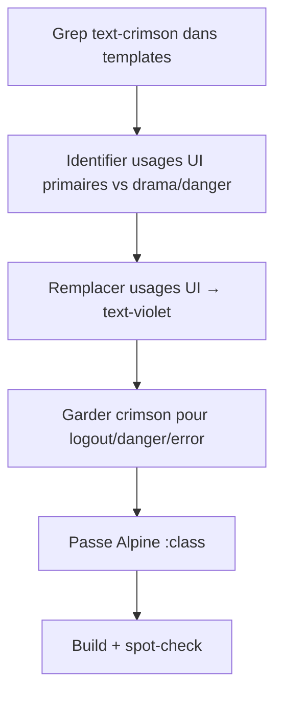

# Dark/Light Mode — Part 3: Accent Migration Templates

## Feature

- **Summary**: Remplacer les usages de `text-crimson` / `bg-crimson` utilisés comme accent UI primaire par `text-violet` / `bg-violet`. Garder crimson pour drama, danger, logout. Grep ciblé + passe manuelle Alpine :class.
- **Stack**: `Django templates`, `UnoCSS 0.62`
- **Branch name**: `feat/dark-light-mode`
- **Parent Plan**: `2026_04_28-dark-light-mode-master.md`
- **Sequence**: `3 of 3`
- Confidence: 8/10
- Time to implement: 1h

## Existing files

- @templates/ (tous sauf base.html)

### New files to create

- none

## User Journey

## Règle de migration

| Contexte | Ancienne classe | Nouvelle classe |
|----------|-----------------|-----------------|
| Liens de navigation actifs | `text-crimson` | `text-violet` |
| Labels overline | `label-overline` | (shortcut déjà mis à jour en Part 1) |
| Liens internes (`link`) | `text-crimson` | (shortcut déjà mis à jour en Part 1) |
| CTA, boutons primaires inline | `text-crimson` | `text-violet` |
| "Tout voir →", pagination | `text-crimson` | `text-violet` |
| Logout, déconnexion | `text-error` / `text-crimson` | **conserver** |
| Messages d'erreur | `text-error` | **conserver** |
| Accents dramatiques (citations) | `text-crimson` | **conserver** |
| Accent blockquote prose | (défini dans presetTypography) | `color: #7c3aed` |

## Implementation phases

### Phase 1 — Find-replace ciblé

> Remplacer `text-crimson` → `text-violet` pour les usages UI primaires uniquement.
> NE PAS faire un find-replace global — inspecter chaque occurrence.

1. Grep `text-crimson` dans `templates/` (hors base.html)
2. Pour chaque occurrence, déterminer le contexte :
   - Navigation, CTA, lien "voir plus", pagination → `text-violet`
   - Logout, danger, drama, citation → garder `text-crimson`
3. Même logique pour `hover:text-crimson` → `hover:text-violet` (usages UI)
4. `border-crimson` → `border-violet` pour les focus rings UI

### Phase 2 — presetTypography

> Mettre à jour la couleur des liens dans le rendu prose (reports).

1. Dans `uno.config.js`, mettre à jour `cssExtend` dans `presetTypography` :
   - `a.color` : `#7c3aed` (violet, était #e03558)
   - `blockquote.border-left-color` : conserver `#e03558` (drama)

### Phase 3 — Alpine :class bindings

> Grep `:class=` dans les templates pour vérifier les occurrences crimson résiduelles.

1. Grep `:class=` pour toute occurrence contenant `crimson`
2. Appliquer la même logique UI vs drama

### Phase 4 — Spot-check visuel

1. Nav active state : violet ✓
2. Boutons primaires : violet ✓
3. Logout : rouge/crimson ✓
4. Citations dans les reports : crimson blockquote ✓
5. Liens dans prose : violet ✓

## Validation flow

1. `pnpm run build` sans erreur
2. `python manage.py runserver` — vérifier les 5 points du spot-check
3. Dark mode + light mode : accents violet visibles dans les deux modes
