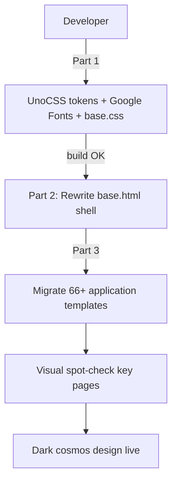

# Design System Alignment — Master Plan

## Feature

- **Summary**: Align the then.suddenly.social application design system with the suddenly.social showcase site — dark cosmos aesthetic, crimson accent, Crimson Text + Inter typography.
- **Stack**: `UnoCSS 0.62`, `Vite 5.4`, `Django templates`, `Alpine.js 3.14`, `Google Fonts`
- **Branch name**: `feat/design-system`
- **Parent Plan**: none
- **Sequence**: master
- Confidence: 9/10
- Time to implement: 3–4h

## Child plans

- Part 1 — Tokens & typography: `2026_04_28-design-system-alignment-part-1.md`
- Part 2 — Shell (base.html): `2026_04_28-design-system-alignment-part-2.md`
- Part 3 — Application templates: `2026_04_28-design-system-alignment-part-3.md`

## Design tokens (source of truth)

### Palette
| Token UnoCSS | Classe utilitaire | Value |
|---|---|---|
| background | `bg-background` | #0a0915 |
| surface | `bg-surface` | #100e20 |
| card | `bg-card` | #18162a |
| card-dark | `bg-card-dark` | #211e36 |
| border | `border-border` | #2d2845 |
| primary | `text-primary` | #ede8f5 |
| secondary | `text-secondary` | #b0a8cc |
| muted | `text-muted` | #7a7290 |
| crimson | `bg-crimson` / `text-crimson` | #e03558 |
| crimson-hover | (shortcut only) | #c82a4a |

### Ex-nihilo (flash messages & états)
| Token | Value |
|-------|-------|
| success | #16a34a |
| warning | #d97706 |
| error | #e03558 (crimson — cohérence accent) |
| info | #6366f1 |

### Typography
| Role | Family | Weights |
|------|--------|---------|
| sans (body, UI) | Inter | 400, 500, 600, 700 |
| serif (titles) | Crimson Text | 400, 600, 400italic |

> Playfair Display hors scope — utilisé uniquement pour le logo du site vitrine, absent de l'app.

## User journey

## Confidence assessment

✅ Design tokens fully extracted from CSS source — no guesswork
✅ UnoCSS shortcut system allows centralized migration
✅ No backend changes, no migrations
✅ Parts are sequential but each independently shippable
✅ Form inputs and Alpine :class bindings explicitly covered in Part 3
❌ 66+ templates — bulk find-replace may miss edge cases → spot-check required
