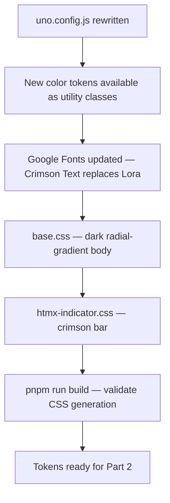

# Design System Alignment — Part 1: Tokens & Typography

## Feature

- **Summary**: Replace the current indigo/emerald/amber palette with the dark cosmos design tokens. Swap Google Fonts (Lora → Crimson Text). Add dark body background via radial-gradient in base.css.
- **Stack**: `UnoCSS 0.62`, `Vite 5.4`, `Google Fonts`
- **Branch name**: `feat/design-system`
- **Parent Plan**: `2026_04_28-design-system-alignment-master.md`
- **Sequence**: `1 of 3`
- Confidence: 9/10
- Time to implement: 45min

## Existing files

- @frontend/uno.config.js
- @frontend/src/base.css
- @frontend/src/htmx-indicator.css
- @templates/base.html

### New files to create

- none

## User Journey



## Implementation phases

### Phase 1 — Réécrire uno.config.js

> Remplacer la palette indigo/emerald/amber par les tokens dark cosmos. Conserver les shortcuts existants en les rebrancher sur les nouveaux tokens.

1. Remplacer les couleurs `primary`, `secondary`, `accent`, `gray` par :
   - `background: '#0a0915'`
   - `surface: '#100e20'`
   - `card: { DEFAULT: '#18162a', dark: '#211e36' }`
   - `border: '#2d2845'`
   - `primary: '#ede8f5'` (text-primary)
   - `secondary: '#b0a8cc'` (text-secondary)
   - `muted: '#7a7290'` (text-muted)
   - `crimson: { DEFAULT: '#e03558', hover: '#c82a4a' }`
   - `success: '#16a34a'`, `warning: '#d97706'`, `error: '#e03558'`, `info: '#6366f1'`
2. Remplacer `serif: Lora` par `serif: ['Crimson Text', 'Georgia', 'serif']`
3. Supprimer `display: Playfair Display` (hors scope app)
4. Réécrire les shortcuts :
   - `btn-primary` → `bg-crimson text-white px-7 py-[13px] text-[15px] font-semibold rounded-[12px] transition-all duration-250 hover:bg-crimson-hover hover:-translate-y-0.5 hover:shadow-btn`
   - `btn-secondary` → `bg-transparent border border-border text-secondary px-7 py-[13px] text-[15px] font-semibold rounded-[12px] transition-all duration-250 hover:border-crimson hover:text-crimson hover:-translate-y-0.5`
   - `btn-ghost` → `bg-transparent text-secondary hover:text-primary transition-colors`
   - `btn-danger` → `bg-error text-white ... hover:bg-error/90`
   - `card` → `bg-card border border-border rounded-2xl p-6`
   - `dropdown-menu` → `bg-surface border border-border rounded-[12px] shadow-lg`
   - `label-overline` → `text-crimson text-[12px] font-medium tracking-[3px] uppercase`
   - `input-base` (nouveau) → `bg-card border border-border rounded-[12px] text-primary placeholder-muted focus:border-crimson focus:ring-1 focus:ring-crimson outline-none`
5. Ajouter dans le safelist : les nouvelles classes dynamiques si nécessaire
6. Conserver les shortcuts `badge-*` (available/claimed/adopted/forked/pc) — vérifier lisibilité sur fond dark
7. Conserver z-index tokens et animation durations

### Phase 2 — Google Fonts dans base.html

> Remplacer Lora par Crimson Text. Supprimer Playfair Display.

1. Remplacer le `<link>` Google Fonts :
   - Supprimer `family=Lora:ital,wght@0,400;0,600;1,400`
   - Ajouter `family=Crimson+Text:ital,wght@0,400;0,600;1,400`
   - Conserver `family=Inter:wght@400;500;600;700`
   - Ne pas ajouter Playfair Display

### Phase 3 — base.css

> Ajouter le fond dark avec radial-gradient. Supprimer le reset color redondant.

1. Remplacer le contenu par :
   ```css
   body {
     background: radial-gradient(ellipse at top, rgba(24,18,40,0.5), #0a0915) #0a0915;
     color: #ede8f5;
   }

   a {
     text-decoration: none;
   }
   ```

### Phase 4 — htmx-indicator.css

> Mettre à jour la barre de chargement en crimson.

1. Remplacer la couleur de la barre HTMX par `#e03558`

## Validation flow

1. `cd frontend && pnpm run build` — doit compiler sans erreur
2. Vérifier dans le CSS généré que les classes `bg-crimson`, `text-primary`, `bg-surface`, `bg-background` sont présentes
3. `python manage.py runserver` — ouvrir la page d'accueil : fond quasi-noir visible via base.css
