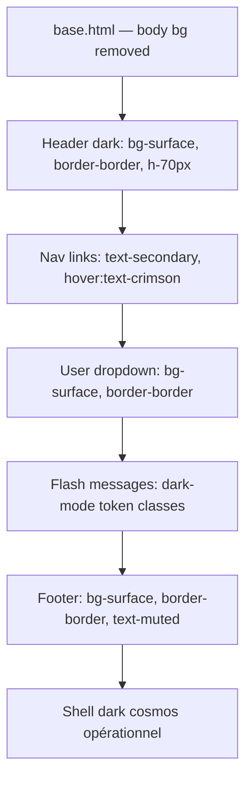

# Design System Alignment — Part 2: Shell (base.html)

## Feature

- **Summary**: Rewrite base.html to use the new dark cosmos tokens — body, header, nav, user dropdown, mobile menu, flash messages, footer.
- **Stack**: `Django templates`, `UnoCSS 0.62`, `Alpine.js 3.14`
- **Branch name**: `feat/design-system`
- **Parent Plan**: `2026_04_28-design-system-alignment-master.md`
- **Sequence**: `2 of 3`
- Confidence: 9/10
- Time to implement: 30min

## Existing files

- @templates/base.html

### New files to create

- none

## User Journey

## Implementation phases

### Phase 1 — Body

> Supprimer les classes de fond clair sur body ; le radial-gradient est dans base.css.

1. Remplacer `class="h-full bg-gray-50 text-gray-900 font-sans antialiased"` par `class="h-full font-sans antialiased"`

### Phase 2 — Header & navigation

> Passer le header en dark avec les tokens surface/border.

1. Header : `bg-white border-gray-200` → `bg-surface border-border`
2. Logo : `text-gray-900 hover:text-primary-600` → `text-primary hover:text-crimson`
3. Nav links : `text-gray-600 hover:text-gray-900` → `text-secondary hover:text-primary`
4. Boutons login/signup : utiliser les shortcuts `btn-ghost btn-sm` et `btn-primary btn-sm`

### Phase 3 — User dropdown

> Appliquer les tokens dark au dropdown utilisateur.

1. Dropdown items : `text-gray-700 hover:bg-gray-100` → `text-secondary hover:bg-card`
2. Séparateur `hr` : `border-gray-200` → `border-border`
3. Logout : `text-red-600 hover:bg-red-50` → `text-error hover:bg-error-bg`

### Phase 4 — Menu mobile

> Même migration que le header pour le menu mobile.

1. Fond : `bg-white border-gray-200` → `bg-surface border-border`
2. Liens : `text-gray-600` → `text-secondary`
3. Login/signup : `text-primary-600` → `text-crimson`

### Phase 5 — Flash messages

> Remplacer les classes Tailwind light par les tokens dark ex-nihilo.

1. success : `bg-green-50 text-green-800 border-green-200` → `bg-success-bg text-success border-success/30`
2. error : `bg-red-50 text-red-800 border-red-200` → `bg-error-bg text-error border-error/30`
3. warning : `bg-amber-50 text-amber-800 border-amber-200` → `bg-warning-bg text-warning border-warning/30`
4. info : `bg-blue-50 text-blue-800 border-blue-200` → `bg-info-bg text-info border-info/30`

### Phase 6 — Footer

> Footer dark cohérent avec le header.

1. Footer wrapper : `bg-white border-gray-200` → `bg-surface border-border`
2. Logo/description : `text-gray-600`, `text-gray-400`, `text-gray-500` → `text-secondary`, `text-muted`
3. Liens footer : `text-gray-500 hover:text-gray-900` → `text-muted hover:text-primary`

## Validation flow

1. `python manage.py runserver` — ouvrir la page d'accueil
2. Vérifier header dark, logo visible, nav links en text-secondary
3. Se connecter — vérifier dropdown dark
4. Déclencher un message flash — vérifier rendu dark cohérent
5. Vérifier le footer dark en bas de page
