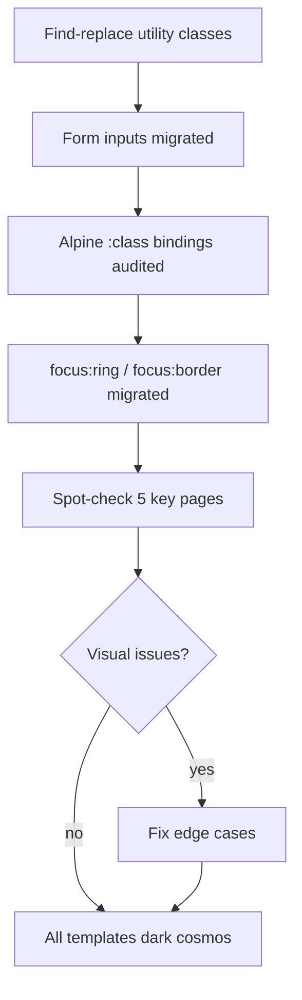

# Design System Alignment — Part 3: Application Templates

## Feature

- **Summary**: Migrate all 66+ application templates from the light gray/indigo palette to the dark cosmos tokens — find-replace on utility classes, targeted pass on form inputs and Alpine :class bindings, then visual spot-check.
- **Stack**: `Django templates`, `UnoCSS 0.62`
- **Branch name**: `feat/design-system`
- **Parent Plan**: `2026_04_28-design-system-alignment-master.md`
- **Sequence**: `3 of 3`
- Confidence: 9/10
- Time to implement: 1.5–2h

## Existing files

- @templates/ (all subdirectories, excluding base.html already done in Part 2)

### New files to create

- none

## User Journey

## Token mapping (find → replace)

### Backgrounds & surfaces
| Old class | New class |
|-----------|-----------|
| `bg-white` | `bg-surface` |
| `bg-gray-50` | `bg-surface` |
| `bg-gray-100` | `bg-card` |
| `hover:bg-gray-100` | `hover:bg-card` |
| `hover:bg-gray-50` | `hover:bg-card` |

### Textes
| Old class | New class |
|-----------|-----------|
| `text-gray-900` | `text-primary` |
| `text-gray-700` | `text-secondary` |
| `text-gray-600` | `text-secondary` |
| `text-gray-500` | `text-muted` |
| `text-gray-400` | `text-muted` |
| `hover:text-gray-900` | `hover:text-primary` |
| `hover:text-gray-700` | `hover:text-secondary` |

### Bordures & séparateurs
| Old class | New class |
|-----------|-----------|
| `border-gray-200` | `border-border` |
| `border-gray-100` | `border-border` |
| `border-gray-300` | `border-border` |
| `divide-gray-200` | `divide-border` |

### Accent (primary → crimson)
| Old class | New class |
|-----------|-----------|
| `text-primary-600` | `text-crimson` |
| `bg-primary-600` | `bg-crimson` |
| `hover:text-primary-600` | `hover:text-crimson` |
| `hover:bg-primary-600` | `hover:bg-crimson` |
| `border-primary-600` | `border-crimson` |
| `ring-primary-500` | `ring-crimson` |
| `ring-primary-600` | `ring-crimson` |

### Focus états (formulaires)
| Old class | New class |
|-----------|-----------|
| `focus:border-primary-600` | `focus:border-crimson` |
| `focus:ring-primary-500` | `focus:ring-crimson` |
| `focus:ring-primary-600` | `focus:ring-crimson` |
| `focus:ring-indigo-*` | `focus:ring-crimson` |

### Formulaires (inputs, selects, textareas)
| Old pattern | New pattern |
|-------------|-------------|
| `bg-white border-gray-300 text-gray-900` | `bg-card border-border text-primary` |
| `placeholder-gray-400` | `placeholder-muted` |
| `disabled:bg-gray-100` | `disabled:bg-card-dark` |
| `disabled:text-gray-400` | `disabled:text-muted` |

### Messages flash (si présents dans templates enfants)
| Old class | New class |
|-----------|-----------|
| `bg-green-50 text-green-800 border-green-200` | `bg-success/10 text-success border-success/30` |
| `bg-red-50 text-red-800 border-red-200` | `bg-error/10 text-error border-error/30` |
| `bg-amber-50 text-amber-800 border-amber-200` | `bg-warning/10 text-warning border-warning/30` |
| `bg-blue-50 text-blue-800 border-blue-200` | `bg-info/10 text-info border-info/30` |

## Implementation phases

### Phase 1 — Find-replace global

> Appliquer le mapping couleur sur tous les fichiers dans `templates/` sauf `base.html`.

1. Appliquer chaque ligne du mapping ci-dessus sur l'ensemble des templates
2. Ne pas toucher aux classes non-couleur (layout, spacing, typography)
3. Traiter par catégorie dans l'ordre : backgrounds → textes → bordures → accent → focus → formulaires → messages

### Phase 2 — Alpine :class bindings

> Les expressions `:class="{...}"` et `:class="..."` ne sont pas atteignables par find-replace textuel.

1. Grep tous les templates pour `:class=` et `x-bind:class=`
2. Pour chaque occurrence, inspecter manuellement et appliquer le mapping token correspondant
3. Cas typiques : `:class="{'bg-gray-100': isActive}"` → `{'bg-card': isActive}`

### Phase 3 — Spot-check visuel

> Vérifier le rendu des 5 pages représentatives.

1. Page d'accueil (`/`) — cards reports, hero
2. Liste des parties (`/games/`) — cards games
3. Liste des personnages (`/characters/`) — cards + badges status
4. Profil utilisateur (`/@<username>/`) — avatar, bio, stats
5. Page À propos (`/about/`) — stats instance

### Phase 4 — Corrections edge cases

> Fixer les anomalies identifiées lors du spot-check.

1. Corriger les classes manquées ou mal mappées
2. Vérifier lisibilité des formulaires (inputs, labels, placeholders sur fond dark)
3. Vérifier badges status (available/claimed/adopted/forked/pc) lisibles sur fond dark

## Validation flow

1. `python manage.py runserver` + navigation sur les 5 pages ci-dessus
2. Aucun fond blanc parasite visible
3. Textes lisibles sur fond dark (contraste suffisant)
4. Champs de formulaire avec fond dark, bordure et placeholder visibles
5. Badges et statuts bien différenciés
6. Focus visible sur les inputs (ring crimson)
