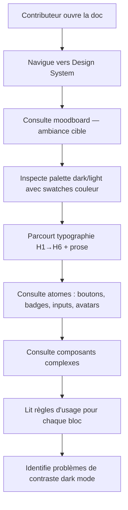

# Design System Documentation Page

## Feature

- **Summary**: Create a `docs/design-system.md` page in MkDocs with full visual catalog of Suddenly's design tokens, typography, UI atoms, and complex components — serves as diagnostic for dark mode issues and contribution guide.
- **Stack**: `MkDocs Material`, `CSS inline`
- **Branch name**: `feat/design-system-doc`
- **Parent Plan**: none
- **Sequence**: standalone
- Confidence: 9/10
- Time to implement: 1h30

## Existing files

- @docs/index.md
- @docs/translations.md
- @mkdocs.yml
- @frontend/src/base.css
- @frontend/uno.config.js

### New files to create

- `docs/design-system.md`
- `docs/stylesheets/design-system.css`

## User Journey



## Implementation phases

### Phase 1 — CSS custom pour les previews

> Ajouter un fichier CSS docs-only qui injecte les tokens Suddenly dans MkDocs Material, permettant de rendre les blocs HTML inline avec les vraies couleurs.

1. Créer `docs/stylesheets/design-system.css` :
   - Déclarer les variables CSS Suddenly (copie de `base.css`) sous `.sd-` prefix pour éviter conflits avec Material
   - Définir des classes preview : `.sd-swatch` (carré couleur), `.sd-btn-primary`, `.sd-btn-secondary`, `.sd-btn-ghost`, `.sd-btn-danger`, `.sd-card`, `.sd-badge`, `.sd-input`, `.sd-avatar`
   - Ces classes utilisent les vraies valeurs hex (pas de CSS variables — MkDocs n'a pas le toggle Suddenly)
   - Deux blocs : `.sd-dark` (wrapper dark) et `.sd-light` (wrapper light) avec backgrounds respectifs
2. Ajouter dans `mkdocs.yml` :
   ```yaml
   extra_css:
     - stylesheets/design-system.css
   ```

### Phase 2 — Page design-system.md

> Créer le contenu complet de la page, section par section.

1. **Moodboard** :
   - Lien SonOfOak avec description : "sombre, littéraire, dramatique — typographie serif, espaces respirants"
   - Description textuelle AI Anime Chat : "dark purple bg, accents violet néon, cards avec halo coloré, contraste élevé"
   - Admonition `tip` récapitulant les principes : "néon dans la nuit, pas monochrome"

2. **Palette & tokens** :
   - Tableau Markdown : Token | Variable CSS | Light | Dark
   - Swatches inline HTML (`<span class="sd-swatch" style="background:#faf9f6">`) pour chaque valeur
   - Tableau accents : violet / crimson / success / warning / error / info + règle d'usage courte

3. **Typographie** :
   - Blocs HTML inline montrant H1→H6 avec Inter (headings) et Crimson Text (prose/citations)
   - Montrer `label-overline`, corps de texte, texte secondaire, muted
   - Règle : "Inter pour UI, Crimson Text pour prose narrative uniquement"

4. **Atomes UI** — pour chaque groupe, un bloc HTML preview + tableau règles d'usage :
   - Boutons : `btn-primary`, `btn-secondary`, `btn-ghost`, `btn-danger` + variantes `btn-sm` / `btn-lg`
   - Badges : tous les `badge-*` côte à côte
   - Labels & liens : `label-overline`, `link`, `form-label`, `form-help`, `form-error`
   - Inputs : `input-base`, textarea, select, checkbox, radio, `form-dropzone`
   - Avatars : tailles sm/md/lg/xl + placeholder

5. **Composants complexes** — description + extrait de code HTML :
   - Card (default + card-hover)
   - Dropdown menu
   - Notification / toast (success / error / info)
   - Navigation active state (lien avec classe `text-violet`)
   - Theme toggle switch (le pill lune/soleil)

6. **Mise à jour `mkdocs.yml` nav** :
   ```yaml
   nav:
     - "← Back to Suddenly": https://then.suddenly.social
     - Home: index.md
     - Design System: design-system.md
     - Contributing:
       - Translations: translations.md
   ```

## Validation flow

1. `mkdocs serve` — ouvrir `http://localhost:8000`
2. Naviguer vers "Design System" dans la nav
3. Vérifier que les swatches couleur sont visibles
4. Vérifier que les previews boutons/badges/inputs s'affichent
5. Vérifier que la page est lisible et cohérente
6. `mkdocs build` sans erreur
