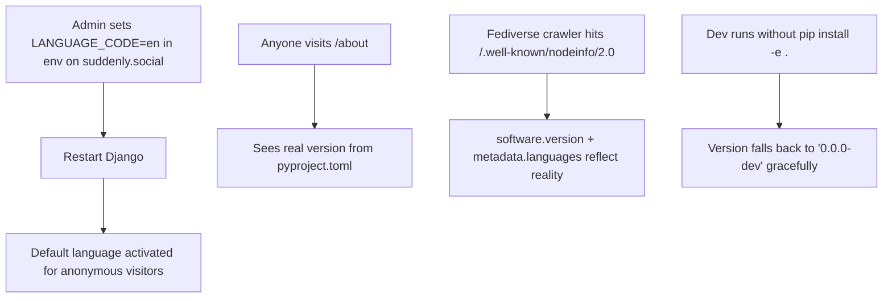

# Instruction: i18n + Versioning — Part 1: Infrastructure

## Feature

- **Summary**: Configure Django i18n infrastructure (env-driven, normalized language code), expose dynamic version everywhere it's currently hardcoded, advertise actually-available translations in NodeInfo. Shippable independently as PR #1.
- **Stack**: `Django 5.0.14`, `importlib.metadata`, `pytest-django`
- **Branch name**: `feat/i18n-infra`
- **Parent Plan**: `2026_04_28-i18n-versioning-master.md`
- **Sequence**: `1 of 3`
- **Confidence**: 9/10
- **Time to implement**: ~3h

## Existing files

- @config/settings/base.py
- @suddenly/core/context_processors.py
- @suddenly/activitypub/views.py
- @templates/core/about.html
- @suddenly/core/views.py
- @.gitignore
- @aidd_docs/external/alwaysdata-deployment.md
- @aidd_docs/external/docker-deployment.md
- @aidd_docs/external/vps-deployment.md

### New files to create

- `locale/fr/LC_MESSAGES/.gitkeep`
- `locale/en/LC_MESSAGES/.gitkeep`
- `suddenly/core/version.py` — version helper + available languages helper
- `tests/core/test_version.py`
- `tests/activitypub/test_nodeinfo_version.py`
- `tests/core/test_settings.py`

## User Journey



## Implementation phases

### Phase 1 — Version + languages helper module

> Centralize version reading and "what languages are actually available" detection.

1. Create `suddenly/core/version.py`:
   - `get_version() -> str`: uses `importlib.metadata.version("suddenly")` wrapped in try/except `PackageNotFoundError` → fallback `"0.0.0-dev"`. Cached with `functools.cache`.
   - `get_available_languages() -> list[str]`: scans `BASE_DIR / "locale"` for subdirectories containing a non-empty `LC_MESSAGES/django.mo` (or `.po` if `.mo` not yet compiled). Returns sorted list. Decorated with `@functools.cache`.
2. Tests in `tests/core/test_version.py`:
   - Nominal `get_version()` returns string matching `pyproject.toml`
   - Mock `PackageNotFoundError` → returns `"0.0.0-dev"`
   - **Important**: each test calls `get_version.cache_clear()` to avoid cross-test pollution
   - `get_available_languages()` returns `["en", "fr"]` when both dirs exist, `[]` when locale dir empty

### Phase 2 — Audit and normalize `fr-fr` → `fr`

> Single occurrence confirmed in `config/settings/base.py:105`. Trivial change but flagged for visibility.

1. Confirm via grep: only `config/settings/base.py:105` references `fr-fr` in source code (verified: no cookies, no tests, no fixtures)
2. In `config/settings/base.py`:
   - Replace `LANGUAGE_CODE = "fr-fr"` with `LANGUAGE_CODE = os.environ.get("LANGUAGE_CODE", "fr")` (use `os.environ` since `django-environ` not installed)
   - Add `LANGUAGES = [("en", "English"), ("fr", "Français")]` (English first as source language)
   - Add `LOCALE_PATHS = [BASE_DIR / "locale"]`
   - Insert `"django.middleware.locale.LocaleMiddleware"` AFTER `SessionMiddleware` (index 2) and BEFORE `HtmxMiddleware` (current index 3) — resulting index 3 in the new list
3. Document in `CHANGELOG` or PR description: "If your `.env` had `LANGUAGE_CODE=fr-fr`, change to `fr`"

### Phase 3 — Locale directory scaffolding + .gitignore

> Create empty locale tree so `makemessages` (Part 2) has somewhere to write.

1. Create `locale/fr/LC_MESSAGES/.gitkeep` and `locale/en/LC_MESSAGES/.gitkeep`
2. Add to `.gitignore`:
   ```
   # i18n compiled catalogs (generated at deploy time)
   locale/*/LC_MESSAGES/*.mo
   ```
3. Add `gettext` system dependency note to all 3 deployment docs (alwaysdata, docker, vps): `apt-get install gettext` (Debian/Ubuntu) or equivalent. For Alwaysdata: check if `gettext` is pre-installed via SSH (`which msgfmt`); if unavailable, document the fallback of committing `.mo` files directly (not gitignored for that case).

### Phase 4 — Plug version + languages into context processor + NodeInfo + about

> Replace all hardcoded "0.1.0" and expose available languages.

1. In `suddenly/core/context_processors.py`: add `APP_VERSION` key calling `get_version()`
2. In `suddenly/activitypub/views.py` NodeInfo view:
   - Replace `"0.1.0"` with `get_version()`
   - Add `metadata.languages = get_available_languages()` (uses helper, reflects reality)
3. In `templates/core/about.html`: replace `{{ version|default:"0.1.0" }}` with `{{ APP_VERSION }}`

### Phase 5 — Tests

> Lock the contract.

1. `tests/activitypub/test_nodeinfo_version.py`: assert `software.version == get_version()`
2. `tests/activitypub/test_nodeinfo_version.py`: assert `metadata.languages` matches `get_available_languages()`
3. `tests/core/test_settings.py`:
   - Assert `LocaleMiddleware` positioned between `SessionMiddleware` and `CommonMiddleware`
   - Assert `LANGUAGE_CODE` reads from env (mock `os.environ` for the test)
   - Assert `LOCALE_PATHS` configured
   - Assert `LANGUAGES` contains `en` first, `fr` second

## Validation flow

1. `python manage.py check` → no errors
2. `pytest tests/core/test_version.py tests/activitypub/test_nodeinfo_version.py tests/core/test_settings.py -v` → all green
3. `LANGUAGE_CODE=en python manage.py runserver`, visit `/` → page renders (no template translations yet, but no crash, French strings still display)
4. `curl http://localhost:8000/.well-known/nodeinfo/2.0` → JSON contains `"version": "<actual pyproject version>"` and `"languages": []` (empty list because no `.mo` files yet — will populate after Part 2)
5. Visit `/about` → version line shows actual pyproject version
6. `pytest --cov=suddenly/core/version --cov-report=term-missing` → 100% coverage on `version.py`
