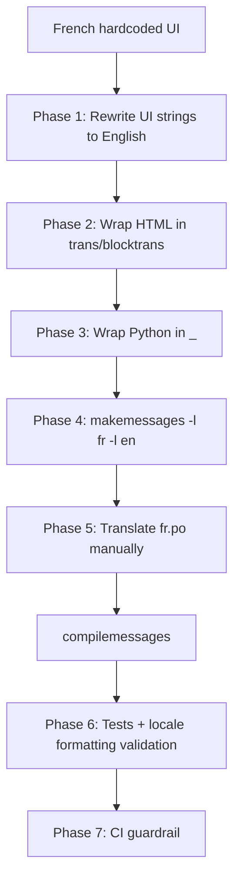

# Instruction: i18n + Versioning — Part 2: English Source Rewrite + Templates + Catalogs

## Feature

- **Summary**: Rewrite all UI strings in 66 templates and Python code from French to English (canonical source), wrap with `` / `_()`, generate fr/en catalogs, translate French, compile, validate locale-dependent formatting (dates, numbers).
- **Stack**: `Django 5.0.14`, `gettext`, `pytest-django`
- **Branch name**: `feat/i18n-templates`
- **Parent Plan**: `2026_04_28-i18n-versioning-master.md`
- **Sequence**: `2 of 3` (depends on Part 1 merged)
- **Confidence**: 8/10
- **Time to implement**: ~12h (rewrite to English ≈ 4h, balisage ≈ 6h, translation + tests ≈ 2h)

## Existing files (66 HTML templates + Python sources)

- @templates/base.html
- @templates/core/*.html
- @templates/users/*.html
- @templates/account/*.html (allauth overrides)
- @templates/characters/*.html
- @templates/games/*.html
- @templates/feed/*.html
- @templates/notifications/*.html
- @templates/onboarding/*.html
- @templates/components/*.html
- @suddenly/users/forms.py, models.py
- @suddenly/characters/models.py
- @suddenly/games/models.py
- @suddenly/**/views.py (flash messages)

### New files to create

- `locale/fr/LC_MESSAGES/django.po`
- `locale/en/LC_MESSAGES/django.po`
- `tests/core/test_i18n.py`
- `tests/core/test_locale_formatting.py`
- `Makefile` target `i18n-check`
- Update `make check` to include `i18n-check`

## User Journey



## Implementation phases

### Phase 1 — Rewrite UI source strings to English

> Source language decision is English (canonical Django convention). Rewrite BEFORE wrapping.

1. Walk each template, replace French UI strings with English equivalents
   - Examples: "Bienvenue sur Suddenly" → "Welcome to Suddenly", "Connexion" → "Log in", "Mes parties" → "My games"
2. Same for Python: model verbose_names, choice labels, form labels, flash messages
3. Same for templates'`<title>` blocks
4. Do NOT touch user-generated content references, code identifiers, technical strings
5. Commit by directory for reviewability ("rewrite: core templates to English", "rewrite: characters to English", etc.)

### Phase 2 — HTML balisage (66 templates)

> Wrap all (now-English) UI strings.

1. Add `` at top of each template containing UI text (skip if `base.html` is extended AND base loads it — verify)
2. Wrap simple strings: ``
3. Wrap interpolated strings: `Adopt {{ name }}`
4. Wrap pluralized strings: `1 character{{ counter }} characters`
5. Do NOT wrap: user-generated content (titles, names, bios, content), URLs, CSS classes, data attributes, technical IDs, HTML comments

### Phase 3 — Python strings

> Same treatment for Python user-facing strings.

1. Import `from django.utils.translation import gettext_lazy as _` in models, forms, choices files
2. Wrap `verbose_name`, `help_text`, `TextChoices` labels with `_()`: e.g. `CLAIMED = "claimed", _("Revealed")`
3. Wrap Form field labels and help texts with `_()`
4. In views: `from django.utils.translation import gettext as _` then `messages.success(request, _("Profile updated"))`
5. NOT to wrap: log strings, exception messages (developer-facing), API error codes

### Phase 4 — Generate catalogs

> One single makemessages run, AFTER both HTML + Python balisage.

1. `python manage.py makemessages -l fr -l en --no-wrap --ignore=venv --ignore=node_modules --ignore=staticfiles`
   - Rationale for `--no-wrap`: stable diffs, easier review
2. Verify both `.po` files created with all extracted msgids in English
3. Commit both `.po` files

### Phase 5 — Translate French + compile

> French is the primary translation (instance default for soudainement.fr). English is identity (no translation needed since source is English).

1. `locale/en/LC_MESSAGES/django.po`: leave msgstrs empty (Django falls back to msgid which is already English)
2. `locale/fr/LC_MESSAGES/django.po`: translate every msgid to French
3. `python manage.py compilemessages -l fr -l en` → generates `.mo` files
4. Verify NodeInfo `metadata.languages` (from Part 1) now returns `["en", "fr"]`

### Phase 6 — Tests including locale-dependent formatting

> Smoke tests + format validation.

1. `tests/core/test_i18n.py::test_locale_files_exist` — verify both `.po` files present
2. `tests/core/test_i18n.py::test_no_fuzzy_translations` — parse fr.po, fail if any `#, fuzzy` or empty msgstr
3. `tests/core/test_i18n.py::test_homepage_renders_in_english` — set lang=en, hit `/`, assert "Welcome" present
4. `tests/core/test_i18n.py::test_homepage_renders_in_french` — set lang=fr, hit `/`, assert "Bienvenue" present (proves translation IS active, not just identity)
5. `tests/core/test_locale_formatting.py::test_date_format_french` — assert French date format (`28 avril 2026`)
6. `tests/core/test_locale_formatting.py::test_date_format_english` — assert English date format (`April 28, 2026`)
7. `tests/core/test_locale_formatting.py::test_number_format` — assert thousand separator differs per locale

### Phase 7 — CI guardrail (no `--check` flag in Django 5.0)

> Verified: `python manage.py makemessages --check` does NOT exist. Use git diff approach.

1. Create `Makefile` target `i18n-check`:
   ```makefile
   i18n-check:
   	python manage.py makemessages -l fr -l en --no-wrap --ignore=venv --ignore=node_modules --ignore=staticfiles
   	@git diff --exit-code locale/ || (echo "i18n catalogs out of date; commit makemessages output" && exit 1)
   ```
2. Add `i18n-check` to `make check` target (alongside lint, typecheck, test)
3. CI must run `make check` (already wired per project rules)

## Validation flow

1. `LANGUAGE_CODE=en python manage.py runserver` → all major pages display English
2. `LANGUAGE_CODE=fr python manage.py runserver` → all major pages display French
3. `make i18n-check` → exit 0
4. Modify a template (add new English string) without running makemessages → `make i18n-check` → exit 1
5. `pytest tests/core/test_i18n.py tests/core/test_locale_formatting.py -v` → all green
6. Coverage on touched files maintained ≥ 80%
7. Verify a published Spanish-titled report displays as-is (user content untouched)
8. NodeInfo now returns `metadata.languages: ["en", "fr"]` (after compilemessages)
