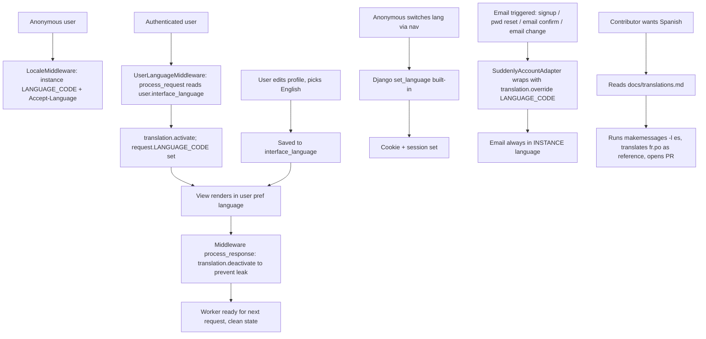

# Instruction: i18n + Versioning — Part 3: User Preference, Email Override & Contributor Docs

## Feature

- **Summary**: Add a NEW `interface_language` field on User (separate from confirmed-used `content_language` content-filtering field), activate it via thread-safe middleware (with `process_response` deactivate), expose in profile form + nav switcher (Django built-in `set_language`), force instance language for ALL allauth transactional emails, ship contributor docs.
- **Stack**: `Django 5.0.14`, `django-allauth`, `pytest-django`
- **Branch name**: `feat/i18n-user-pref`
- **Parent Plan**: `2026_04_28-i18n-versioning-master.md`
- **Sequence**: `3 of 3` (depends on Part 1 merged; can be developed in parallel with Part 2)
- **Confidence**: 9/10
- **Time to implement**: ~6h

## Existing files

- @suddenly/users/models.py
- @suddenly/users/views.py
- @suddenly/users/forms.py
- @suddenly/users/admin.py
- @suddenly/core/middleware.py
- @templates/users/profile_edit.html
- @templates/base.html
- @config/settings/base.py
- @config/urls.py
- @CONTRIBUTING.md (root)
- @README.md

### New files to create

- `suddenly/users/migrations/00XX_add_interface_language.py`
- `suddenly/users/adapters.py` — custom AccountAdapter forcing instance language
- `docs/translations.md` — contributor guide (linked from root CONTRIBUTING.md)
- `tests/core/test_user_language_middleware.py`
- `tests/users/test_interface_language.py`
- `tests/core/test_email_language.py`

## User Journey



## Implementation phases

### Phase 1 — New `interface_language` field (NOT repurposing `content_language`)

> Verified: `content_language` IS used (admin filter, ProfileForm, profile_edit.html template, migration 0002). It's content filtering, not UI. Add a separate field.

1. In `suddenly/users/models.py`:
   - Above existing language fields, add comment block clarifying their content-filtering purpose
   - Add new field: `interface_language = models.CharField(max_length=10, blank=True, default="", help_text=_("UI language. Empty = use instance default."))`
2. Generate migration: `python manage.py makemigrations users -n add_interface_language`
3. Run migration on dev DB; verify existing users have `interface_language=""` (empty default)
4. Test in `tests/users/test_interface_language.py`: existing users keep `content_language` unchanged, get empty `interface_language`

### Phase 2 — Thread-safe `UserLanguageMiddleware`

> Critical bug fix from challenge: must deactivate after response.

1. In `suddenly/core/middleware.py`, add:
   ```python
   class UserLanguageMiddleware:
       def __init__(self, get_response):
           self.get_response = get_response

       def __call__(self, request):
           activated = False
           if request.user.is_authenticated and request.user.interface_language:
               try:
                   translation.activate(request.user.interface_language)
                   request.LANGUAGE_CODE = request.user.interface_language
                   activated = True
               except Exception:
                   pass  # invalid lang code; fall through to LocaleMiddleware default
           try:
               return self.get_response(request)
           finally:
               if activated:
                   translation.deactivate()
   ```
2. Register in `MIDDLEWARE` AFTER `LocaleMiddleware` (index 3 after Part 1) and AFTER `AuthenticationMiddleware` (index 7 after Part 1 insertion) — resulting index 8
3. Tests in `tests/core/test_user_language_middleware.py`:
   - Anonymous → no override, no leak
   - Authenticated empty pref → no override
   - Authenticated valid pref → translation activated during request, deactivated after
   - Authenticated invalid pref ("xx-yy") → graceful fallback, no exception bubbled
   - **Concurrent simulation** (mock-based, not pytest-xdist): use `concurrent.futures.ThreadPoolExecutor` with `django.test.Client` per thread; request 1 with `interface_language="en"`, request 2 anonymous — assert request 2 response language is NOT English

### Phase 3 — Profile form + UI + nav switcher

> Use Django built-in `set_language` view, no custom endpoint.

1. In `suddenly/users/forms.py` `ProfileForm`:
   - Add `interface_language` to `fields` tuple
   - Override widget: `forms.Select(choices=[("", _("Use instance default"))] + list(settings.LANGUAGES))`
2. In `suddenly/users/admin.py`: add `interface_language` to `fieldsets` (alongside content_language for admin clarity)
3. In `templates/users/profile_edit.html`: render the new field with label "Interface language"
4. In `config/urls.py`: add `path("i18n/", include("django.conf.urls.i18n"))` (exposes Django's `set_language`)
5. In `templates/base.html`: add compact form in header:
   ```html
   <form method="post" action="" class="inline-flex items-center gap-1">
     
     <input type="hidden" name="next" value="{{ request.path }}">
     <select name="language" onchange="this.form.submit()">
       
       
       
         <option value="{{ lang_code }}" selected>{{ lang_name }}</option>
       
     </select>
     <noscript><button type="submit">OK</button></noscript>
   </form>
   ```
   - Anonymous: cookie + session set by `set_language`
   - Authenticated: set_language sets cookie too, but on next request UserLanguageMiddleware overrides — acceptable (user explicitly clicked)

### Phase 4 — Force instance language for ALL allauth emails

> Custom adapter — single point of truth, covers signup, password reset, email confirmation, email change, account deletion.

1. Create `suddenly/users/adapters.py`:
   ```python
   from django.conf import settings
   from django.utils import translation
   from allauth.account.adapter import DefaultAccountAdapter

   class SuddenlyAccountAdapter(DefaultAccountAdapter):
       def send_mail(self, template_prefix, email, context):
           with translation.override(settings.LANGUAGE_CODE):
               return super().send_mail(template_prefix, email, context)
   ```
2. In `config/settings/base.py`: `ACCOUNT_ADAPTER = "suddenly.users.adapters.SuddenlyAccountAdapter"`
3. Tests in `tests/core/test_email_language.py` cover ALL email triggers:
   - Signup confirmation
   - Password reset
   - Email confirmation (after email change)
   - Email change confirmation
   - Account deletion confirmation (if allauth feature enabled)
   - For each: user has `interface_language="en"`, instance `LANGUAGE_CODE="fr"` → captured email body contains French strings, NOT English

### Phase 5 — Contributor documentation

> Required by user spec ("doc à prévoir pour traductions tierces"). Place at convention-friendly location.

1. Create `docs/translations.md` covering:
   - **Prerequisites**: Python 3.11+, gettext (`apt install gettext` / `brew install gettext` / `choco install gettext`)
   - **Adding a new language**: e.g. Spanish
     ```bash
     python manage.py makemessages -l es --no-wrap --ignore=venv --ignore=node_modules
     # Edit locale/es/LC_MESSAGES/django.po (use locale/fr/LC_MESSAGES/django.po as reference)
     python manage.py compilemessages -l es
     LANGUAGE_CODE=es python manage.py runserver
     ```
   - **Adding code to LANGUAGES**: edit `config/settings/base.py`
   - **Translating**: recommend Poedit GUI, explain plural forms (`Plural-Forms: nplurals=2; plural=n != 1;` for English)
   - **Rules**:
     - Only UI strings, never user content
     - Keep `msgid` stable (never edit English source in PRs that only translate)
     - Respect plural forms per language
     - No "fuzzy" entries in committed `.po` (review and unfuzz)
   - **PR checklist**: `.po` updated, all msgids translated, no fuzzy, manually tested
2. Update root `CONTRIBUTING.md` with section "Translations" pointing to `docs/translations.md`
3. Update `README.md` "Contributing" to mention translation contributions welcome

## Validation flow

1. Migration applies cleanly on populated DB → existing users have `interface_language=""`, `content_language` unchanged
2. Log in, edit profile, set "English" → reload any page → UI in English
3. Log out → UI back to instance language (e.g. French if `LANGUAGE_CODE=fr`)
4. As anonymous: click nav switcher to "English" → UI in English (cookie/session set by Django built-in)
5. **Concurrency test**: in production-like setup, two concurrent users (one with `interface_language=en`, other with empty) → each sees their own language, no cross-contamination
6. Trigger signup, password reset, email change → all received emails are in INSTANCE language regardless of user's `interface_language`
7. Follow `docs/translations.md` to add Spanish stub locally → instructions work end-to-end, NodeInfo updates `metadata.languages` to `["en", "es", "fr"]`
8. `pytest tests/core/test_user_language_middleware.py tests/users/test_interface_language.py tests/core/test_email_language.py` → all green
9. Coverage on new files = 100%, project total ≥ 80%

## Rollback plan

If incident in production:
1. Revert merge commit on main (Django migration auto-reverses)
2. Run migration: `python manage.py migrate users 0002` (the migration before this one) — drops `interface_language` column
3. Cookies set by `set_language` (`django_language=fr`) persist on user browsers but are harmless without `LocaleMiddleware` interpreting them — they expire after `LANGUAGE_COOKIE_AGE` (default 1 year). For faster cleanup, push a one-shot view that deletes the cookie.
4. Custom `AccountAdapter` config in settings: revert by removing `ACCOUNT_ADAPTER` line
