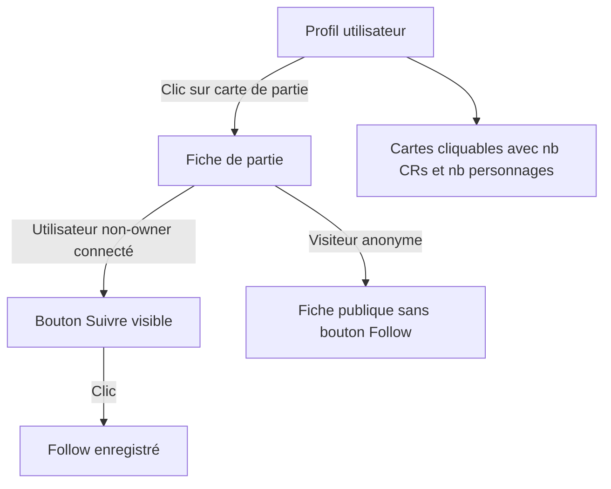

# Instruction: US-02 — Créer ma partie

## Feature

- **Summary**: Complete US-02 by making game cards on the profile page clickable with metadata, and wiring the follow button on the game detail page.
- **Stack**: `Django 5.x, HTMX, Alpine.js, UnoCSS`
- **Branch name**: `fix/us02-game-profile-follow`
- **Parent Plan**: `none`
- **Sequence**: `standalone`
- Confidence: 9/10
- Time to implement: ~1h

## Existing files

- @suddenly/users/views.py
- @suddenly/games/front_views.py
- @templates/users/profile.html
- @templates/games/detail.html
- @templates/components/follow_button.html
- @suddenly/characters/follow_views.py
- @suddenly/characters/models.py

### New files to create

- none

## User Journey



## Implementation phases

### Phase 1 — Profil : cartes de parties cliquables

> Rendre les cartes de parties sur le profil navigables et informatives.

1. Dans `templates/users/profile.html`, remplacer les `<div class="card card-body">` des parties par des `<a href="">` avec le même contenu
2. Ajouter dans la carte : nombre de CRs (`game.reports.count`) et nombre de personnages (`game.characters.count`)
3. Vérifier que `ProfileView` passe déjà les parties avec `select_related` ou `prefetch_related` — si non, ajouter `prefetch_related("reports", "characters")` pour éviter N+1

### Phase 2 — Fiche de partie : bouton Follow

> Ajouter le suivi d'une partie depuis sa fiche.

1. Dans `game_detail()` (`games/front_views.py`), calculer `is_following` :
   ```python
   from suddenly.characters.models import Follow
   from django.contrib.contenttypes.models import ContentType
   is_following = False
   if request.user.is_authenticated and request.user != game.owner:
       ct = ContentType.objects.get_for_model(game)
       is_following = Follow.objects.filter(
           follower=request.user, content_type=ct, object_id=game.pk
       ).exists()
   context["is_following"] = is_following
   ```
2. Dans `templates/games/detail.html`, inclure le composant dans l'en-tête de la fiche (à côté du titre, visible uniquement si non-owner) :
   ```html
   
     
   
   ```

## Validation flow

1. Se connecter et aller sur son profil `/@username/`
2. Vérifier que les cartes de parties sont cliquables et affichent nb CRs + nb personnages
3. Se déconnecter ou utiliser un autre compte, aller sur la fiche d'une partie publique
4. Vérifier que le bouton "Suivre" est affiché
5. Cliquer "Suivre" → vérifier que le Follow est enregistré (sans erreur 500)
6. Vérifier que le bouton bascule en "Ne plus suivre"
7. `make check` passe (lint + typecheck + tests)
