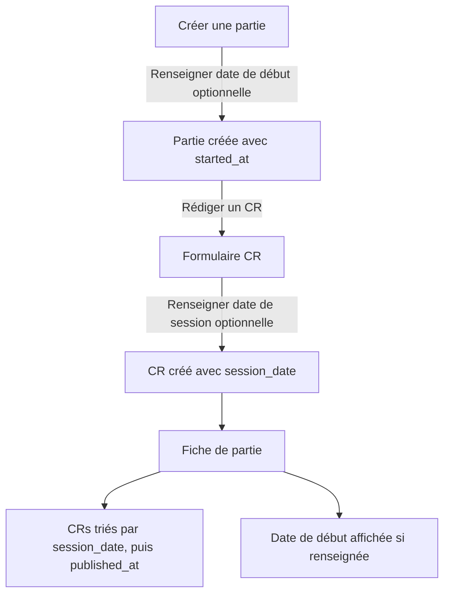

# Instruction: US-03 — Reconstituer une campagne passée

## Feature

- **Summary**: Allow players to create games with a past start date and write reports with a past session date, so that chronology respects session dates rather than publication dates.
- **Stack**: `Django 5.x, HTMX, Alpine.js, UnoCSS`
- **Branch name**: `feat/us03-partie-historique`
- **Parent Plan**: `none`
- **Sequence**: `standalone`
- Confidence: 9/10
- Time to implement: ~2h

## Existing files

- @suddenly/games/models.py
- @suddenly/games/front_views.py
- @suddenly/games/migrations/
- @templates/games/game_form.html
- @templates/games/report_compose.html
- @templates/games/report_form.html
- @templates/games/detail.html

### New files to create

- `suddenly/games/migrations/0010_game_started_at_report_session_date.py`

## User Journey



## Implementation phases

### Phase 1 — Modèles + migration

> Ajouter les champs date sur Game et Report, générer la migration.

1. Dans `suddenly/games/models.py` :
   - Ajouter sur `Game` : `started_at = models.DateField(null=True, blank=True)`
   - Ajouter sur `Report` : `session_date = models.DateField(null=True, blank=True)`
2. Générer la migration : `python manage.py makemigrations games --name game_started_at_report_session_date`
3. Appliquer : `python manage.py migrate`
4. Mettre à jour `Report.Meta.ordering` pour trier par `session_date` en premier (NULLS LAST), puis `published_at` :
   ```python
   ordering = [
       models.F("session_date").asc(nulls_last=True),
       models.F("published_at").desc(nulls_last=True),
       "-created_at",
   ]
   ```

### Phase 2 — Formulaires

> Exposer les champs date dans les formulaires de création/édition.

1. Dans `templates/games/game_form.html` : ajouter un champ `started_at` (type `date`, optionnel) après le champ `description`, avec label "Date de début (optionnelle)"
2. Dans `game_create()` et `game_edit()` (`games/front_views.py`) : lire `request.POST.get("started_at")` et l'assigner à `game.started_at` (parser avec `datetime.date.fromisoformat()`, ignorer si vide ou invalide)
3. Dans `templates/games/report_form.html` : ajouter un champ `session_date` (type `date`, optionnel) avec label "Date de session (optionnelle)"
4. Dans `report_create()` et `report_edit()` (`games/front_views.py`) : même pattern — lire, parser, assigner `report.session_date`

### Phase 3 — Affichage & tri

> Afficher les dates et respecter la chronologie.

1. Dans `templates/games/detail.html` :
   - Afficher `game.started_at` dans l'en-tête si renseigné (ex. "Depuis {{ game.started_at|date:'d/m/Y' }}")
   - Dans la liste des CRs, afficher `report.session_date` quand présent à la place de `published_at` (avec label "Session du")
2. Dans `games/front_views.py::game_detail()` : s'assurer que les reports sont triés par `session_date` NULLS LAST, puis `published_at` DESC (aligner avec `Report.Meta.ordering`)

## Validation flow

1. `make check` passe après la migration
2. Créer une partie avec une date de début dans le passé (ex. 01/01/2024) → vérifier que `started_at` est sauvegardé
3. Créer un CR avec une date de session dans le passé (ex. 15/03/2024) → vérifier `session_date` sauvegardé
4. Créer un second CR avec une date de session plus ancienne (ex. 01/03/2024) → vérifier que ce CR apparaît **avant** dans la fiche de partie
5. Créer un CR sans date de session → vérifier qu'il apparaît après les CRs datés (NULLS LAST)
6. `make check` passe (lint + typecheck + tests + coverage)
