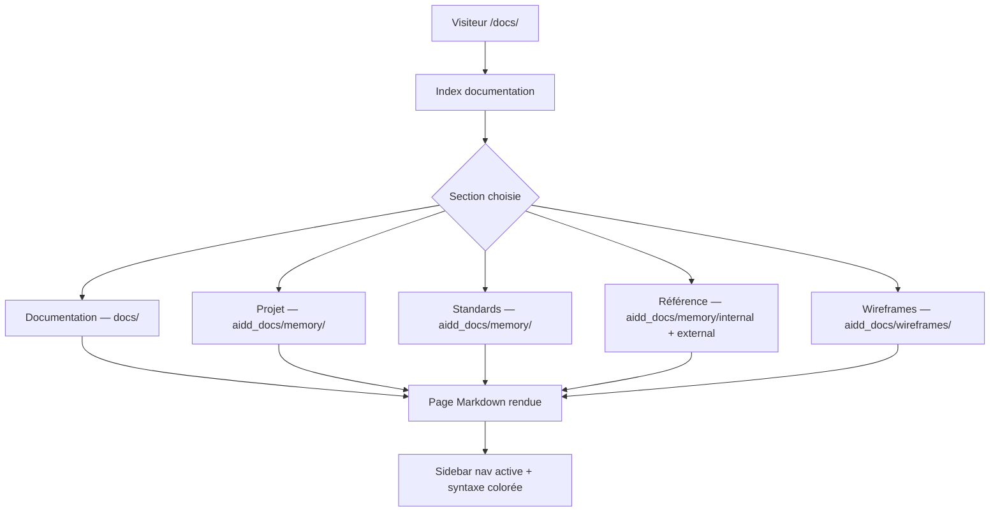

# Master Plan: Django Docs — Documentation intégrée

## Feature

- **Summary**: Replace MkDocs with a Django `docs` app that renders Markdown files from `docs/`, `aidd_docs/memory/`, and `aidd_docs/wireframes/` using the existing UnoCSS design system. The result serves both human developers joining the project and AI agents needing architecture/standards/API reference.
- **Stack**: `Django 5.x, HTMX, Alpine.js, UnoCSS, python-markdown`
- **Branch name**: `feat/django-docs`
- **Parent Plan**: none
- **Sequence**: master (3 parts)
- Confidence: 9/10
- Time to implement: ~3h

## User Journey

## Parts

| Part | Fichier | Scope |
|------|---------|-------|
| 1 | `2026_04_29-#06-django-docs-part-1.md` | App Django, URL routing, vue Markdown |
| 2 | `2026_04_29-#06-django-docs-part-2.md` | Templates (base docs + sidebar nav 5 sections) |
| 3 | `2026_04_29-#06-django-docs-part-3.md` | Contenu : mapping fichiers → nav, index, Pygments CSS |

## Source directories

| Section nav | Répertoire source | Description |
|-------------|------------------|-------------|
| Documentation | `docs/` | 4 fichiers : index, translations, design-system, import-export |
| Projet | `aidd_docs/memory/` (racine) | ARCHITECTURE, CODEBASE_MAP, PROJECT_BRIEF, DEPLOYMENT |
| Standards | `aidd_docs/memory/` (racine) | CODING_ASSERTIONS, TESTING, VCS |
| Référence | `aidd_docs/memory/internal/` + `aidd_docs/memory/external/` | API_DOCS, DATABASE, BookWyrm, claim-adopt-fork, guides déploiement |
| Wireframes | `aidd_docs/wireframes/` | README + 22 fichiers wireframes |

## Existing files

- @suddenly/urls.py
- @config/settings/base.py
- @templates/base.html
- @docs/index.md
- @docs/translations.md
- @docs/design-system.md
- @docs/import-export.md
- @aidd_docs/memory/ARCHITECTURE.md
- @aidd_docs/memory/CODING_ASSERTIONS.md
- @aidd_docs/memory/TESTING.md
- @aidd_docs/memory/VCS.md
- @aidd_docs/memory/DEPLOYMENT.md
- @aidd_docs/memory/PROJECT_BRIEF.md
- @aidd_docs/memory/CODEBASE_MAP.md
- @aidd_docs/memory/internal/API_DOCS.md
- @aidd_docs/memory/internal/DATABASE.md
- @aidd_docs/memory/external/
- @aidd_docs/wireframes/

### New files to create

- `suddenly/docs/__init__.py`
- `suddenly/docs/apps.py`
- `suddenly/docs/views.py`
- `suddenly/docs/urls.py`
- `suddenly/docs/nav.py`
- `templates/docs/base.html`
- `templates/docs/page.html`
- `templates/docs/index.html`
- `templates/components/docs_sidebar.html`
- `static/css/docs-pygments.css`

## Validation flow

1. `make check` passe
2. `/docs/` affiche la page d'index avec les 5 sections
3. Clic sur "Documentation → index" → page rendue avec syntaxe Markdown
4. Clic sur "Projet → Architecture" → `aidd_docs/memory/ARCHITECTURE.md` rendu
5. Clic sur "Wireframes → 18-report-character-links" → wireframe rendu
6. La sidebar indique la page active (lien surligné)
7. Les blocs de code ont la coloration syntaxique (Pygments)
8. Le design correspond à `base.html` (même header, même palette Indigo/Emerald/Amber)
