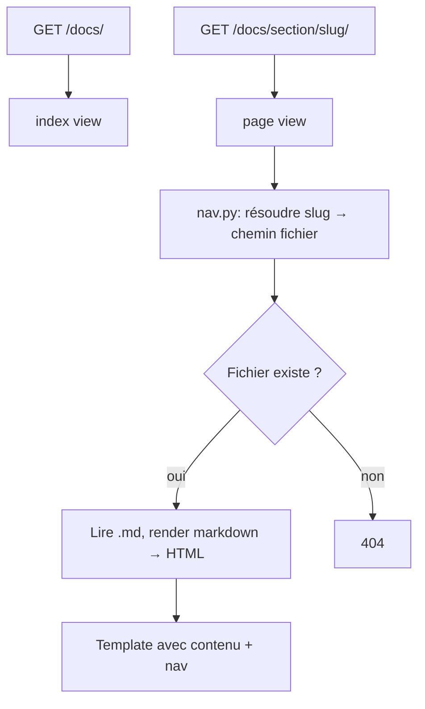

# Instruction: Django Docs — Part 1 : App + Routing + Rendering

## Feature

- **Summary**: Create the `suddenly.docs` Django app with a single view that resolves a doc slug to a Markdown file path, renders it to HTML, and passes rendered content + nav context to the template.
- **Stack**: `Django 5.x, python-markdown>=3.5, Pygments`
- **Branch name**: `feat/django-docs`
- **Parent Plan**: `2026_04_29-#06-django-docs-master.md`
- **Sequence**: 1 of 3
- Confidence: 9/10
- Time to implement: ~45min

## Existing files

- @suddenly/urls.py
- @config/settings/base.py
- @pyproject.toml

### New files to create

- `suddenly/docs/__init__.py`
- `suddenly/docs/apps.py`
- `suddenly/docs/nav.py`
- `suddenly/docs/views.py`
- `suddenly/docs/urls.py`

## User Journey



## Implementation phases

### Phase 1 — App Django

> Créer l'app `docs` et l'enregistrer.

1. Créer `suddenly/docs/__init__.py` (vide)
2. Créer `suddenly/docs/apps.py` :
   ```python
   from django.apps import AppConfig
   class DocsConfig(AppConfig):
       name = "suddenly.docs"
       label = "docs"
   ```
3. Dans `config/settings/base.py`, ajouter `"suddenly.docs"` à `INSTALLED_APPS`
4. Dans `pyproject.toml`, ajouter `"Pygments>=2.17"` aux dépendances (`markdown` est déjà présent, Pygments est requis par `codehilite` et absent du fichier)

### Phase 2 — Navigation map (`nav.py`)

> Définir la structure de navigation : section → liste d'entrées (slug, label, chemin fichier).

1. Créer `suddenly/docs/nav.py` avec `BASE_DIR = settings.BASE_DIR` et la constante `NAV` :
   ```python
   from pathlib import Path
   from django.conf import settings

   BASE = Path(settings.BASE_DIR)

   NAV: list[dict] = [
       {
           "section": "Documentation",
           "slug": "doc",
           "entries": [
               {"slug": "index",         "label": "Introduction",    "path": BASE / "docs/index.md"},
               {"slug": "design-system", "label": "Design System",   "path": BASE / "docs/design-system.md"},
               {"slug": "translations",  "label": "Traductions",     "path": BASE / "docs/translations.md"},
               {"slug": "import-export", "label": "Import / Export", "path": BASE / "docs/import-export.md"},
           ],
       },
       {
           "section": "Projet",
           "slug": "projet",
           "entries": [
               {"slug": "brief",       "label": "Brief",         "path": BASE / "aidd_docs/memory/PROJECT_BRIEF.md"},
               {"slug": "architecture","label": "Architecture",  "path": BASE / "aidd_docs/memory/ARCHITECTURE.md"},
               {"slug": "codebase",    "label": "Codebase Map",  "path": BASE / "aidd_docs/memory/CODEBASE_MAP.md"},
               {"slug": "deployment",  "label": "Déploiement",   "path": BASE / "aidd_docs/memory/DEPLOYMENT.md"},
           ],
       },
       {
           "section": "Standards",
           "slug": "standards",
           "entries": [
               {"slug": "coding",   "label": "Coding Guidelines", "path": BASE / "aidd_docs/memory/CODING_ASSERTIONS.md"},
               {"slug": "testing",  "label": "Tests",             "path": BASE / "aidd_docs/memory/TESTING.md"},
               {"slug": "vcs",      "label": "Git / VCS",         "path": BASE / "aidd_docs/memory/VCS.md"},
           ],
       },
       {
           "section": "Référence",
           "slug": "reference",
           "entries": [
               {"slug": "api",          "label": "API",                 "path": BASE / "aidd_docs/memory/internal/API_DOCS.md"},
               {"slug": "database",     "label": "Base de données",     "path": BASE / "aidd_docs/memory/internal/DATABASE.md"},
               {"slug": "bookwyrm",     "label": "BookWyrm (référence)", "path": BASE / "aidd_docs/memory/external/bookwyrm-architecture.md"},
               {"slug": "claim-fork",   "label": "Claim / Adopt / Fork","path": BASE / "aidd_docs/memory/external/claim-adopt-fork.md"},
               {"slug": "alwaysdata",   "label": "Alwaysdata",          "path": BASE / "aidd_docs/memory/external/alwaysdata-deployment.md"},
               {"slug": "vps",          "label": "VPS",                 "path": BASE / "aidd_docs/memory/external/vps-deployment.md"},
               {"slug": "docker",       "label": "Docker",              "path": BASE / "aidd_docs/memory/external/docker-deployment.md"},
               {"slug": "pr-template",  "label": "Pull Request",        "path": BASE / "aidd_docs/memory/external/pr-template.md"},
               {"slug": "task-workflow","label": "Task Workflow",        "path": BASE / "aidd_docs/memory/external/task-workflow.md"},
           ],
       },
       {
           "section": "Wireframes",
           "slug": "wireframes",
           "entries": [
               {"slug": "overview",        "label": "Index",              "path": BASE / "aidd_docs/wireframes/README.md"},
               {"slug": "ux-patterns",     "label": "UX Patterns",        "path": BASE / "aidd_docs/wireframes/00-ux-patterns.md"},
               {"slug": "layout",          "label": "Layout",             "path": BASE / "aidd_docs/wireframes/01-layout.md"},
               {"slug": "home",            "label": "Accueil",            "path": BASE / "aidd_docs/wireframes/02-home.md"},
               {"slug": "auth",            "label": "Auth",               "path": BASE / "aidd_docs/wireframes/03-auth.md"},
               {"slug": "profile",         "label": "Profil",             "path": BASE / "aidd_docs/wireframes/04-profile.md"},
               {"slug": "games",           "label": "Parties",            "path": BASE / "aidd_docs/wireframes/05-games.md"},
               {"slug": "reports",         "label": "CRs",                "path": BASE / "aidd_docs/wireframes/06-reports.md"},
               {"slug": "characters",      "label": "Personnages",        "path": BASE / "aidd_docs/wireframes/07-characters.md"},
               {"slug": "quotes",          "label": "Citations",          "path": BASE / "aidd_docs/wireframes/08-quotes.md"},
               {"slug": "links",           "label": "Liens",              "path": BASE / "aidd_docs/wireframes/09-links.md"},
               {"slug": "feed",            "label": "Feed",               "path": BASE / "aidd_docs/wireframes/10-feed.md"},
               {"slug": "notifications",   "label": "Notifications",      "path": BASE / "aidd_docs/wireframes/11-notifications.md"},
               {"slug": "gm-dashboard",    "label": "Dashboard GM",       "path": BASE / "aidd_docs/wireframes/12-gm-dashboard.md"},
               {"slug": "admin",           "label": "Admin",              "path": BASE / "aidd_docs/wireframes/13-admin.md"},
               {"slug": "federation",      "label": "Fédération",         "path": BASE / "aidd_docs/wireframes/14-federation.md"},
               {"slug": "settings",        "label": "Paramètres",         "path": BASE / "aidd_docs/wireframes/15-settings.md"},
               {"slug": "misc",            "label": "Divers",             "path": BASE / "aidd_docs/wireframes/16-misc.md"},
               {"slug": "instance-about",  "label": "À propos instance",  "path": BASE / "aidd_docs/wireframes/17-instance-about.md"},
               {"slug": "report-links",    "label": "CR — Liens perso",   "path": BASE / "aidd_docs/wireframes/18-report-character-links.md"},
               {"slug": "component-map",   "label": "Component Map",      "path": BASE / "aidd_docs/wireframes/COMPONENT_MAP.md"},
               {"slug": "style-guide",     "label": "Style Guide",        "path": BASE / "aidd_docs/wireframes/STYLE_GUIDE.md"},
               {"slug": "fediverse-audit", "label": "Audit Fediverse",    "path": BASE / "aidd_docs/wireframes/PERSONA_FEDIVERSE_AUDIT.md"},
           ],
       },
   ]

   def resolve(section_slug: str, entry_slug: str) -> Path | None:
       for section in NAV:
           if section["slug"] == section_slug:
               for entry in section["entries"]:
                   if entry["slug"] == entry_slug:
                       return entry["path"]
       return None
   ```

### Phase 3 — Vues (`views.py`)

> Vue index + vue page (render Markdown).

1. Créer `suddenly/docs/views.py` :
   - `import markdown` (déjà dans deps) avec extensions dans cet ordre précis : `["fenced_code", "tables", "toc", "codehilite(guess_lang=False)"]` — `fenced_code` DOIT être avant `codehilite` (sinon les blocs fencés ne sont pas colorisés)
   - Vue `index(request)` → rend `docs/index.html` avec `nav=NAV`
   - Vue `page(request, section, slug)` :
     - Appelle `nav.resolve(section, slug)` → si `None` : `raise Http404`
     - Lit le fichier avec `path.read_text(encoding="utf-8")` → si `FileNotFoundError` : `raise Http404`
     - Convertit en HTML avec `markdown.markdown(text, extensions=[...])`
     - Rend `docs/page.html` avec `content`, `nav`, `current_section`, `current_slug`

### Phase 4 — URLs (`urls.py` + câblage)

1. Créer `suddenly/docs/urls.py` :
   ```python
   from django.urls import path
   from . import views
   app_name = "docs"
   urlpatterns = [
       path("", views.index, name="index"),
       path("<str:section>/<str:slug>/", views.page, name="page"),
   ]
   ```
2. Dans `suddenly/urls.py`, ajouter avant les autres includes :
   ```python
   path("docs/", include("suddenly.docs.urls")),
   ```

## Validation flow

1. `make check` passe (lint + typecheck + tests)
2. `GET /docs/` renvoie 200
3. `GET /docs/doc/index/` renvoie 200 et le HTML contient "Suddenly"
4. `GET /docs/projet/architecture/` renvoie 200 et contient "ActivityPub"
5. `GET /docs/wireframes/report-links/` renvoie 200
6. `GET /docs/inexistant/foo/` renvoie 404
