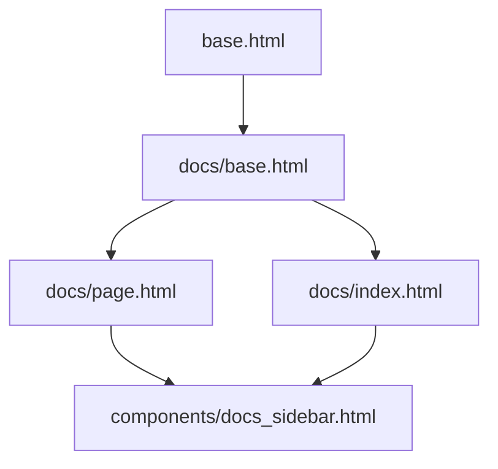

# Instruction: Django Docs — Part 2 : Templates

## Feature

- **Summary**: Build all templates for the docs section — a `docs/base.html` extending `base.html`, a sidebar nav component, a page template rendering Markdown HTML, and an index template. Uses the same UnoCSS palette (Indigo/Emerald/Amber) as the rest of the site.
- **Stack**: `Django templates, UnoCSS, Alpine.js, HTMX`
- **Branch name**: `feat/django-docs`
- **Parent Plan**: `2026_04_29-#06-django-docs-master.md`
- **Sequence**: 2 of 3
- Confidence: 9/10
- Time to implement: ~1h

## Existing files

- @templates/base.html
- @templates/components/
- @suddenly/docs/nav.py (créé en Part 1)
- @suddenly/docs/views.py (créé en Part 1)

### New files to create

- `templates/docs/base.html`
- `templates/docs/index.html`
- `templates/docs/page.html`
- `templates/components/docs_sidebar.html`

## User Journey

## Implementation phases

### Phase 1 — Base template docs

> Hérite de `base.html`, ajoute un layout 2 colonnes (sidebar + contenu).

1. Créer `templates/docs/base.html` :
   - ``
   - Block `title` : `Documentation — Suddenly`
   - Block `content` : layout flex avec sidebar gauche fixe (`w-64 shrink-0`) + zone contenu principale (`flex-1 min-w-0`)
   - Inclure `` dans la colonne gauche
   - Zone contenu : ``
   - Max-width container identique au reste du site (`container-app`)
   - Sticky sidebar : `sticky top-20 self-start`

### Phase 2 — Sidebar nav component

> Affiche les 5 sections avec leurs entrées ; surligne la page active.

1. Créer `templates/components/docs_sidebar.html` :
   - Itère `` — chaque section est un `
` avec `
` en titre de section
   - Label section : texte gras, couleur `text-primary` (`indigo`)
   - Pour chaque entrée : lien `<a href="">` 
   - Entrée active : `` → classe `bg-primary/10 text-primary font-medium` ; sinon `hover:bg-surface`
   - Icônes Lucide selon la section (optionnel) : `book`, `folder`, `code`, `database`, `layout`
   - Lien retour "← Application" en haut, pointant vers ``

### Phase 3 — Template index

> Page d'accueil de la doc avec les 5 sections en grille.

1. Créer `templates/docs/index.html` :
   - ``
   - Block `doc_content` : titre h1 "Documentation", sous-titre expliquant le double usage (devs + agents)
   - Grille 2 colonnes des 5 sections : chaque carte affiche le nom de section, le nombre d'entrées, et un lien vers la première entrée
   - Utiliser le style cards UnoCSS existant (`bg-surface border border-border rounded-lg p-4`)

### Phase 4 — Template page

> Affiche le HTML Markdown rendu avec styles typographiques.

1. Créer `templates/docs/page.html` :
   - ``
   - Block `doc_content` :
     - Breadcrumb : `Section > Label` avec liens
     - Zone prose : `
{{ content|safe }}
` — `prose-report` est le shortcut UnoCSS déjà défini (`prose max-w-none`)
     - L'extension `codehilite` produit des `
` — le CSS Pygments (Part 3) cible ces classes
   - Block `title` : label de la page courante + " — Suddenly"

### Phase 5 — Styles prose UnoCSS

> `presetTypography` est déjà importé et activé dans `frontend/uno.config.js` (ligne 188). Un shortcut `prose-report` y est défini comme `'prose max-w-none'`.

1. Dans `templates/docs/page.html`, utiliser `class="prose-report"` (shortcut UnoCSS déjà défini) plutôt que `class="prose max-w-none"`
2. Aucune modification de `uno.config.js` nécessaire

## Validation flow

1. `GET /docs/` affiche la page index avec 5 sections visibles
2. `GET /docs/doc/index/` affiche le contenu Markdown avec titre h1 stylisé
3. La sidebar est visible et la page active est surlignée
4. `GET /docs/wireframes/report-links/` affiche le wireframe avec les blocs de code rendus en ASCII art monospace dans `<pre>`
5. Responsive : sur mobile, la sidebar se replie (via `
`)
6. Le header et footer sont identiques au reste de l'application
