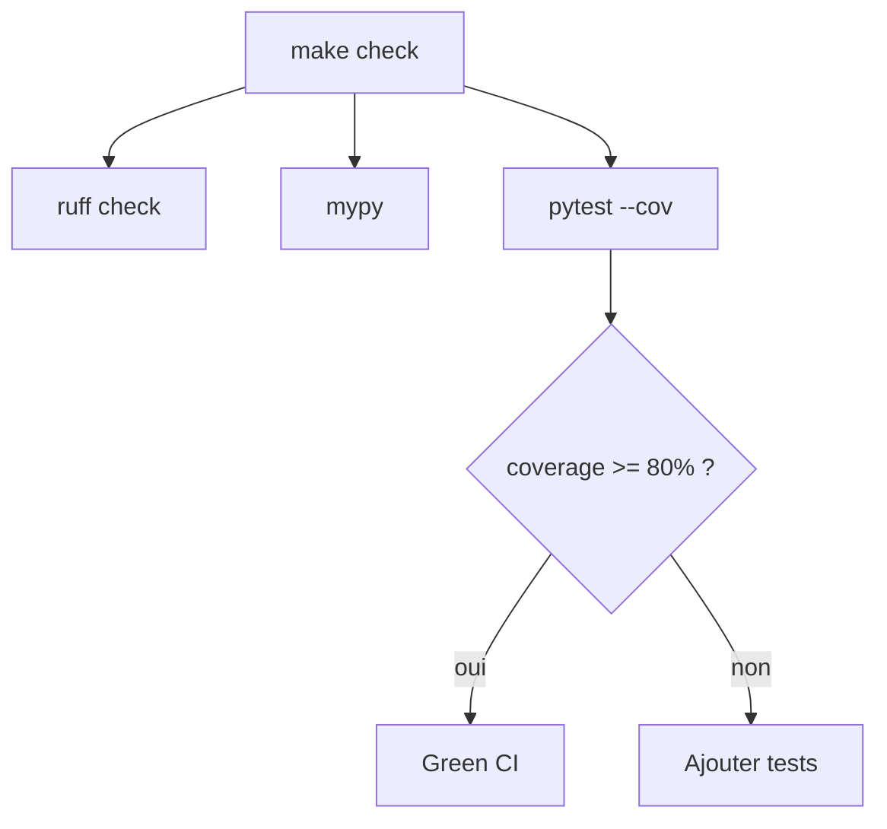

# Instruction: Django Docs — Part 3 : CSS Pygments + Tests + Cleanup

## Feature

- **Summary**: Generate the Pygments CSS file for syntax highlighting, write minimal tests for the docs views, and optionally clean up MkDocs build artifacts (`site/`). Ensure `make check` passes with ≥ 80% coverage on new files.
- **Stack**: `Django 5.x, pytest-django, Pygments`
- **Branch name**: `feat/django-docs`
- **Parent Plan**: `2026_04_29-#06-django-docs-master.md`
- **Sequence**: 3 of 3
- Confidence: 9/10
- Time to implement: ~30min

## Existing files

- @suddenly/docs/views.py (Part 1)
- @suddenly/docs/nav.py (Part 1)
- @tests/
- @pyproject.toml
- @static/css/

### New files to create

- `static/css/docs-pygments.css`
- `tests/docs/test_views.py`
- `tests/docs/__init__.py`

## User Journey



## Implementation phases

### Phase 1 — CSS Pygments

> Générer le fichier CSS de coloration syntaxique et le référencer dans le template.

1. Générer `static/css/docs-pygments.css` via :
   ```python
   from pygments.formatters import HtmlFormatter
   css = HtmlFormatter(style="friendly").get_style_defs(".codehilite")
   # écrire dans static/css/docs-pygments.css
   ```
   Ou exécuter : `python -c "from pygments.formatters import HtmlFormatter; print(HtmlFormatter(style='friendly').get_style_defs('.codehilite'))" > static/css/docs-pygments.css`

2. Dans `templates/docs/base.html`, ajouter dans le block `extra_head` :
   ```html
   
   <link rel="stylesheet" href="">
   ```

3. Vérifier que `whitenoise` sert bien `static/` en development (`STATICFILES_DIRS` dans settings)

### Phase 2 — Tests

> Tests minimaux pour la couverture de `suddenly/docs/views.py` et `nav.py`.

1. Créer `tests/docs/__init__.py` (vide)
2. Créer `tests/docs/test_views.py` avec `pytest.mark.django_db` :
   - `test_index_200` : `GET /docs/` → 200, template `docs/index.html`
   - `test_page_doc_index_200` : `GET /docs/doc/index/` → 200, contenu contient "Suddenly"
   - `test_page_projet_architecture_200` : `GET /docs/projet/architecture/` → 200
   - `test_page_wireframes_report_links_200` : `GET /docs/wireframes/report-links/` → 200
   - `test_page_404_unknown_section` : `GET /docs/inexistant/foo/` → 404
   - `test_page_404_unknown_slug` : `GET /docs/doc/inexistant/` → 404
3. Tests `nav.py` dans le même fichier :
   - `test_nav_resolve_valid` : `nav.resolve("doc", "index")` retourne un `Path` existant
   - `test_nav_resolve_invalid` : `nav.resolve("doc", "nope")` retourne `None`

### Phase 3 — Cleanup MkDocs

> `site/` est déjà dans `.gitignore`. Vérifier qu'il n'a pas été commité par erreur.

1. Vérifier : `rtk git status` — si `site/` apparaît comme tracké, exécuter `git rm -r --cached site/`
2. Ne pas supprimer `mkdocs.yml` ni le contenu de `docs/` — ils servent de source pour la doc Django
3. Ne pas désinstaller MkDocs — ce n'est pas une dépendance dans `pyproject.toml`

## Validation flow

1. `python -c "from pygments.formatters import HtmlFormatter; print('ok')"` → `ok`
2. `GET /docs/doc/design-system/` → les blocs de code ont un fond coloré (coloration syntaxique visible)
3. `make check` passe avec coverage ≥ 80% sur `suddenly/docs/`
4. Aucune erreur mypy sur `suddenly/docs/views.py` et `suddenly/docs/nav.py`
5. `GET /docs/wireframes/overview/` → le tableau Markdown est rendu en `<table>` avec les styles prose
