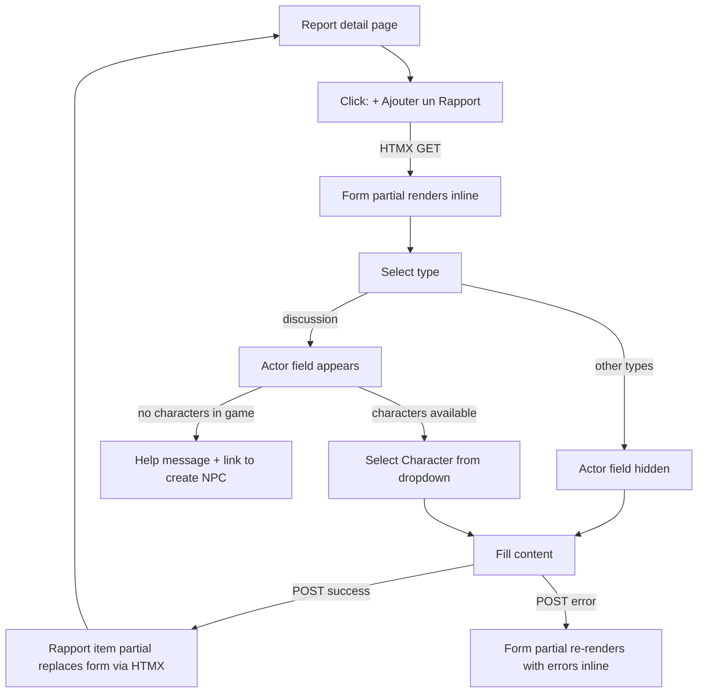

# Instruction: Rapport — Typed atomic entries for a Report

## Feature

- **Summary**: Add a `Rapport` model as the atomic narrative element of a `Report`. Each `Rapport` has a fixed type (description, action, discussion, narration). The `discussion` type requires an existing `Character` as actor. The UI guides the user when no character is available. `Report.content` is kept as-is (backward compatibility — existing reports are unaffected).
- **Stack**: `Django 4.x`, `Python 3.12`, `HTMX`, `Alpine.js`, `UnoCSS`, `pytest-django`
- **Branch name**: `feat/rapport-typed-entries`
- **Parent Plan**: `none`
- **Sequence**: `standalone`
- Confidence: 9/10
- Time to implement: 3-4h

## Existing files

- @suddenly/games/models.py — add `Rapport` model after `Report`
- @suddenly/games/migrations/ — new migration
- @suddenly/games/front_views.py — add rapport_create / rapport_edit / rapport_delete views
- @suddenly/games/front_urls.py — add rapport URLs under `<game_pk>/reports/<pk>/rapports/`
- @suddenly/games/admin.py — add RapportInline to ReportAdmin
- @templates/games/report_detail.html — add Rapport list + add button

### New files to create

- `suddenly/games/rapport_forms.py` — RapportForm with conditional actor field
- `templates/games/rapport_form.html` — form template (Alpine.js for conditional actor)
- `templates/games/partials/rapport_item.html` — single Rapport in the list (HTMX swap)
- `tests/games/test_rapport_model.py` — model + validation tests
- `tests/games/test_rapport_views.py` — view tests (create, edit, delete)

## Cohabitation Report.content / Rapport

`Report.content` (existing rich Markdown field) is **kept unchanged** — this plan is purely additive.
Existing reports with content are unaffected. New reports can have `content` empty and use Rapports instead.
Migration to deprecate `Report.content` is out of scope for this issue.

## User Journey

## Implementation phases

### Phase 1 — Model

> Add `Rapport` model in `suddenly/games/models.py` and generate migration.

1. Add `RapportKind` TextChoices: `DESCRIPTION`, `ACTION`, `DISCUSSION`, `NARRATION`
2. Add `Rapport(BaseModel)` with fields: `report` (FK→Report, CASCADE, related_name="rapports"), `kind` (CharField, choices=RapportKind), `content` (TextField), `actor` (FK→Character, null=True, blank=True, SET_NULL, related_name="rapport_appearances")
3. Add `clean()`: raise `ValidationError` on `actor` if `kind != DISCUSSION` and actor is set; raise `ValidationError` if `kind == DISCUSSION` and actor is None
4. Add `class Meta`: ordering `["created_at"]`, index on `(report, kind)`
5. Run `makemigrations` → `0011_rapport.py`

### Phase 2 — Admin

> Expose Rapports inline under Report in Django admin.

1. Add `RapportInline(TabularInline)` — fields: `kind`, `actor`, `content` — extra=0
2. Register inline on `ReportAdmin`

### Phase 3 — Form & Views

> Add CRUD views for Rapport within a Report context.

1. Create `rapport_forms.py` with `RapportForm(ModelForm)` — fields: `kind`, `content`, `actor` — actor queryset filtered to `Character.objects.filter(origin_game=report.game)`
2. Add `rapport_create(request, game_pk, pk)` view (GET+POST, login required):
   - GET: return form partial (HTMX)
   - POST success: return `rapport_item.html` partial (HTMX swap)
   - POST error: return form partial with errors (HTMX swap, no redirect)
   - Guard: `report.author == request.user` else 403
3. Add `rapport_edit(request, game_pk, pk, rapport_pk)` view (GET+POST, login required) — same guard + same HTMX pattern
4. Add `rapport_delete(request, game_pk, pk, rapport_pk)` view (POST only, login required) — guard + return `HttpResponse("")` (empty 200); template uses `hx-post` + `hx-target="#rapport-{{ id }}"` + `hx-swap="outerHTML"` to remove the element from DOM
5. Register URLs in `front_urls.py`:
   - `<uuid:game_pk>/reports/<uuid:pk>/rapports/new/` → `rapport_create`, name `rapport_create`
   - `<uuid:game_pk>/reports/<uuid:pk>/rapports/<uuid:rapport_pk>/edit/` → `rapport_edit`, name `rapport_edit`
   - `<uuid:game_pk>/reports/<uuid:pk>/rapports/<uuid:rapport_pk>/delete/` → `rapport_delete`, name `rapport_delete`

### Phase 4 — Templates

> Build form and list templates with conditional actor field.

1. `rapport_form.html` — type selector + content field + actor field in `x-show="kind === 'discussion'"` (Alpine.js); if actor queryset is empty: replace dropdown with help message + link to `games:detail` (the game page where NPCs are managed) — no standalone character create URL exists
2. `partials/rapport_item.html` — type badge + content + actor name (if discussion) + edit/delete buttons (HTMX)
3. Update `report_detail.html` — ordered list of Rapports (`report.rapports.all`) + "Ajouter un Rapport" button (`hx-get` → form partial, `hx-target` = list container)

### Phase 5 — Tests

> Cover model validation and view access control.

1. `test_rapport_model.py`:
   - actor required when `kind == discussion` → `clean()` raises
   - actor must be None when `kind != discussion` → `clean()` raises
   - default ordering is by `created_at`
2. `test_rapport_views.py`:
   - unauthenticated create → 302 to login
   - non-author create → 403
   - valid description create → 200 + rapport in DB
   - discussion without actor → form error, no DB insert
   - actor queryset only contains characters from the report's game
   - empty actor queryset renders help message with link to `games:detail`

## Validation flow

1. Open a Report as authenticated author
2. Click "Ajouter un Rapport" → form partial loads inline (HTMX GET)
3. Select "Description" → actor field absent → fill content → submit → Rapport item appears in list
4. Select "Discussion" → actor dropdown appears with game characters only
5. Submit Discussion without actor → form re-renders inline with error, no insert
6. If no characters in game → actor field shows help message with link to game detail page
7. Edit a Rapport → content and type update correctly
8. Delete a Rapport → removed from list via HTMX, no page reload
9. Run `make check` → all tests pass, coverage ≥ 80%
