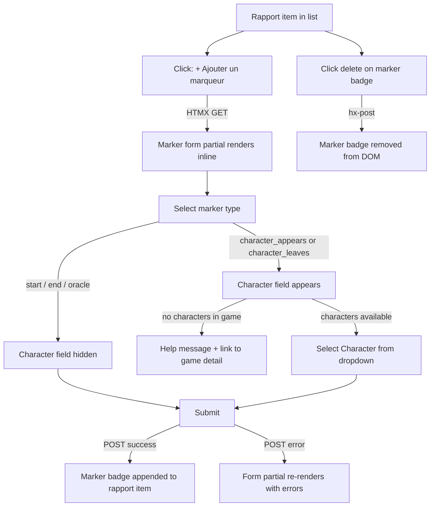

# Instruction: Rapport — Narrative markers

## Feature

- **Summary**: Add a `RapportMarker` model allowing multiple narrative markers on a single `Rapport`. Five marker types: `start`, `end`, `character_appears`, `character_leaves`, `oracle`. The two character-linked types require an existing `Character`; the others forbid it. UI exposed via HTMX on the rapport item.
- **Stack**: `Django 4.x`, `Python 3.12`, `HTMX`, `Alpine.js`, `UnoCSS`, `pytest-django`
- **Branch name**: `feat/rapport-typed-entries` (same branch as #64)
- **Parent Plan**: `none`
- **Sequence**: `standalone` (builds on #64 Rapport model)
- Confidence: 9/10
- Time to implement: 2-3h

## Existing files to modify

- @suddenly/games/models.py — add `MarkerKind` + `RapportMarker` after `Rapport`
- @suddenly/games/migrations/ — new migration `0011_rapportmarker.py`
- @suddenly/games/front_views.py — add `marker_create`, `marker_delete` views
- @suddenly/games/front_urls.py — add marker URLs under rapports
- @suddenly/games/admin.py — add `RapportMarkerInline` on `RapportInline`
- @templates/games/partials/rapport_item.html — show marker badges + add button

### New files to create

- `suddenly/games/marker_forms.py` — `RapportMarkerForm` with conditional character field
- `templates/games/marker_form.html` — HTMX partial form (Alpine.js conditional character)
- `templates/games/partials/marker_badge.html` — single marker badge (HTMX swap)
- `tests/games/test_rapportmarker_model.py` — model validation tests
- `tests/games/test_marker_views.py` — view tests

## Design: RapportMarker join model

`RapportMarker` mirrors the `CharacterAppearance` pattern (join model, not bare M2M) because some marker types carry a `character` FK while others do not. This avoids a M2M with a through table and keeps `clean()` validation simple.

Character-required marker types: `character_appears`, `character_leaves`
Character-forbidden marker types: `start`, `end`, `oracle`

## User Journey

## Implementation phases

### Phase 1 — Model

> Add `RapportMarker` model and generate migration.

1. Add `MarkerKind` TextChoices: `START = "start"`, `END = "end"`, `CHARACTER_APPEARS = "character_appears"`, `CHARACTER_LEAVES = "character_leaves"`, `ORACLE = "oracle"`
2. Define `CHARACTER_MARKER_KINDS = {MarkerKind.CHARACTER_APPEARS, MarkerKind.CHARACTER_LEAVES}` as a module-level constant
3. Add `RapportMarker(BaseModel)` with fields:
   - `rapport`: FK → Rapport, CASCADE, related_name="markers"
   - `kind`: CharField, choices=MarkerKind, max_length=30
   - `character`: FK → `"characters.Character"`, null=True, blank=True, SET_NULL, related_name="rapport_markers"
4. Add `clean()`:
   - If `kind in CHARACTER_MARKER_KINDS` and `character` is None → `ValidationError({"character": ...})`
   - If `kind not in CHARACTER_MARKER_KINDS` and `character` is not None → `ValidationError({"character": ...})`
5. Add `class Meta`: ordering `["created_at"]`, index on `["rapport", "kind"]`
6. Add `__str__`: `f"{self.get_kind_display()} — {self.rapport}"`
7. Run `makemigrations games` → `0011_rapportmarker.py`

### Phase 2 — Admin

> Expose RapportMarker inline under Report in Django admin.

1. Add `RapportMarkerInline(TabularInline)` — model=RapportMarker, fields=["kind", "character"], extra=0
2. Add `RapportMarkerInline` to `ReportAdmin.inlines` directly (Django does not support nested inlines — RapportMarkerInline cannot go inside RapportInline; it lists all markers for the report, not scoped per Rapport)

### Phase 3 — Form & Views

> Add marker CRUD views and URLs.

1. Create `marker_forms.py` with `RapportMarkerForm(ModelForm)`:
   - fields: `kind`, `character`
   - `__init__(self, *args, game=None, **kwargs)` — filters character queryset to `Character.objects.filter(origin_game=game)` when game provided
2. Add `marker_create(request, game_pk, pk, rapport_pk)` — login_required, GET+POST:
   - Guard: `rapport.report.author != request.user` → 403
   - GET: render `marker_form.html` partial with `RapportMarkerForm(game=rapport.report.game)`
   - POST valid: save marker, re-render `partials/rapport_item.html` with fresh `rapport` (prefetch markers + character) — single target `#rapport-{{ rapport.pk }}`, `hx-swap="outerHTML"` (same pattern as existing `rapport_create`)
   - POST invalid: render `marker_form.html` with errors (422) — same target `#marker-form-{{ rapport.pk }}`
3. Add `marker_delete(request, game_pk, pk, rapport_pk, marker_pk)` — login_required, POST only:
   - Guard: `marker.rapport.report.author != request.user` → 403
   - Delete marker, return `HttpResponse("")` — template uses `hx-target="#marker-{{ marker.pk }}"` `hx-swap="outerHTML"` to remove badge from DOM
4. Register URLs in `front_urls.py`:
   - `<uuid:game_pk>/reports/<uuid:pk>/rapports/<uuid:rapport_pk>/markers/new/` → `marker_create`, name `marker_create`
   - `<uuid:game_pk>/reports/<uuid:pk>/rapports/<uuid:rapport_pk>/markers/<uuid:marker_pk>/delete/` → `marker_delete`, name `marker_delete`

### Phase 4 — Templates

> Build marker form and badge templates; update rapport_item.

1. `marker_form.html` — HTMX partial, Alpine `x-data="{ kind: '' }"`:
   - Select/radio for `kind`
   - `x-show="kind === 'character_appears' || kind === 'character_leaves'"` wraps character field
   - Empty character queryset → help message + link to `games:detail`
   - Form `hx-post` to `marker_create` URL, `hx-target="#rapport-{{ rapport.pk }}"`, `hx-swap="outerHTML"` on success (full rapport_item re-render); error path targets `#marker-form-{{ rapport.pk }}` via 422 response
   - Cancel button clears `#marker-form-{{ rapport.pk }}` (HTMX `hx-get` to empty partial or Alpine toggle)
2. `partials/marker_badge.html` — root element `id="marker-{{ marker.pk }}"`:
   - Kind label badge
   - Character name if present
   - Delete button: `hx-post` → `marker_delete`, `hx-target="#marker-{{ marker.pk }}"`, `hx-swap="outerHTML"`
3. Update `partials/rapport_item.html`:
   - Add `
` listing ``
   - Add `
` for inline form
   - Add "Ajouter un marqueur" button (visible to report.author only): `hx-get` → `marker_create`, `hx-target="#marker-form-{{ rapport.pk }}"`, `hx-swap="innerHTML"`
4. Update `report_detail` view (or queryset): add `prefetch_related("rapports__markers", "rapports__markers__character")` to avoid N+1 when rendering marker badges per Rapport

### Phase 5 — Tests

> Cover model validation and view access control.

1. `test_rapportmarker_model.py`:
   - character_appears without character → clean() raises
   - character_appears with character → valid
   - start with character → clean() raises
   - oracle without character → valid
   - ordering by created_at
2. `test_marker_views.py`:
   - unauthenticated create → 302
   - non-author create → 403
   - valid start marker create → 200, marker in DB
   - character_appears without character → 422, no DB insert
   - character queryset filtered to game characters
   - marker_delete as author → 200 empty, marker deleted
   - marker_delete as non-author → 403

## Validation flow

1. Open a Report as author, see a Rapport item
2. Click "Ajouter un marqueur" → marker form loads inline
3. Select "start" → character field absent → submit → badge "Début" appears
4. Add "character_appears" marker → character dropdown shows game characters only
5. Submit character_appears without character → inline error, no insert
6. Delete a marker → badge removed from DOM via HTMX
7. A Rapport with start + character_appears markers displays both badges simultaneously
8. Run `make check` → all tests pass, coverage ≥ 80%
