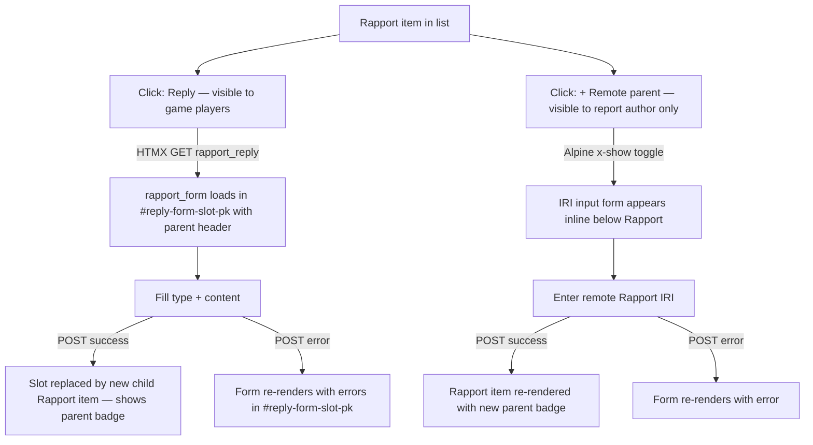

# Instruction: Rapport — Graph chaining (parent/child)

## Feature

- **Summary**: Add a `RapportLink` join model allowing a `Rapport` to have N parents (graph, not tree). Parents can be local (FK) or remote (ActivityPub IRI). UI exposes a Reply button (local parent, visible to players of the game) and a remote IRI form (author only) on each Rapport item.
- **Stack**: `Django 4.x`, `Python 3.12`, `HTMX`, `Alpine.js`, `UnoCSS`, `pytest-django`
- **Branch name**: `feat/rapport-graph-chaining`
- **Parent Plan**: `none`
- **Sequence**: `standalone` (builds on #64 Rapport model)
- Confidence: 9/10
- Time to implement: 3-4h

## Existing files to modify

- @suddenly/games/models.py — add `RapportLink` after `RapportMarker`
- @suddenly/games/migrations/ — new migration `0012_rapportlink.py`
- @suddenly/games/front_views.py — add `rapport_reply`, `rapport_add_remote_parent` views
- @suddenly/games/front_urls.py — add reply and remote-parent URLs
- @suddenly/games/admin.py — add `RapportLinkInline` on `ReportAdmin`
- @templates/games/rapport_form.html — show parent context when replying
- @templates/games/partials/rapport_item.html — add parent badges + reply + remote-parent buttons

### New files to create

- `templates/games/partials/rapport_reply_form.html` — form wrapper with `id="reply-form-slot-{{ parent.pk }}"`, includes rapport_form.html content with parent header
- `tests/games/test_rapportlink_model.py` — model validation tests
- `tests/games/test_rapport_reply_views.py` — view tests (reply, remote parent)

## Design: RapportLink join model

`RapportLink` stores one parent reference per row — either a local FK or a remote IRI (exactly one must be set, enforced in `clean()`). A Rapport with N parents has N `RapportLink` rows with `rapport=self`.

```
Rapport ──< RapportLink >── Rapport (local)
                      └──── parent_iri (remote)
```

Access rules:
- **Reply (local parent)**: any user who has a `Character` with `origin_game=rapport.report.game` — checked via `Character.objects.filter(creator=request.user, origin_game=game).exists()`
- **Add remote parent**: report author only

## User Journey



## Implementation phases

### Phase 1 — Model

> Add `RapportLink` model and generate migration.

1. Add `RapportLink(BaseModel)` with fields:
   - `rapport`: FK → Rapport, CASCADE, related_name="parent_links"
   - `parent_rapport`: FK → Rapport, null=True, blank=True, SET_NULL, related_name="child_links"
   - `parent_iri`: URLField, null=True, blank=True
2. Add `clean()`: exactly one of `parent_rapport` or `parent_iri` must be set — raise `ValidationError` otherwise
3. Add `class Meta`:
   - `UniqueConstraint(fields=["rapport", "parent_rapport"], condition=Q(parent_rapport__isnull=False), name="unique_local_parent")`
   - `UniqueConstraint(fields=["rapport", "parent_iri"], condition=Q(parent_iri__isnull=False), name="unique_remote_parent")`
   - `ordering = ["created_at"]`
4. Add `__str__`: `f"{self.rapport} → {self.parent_rapport or self.parent_iri}"`
5. Run `makemigrations games` → `0012_rapportlink.py`

### Phase 2 — Admin

> Expose RapportLink inline under ReportAdmin.

1. Add `RapportLinkInline(TabularInline)` — model=RapportLink, fields=["rapport", "parent_rapport", "parent_iri"], extra=0
2. Add to `ReportAdmin.inlines`

### Phase 3 — Views & URLs

> Add reply and remote-parent views.

1. Add `_user_has_character_in_game(user, game)` helper → `Character.objects.filter(creator=user, origin_game=game).exists()`
2. Add `rapport_reply(request, game_pk, pk, rapport_pk)` — login_required, GET+POST:
   - Guard GET+POST: `not _user_has_character_in_game(request.user, game)` → 403
   - GET: render `partials/rapport_reply_form.html` with `parent=rapport, report=rapport.report` in context; root div has `id="reply-form-slot-{{ rapport.pk }}"`
   - POST valid: create `Rapport(report=rapport.report, ...)` + `RapportLink(rapport=new, parent_rapport=rapport)`; call `full_clean()` on both before save; render `partials/rapport_item.html` for new rapport (no wrapper — replaces the slot via `outerHTML`)
   - POST invalid: render `partials/rapport_reply_form.html` with `parent=rapport` and errors (422); same root div id preserves slot
3. Add `rapport_add_remote_parent(request, game_pk, pk, rapport_pk)` — login_required, POST-only (form toggled via Alpine `x-show` in the template — no GET endpoint):
   - Guard: `rapport.report.author != request.user` → 403
   - POST valid: validate `parent_iri` (non-empty URLField via `URLValidator`); create `RapportLink(rapport=rapport, parent_iri=iri)`; call `full_clean()` before save; re-render `partials/rapport_item.html` with fresh rapport prefetched, targeting `#rapport-{{ rapport_pk }}` via `outerHTML`
   - POST invalid: render `partials/rapport_item.html` with `remote_parent_error` in context (422); rapport item re-rendered in place, error displayed inline without HX-Retarget
4. Register URLs:
   - `<uuid:game_pk>/reports/<uuid:pk>/rapports/<uuid:rapport_pk>/reply/` → `rapport_reply`, name `rapport_reply`
   - `<uuid:game_pk>/reports/<uuid:pk>/rapports/<uuid:rapport_pk>/add-remote-parent/` → `rapport_add_remote_parent`, name `rapport_add_remote_parent`

### Phase 4 — Templates

> Build reply context and parent badges.

1. Create `templates/games/partials/rapport_reply_form.html`:
   - Root element: `<div id="reply-form-slot-{{ parent.pk }}">`
   - Parent context header: `↩ In reply to: [kind badge] {{ parent.content|truncatechars:60 }}`
   - Form content identical to `rapport_form.html` (hx-post → `rapport_reply`, no hidden parent input — parent pk is in URL)
   - No hidden input needed — parent is already in the URL path (`rapport_pk`)
2. Update `templates/games/partials/rapport_item.html`:
   - Add root id `id="rapport-{{ rapport.pk }}"` to the outermost element (enables hx-swap="outerHTML" targeting)
   - Add parent badges above content: `` — local: kind badge + truncated content; remote: `🌐 {{ link.parent_iri|domain_from_url }}` (templatetag)
   - Add "Reply" button (visible when `request.user.is_authenticated` — server-side guard handles the character check): `hx-get → rapport_reply`, `hx-target="#reply-form-slot-{{ rapport.pk }}"`, `hx-swap="outerHTML"`
   - Add "+ Remote parent" button (Alpine `x-data`, `x-show` toggle): inline IRI input form with `hx-post → rapport_add_remote_parent`, `hx-target="#rapport-{{ rapport.pk }}"`, `hx-swap="outerHTML"`
   - Show `remote_parent_error` if present in context (for 422 re-render)
   - Add `<div id="reply-form-slot-{{ rapport.pk }}"></div>` slot below each rapport item
4. Update `report_detail` view queryset: add `prefetch_related("rapports__parent_links", "rapports__parent_links__parent_rapport")` to avoid N+1

### Phase 5 — Tests

> Cover model validation and view access control.

1. `test_rapportlink_model.py`:
   - parent_rapport and parent_iri both set → `clean()` raises
   - neither parent_rapport nor parent_iri → `clean()` raises
   - parent_rapport set, parent_iri None → valid
   - parent_iri set, parent_rapport None → valid
   - duplicate `(rapport, parent_rapport)` → DB constraint raises
2. `test_rapport_reply_views.py`:
   - unauthenticated reply → 302
   - authenticated user without character in game → 403
   - user with character in game → 200, child Rapport + RapportLink in DB
   - reply POST invalid (no content) → 422, no DB insert
   - add_remote_parent as report author → 200, RapportLink with parent_iri in DB, rapport item re-rendered
   - add_remote_parent with invalid URL → 422, no DB insert
   - add_remote_parent as non-author → 403

## Validation flow

1. Open a Report as a user with a character in the game
2. Click "Reply" on a Rapport → form loads in `#rapport-form-container` with parent header (kind badge + truncated content)
3. Fill type + content → submit → form container replaced by new child Rapport showing "↩ Description" parent badge
4. Unauthenticated user: Reply button absent; if URL hit directly → 302
5. Authenticated user without character in game: 403 on GET and POST
6. Report author clicks "+ Remote parent" → inline IRI form appears
7. Enter valid URL → rapport item re-renders with `🌐 example.com` parent badge
8. Enter invalid URL → inline error, no insert
9. Non-author hits add-remote-parent → 403
10. Run `make check` → all tests pass, coverage ≥ 80%
