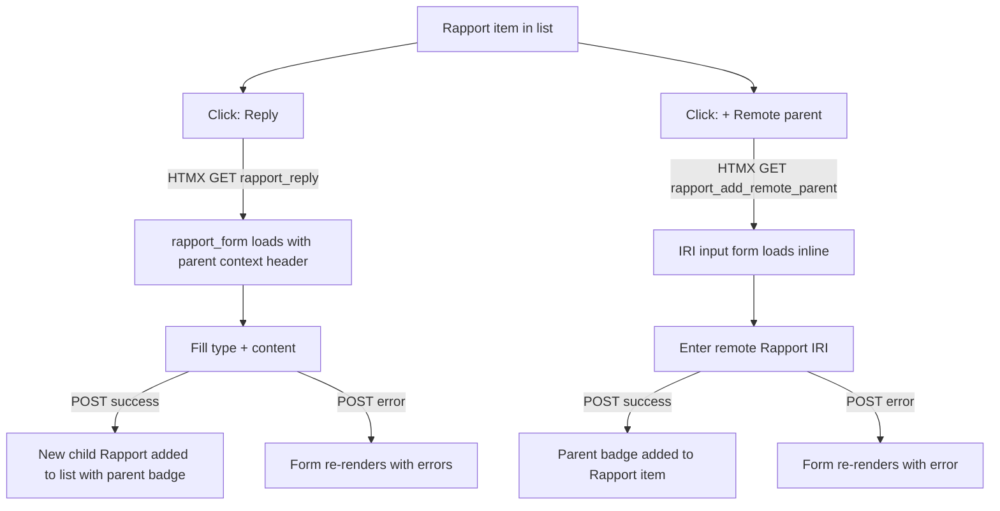

# Instruction: Rapport — Graph chaining (parent/child)

## Feature

- **Summary**: Add a `RapportLink` join model allowing a `Rapport` to have N parents (graph, not tree). Parents can be local (FK) or remote (ActivityPub IRI). UI exposes a Reply button (local parent) and a remote IRI form on each Rapport item.
- **Stack**: `Django 4.x`, `Python 3.12`, `HTMX`, `Alpine.js`, `UnoCSS`, `pytest-django`
- **Branch name**: `feat/rapport-graph-chaining`
- **Parent Plan**: `none`
- **Sequence**: `standalone` (builds on #64 Rapport model)
- Confidence: 8/10
- Time to implement: 3-4h

## Existing files to modify

- @suddenly/games/models.py — add `RapportLink` after `RapportMarker`
- @suddenly/games/migrations/ — new migration `0012_rapportlink.py`
- @suddenly/games/front_views.py — add `rapport_reply`, `rapport_add_remote_parent` views
- @suddenly/games/front_urls.py — add reply and remote-parent URLs
- @suddenly/games/admin.py — add `RapportLinkInline` on `ReportAdmin`
- @templates/games/rapport_form.html — show parent context when replying
- @templates/games/partials/rapport_item.html — add parent badges + reply + remote-parent buttons

### New files to create

- `tests/games/test_rapportlink_model.py` — model validation tests
- `tests/games/test_rapport_reply_views.py` — view tests (reply, remote parent)

## Design: RapportLink join model

`RapportLink` stores one parent reference per row — either a local FK or a remote IRI (exactly one must be set, enforced in `clean()`). A Rapport with N parents has N `RapportLink` rows with `rapport=self`.

```
Rapport ──< RapportLink >── Rapport (local)
                      └──── parent_iri (remote)
```

## User Journey



## Implementation phases

### Phase 1 — Model

> Add `RapportLink` model and generate migration.

1. Add `RapportLink(BaseModel)` with fields:
   - `rapport`: FK → Rapport, CASCADE, related_name="parent_links"
   - `parent_rapport`: FK → Rapport, null=True, blank=True, SET_NULL, related_name="child_links"
   - `parent_iri`: URLField, null=True, blank=True
2. Add `clean()`: exactly one of `parent_rapport` or `parent_iri` must be set — raise `ValidationError` otherwise
3. Add `class Meta`: `UniqueConstraint` on `(rapport, parent_rapport)` and `(rapport, parent_iri)`; ordering `["created_at"]`
4. Add `__str__`: `f"{self.rapport} → {self.parent_rapport or self.parent_iri}"`
5. Run `makemigrations games` → `0012_rapportlink.py`

### Phase 2 — Admin

> Expose RapportLink inline under ReportAdmin.

1. Add `RapportLinkInline(TabularInline)` — model=RapportLink, fields=["rapport", "parent_rapport", "parent_iri"], extra=0
2. Add to `ReportAdmin.inlines`

### Phase 3 — Views & URLs

> Add reply and remote-parent views.

1. Add `rapport_reply(request, game_pk, pk, rapport_pk)` — login_required, GET+POST:
   - Guard: `rapport.report.author != request.user` → 403
   - GET: render `rapport_form.html` with `parent=rapport` in context (form has no pre-fill, parent shown as header)
   - POST valid: create Rapport + RapportLink(rapport=new, parent_rapport=parent), render `partials/rapport_item.html` for new rapport appended to `#rapports-list` via `hx-swap="beforeend"` on `#rapports-list`
   - POST invalid: render form partial with errors (422)
2. Add `rapport_add_remote_parent(request, game_pk, pk, rapport_pk)` — login_required, GET+POST:
   - Guard: `rapport.report.author != request.user` → 403
   - GET: render `partials/rapport_remote_parent_form.html` with `rapport` in context
   - POST valid: create RapportLink(rapport=rapport, parent_iri=iri), re-render `partials/rapport_item.html` via `hx-target="#rapport-{{ pk }}" hx-swap="outerHTML"`
   - POST invalid: render form with errors (422), validate URL format
3. Register URLs:
   - `<uuid:game_pk>/reports/<uuid:pk>/rapports/<uuid:rapport_pk>/reply/` → `rapport_reply`, name `rapport_reply`
   - `<uuid:game_pk>/reports/<uuid:pk>/rapports/<uuid:rapport_pk>/add-remote-parent/` → `rapport_add_remote_parent`, name `rapport_add_remote_parent`

### Phase 4 — Templates

> Build reply context and parent badges.

1. Update `rapport_form.html`:
   - If `parent` in context: add header `<div class="reply-context">↩ In reply to: [parent kind badge] {{ parent.content|truncatechars:60 }}</div>`
   - Add hidden input `<input type="hidden" name="parent_pk" value="{{ parent.pk }}">`
2. Create `templates/games/partials/rapport_remote_parent_form.html`:
   - Root element `id="remote-parent-form-{{ rapport.pk }}"`
   - URL input field, submit + cancel buttons (cancel: `hx-get="" hx-target="#remote-parent-form-{{ rapport.pk }}" hx-swap="innerHTML"`)
3. Update `templates/games/partials/rapport_item.html`:
   - Add parent badges section: `` — show kind badge for local parent or IRI domain for remote
   - Add "Reply" button (visible to authenticated users, not just author): `hx-get → rapport_reply`, `hx-target="#rapport-form-container"`, `hx-swap="outerHTML"`
   - Add "+ Remote parent" button (visible to author only): `hx-get → rapport_add_remote_parent`, `hx-target="#remote-parent-form-{{ rapport.pk }}"`, `hx-swap="innerHTML"`
   - Add `<div id="remote-parent-form-{{ rapport.pk }}"></div>` slot
4. Update `report_detail` view / queryset: add `prefetch_related("rapports__parent_links", "rapports__parent_links__parent_rapport")` to avoid N+1

### Phase 5 — Tests

> Cover model validation and view access control.

1. `test_rapportlink_model.py`:
   - parent_rapport and parent_iri both set → clean() raises
   - neither set → clean() raises
   - parent_rapport set, parent_iri None → valid
   - parent_iri set, parent_rapport None → valid
   - duplicate (rapport, parent_rapport) → DB constraint raises
2. `test_rapport_reply_views.py`:
   - unauthenticated reply → 302
   - non-author reply → 403
   - valid reply → 200, child Rapport + RapportLink in DB
   - reply POST invalid (no content) → 422, no DB insert
   - add_remote_parent as author → 200, RapportLink with parent_iri in DB
   - add_remote_parent invalid URL → 422, no DB insert
   - add_remote_parent as non-author → 403

## Validation flow

1. Open a Report as author, see a Rapport item
2. Click "Reply" → rapport_form loads with parent header showing the parent's kind and truncated content
3. Fill type + content → submit → new Rapport appears in list with "↩ Description" parent badge
4. Click "+ Remote parent" on the new Rapport → IRI form appears
5. Enter a valid URL → submit → parent badge with IRI domain appears
6. Enter an invalid URL → inline error, no insert
7. Non-author can click Reply but is blocked at POST (403)
8. Run `make check` → all tests pass, coverage ≥ 80%
