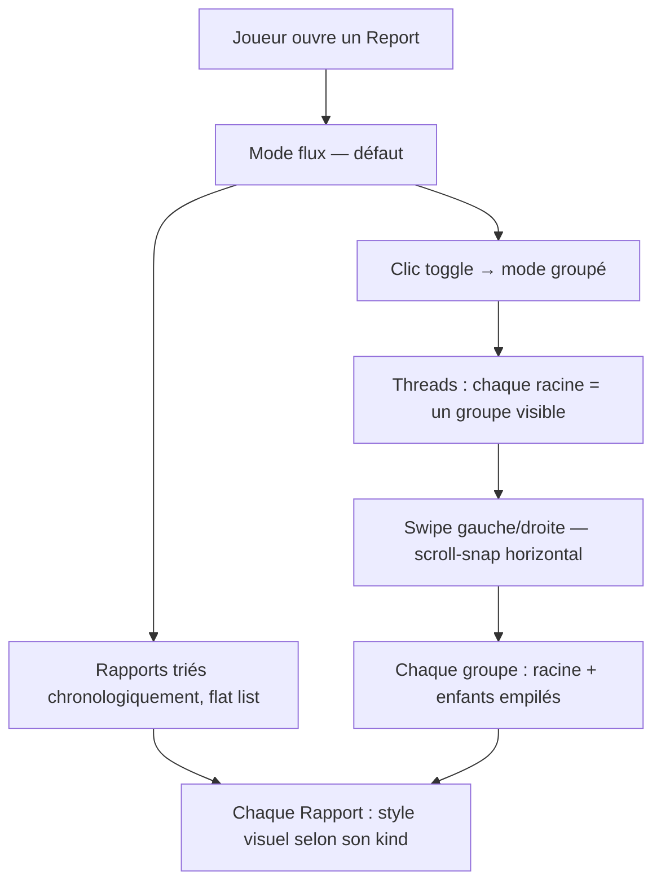

# Instruction: Rapport — Fil fédéré (mode flux / mode groupé)

## Feature

- **Summary**: Add two reading modes to `report_detail`: flux (flat chronological) and grouped (threaded by parent chain with horizontal swipe). Each RapportKind gets distinct visual styling. A wireframe must be delivered before the UI implementation.
- **Stack**: `Django 5.0`, `Python 3.12`, `HTMX`, `Alpine.js`, `UnoCSS`, `pytest-django`
- **Branch name**: `feat/rapport-federated-feed`
- **Parent Plan**: `none`
- **Sequence**: `standalone` (builds on #66 RapportLink)
- Confidence: 9/10
- Time to implement: 2-3h

## Existing files to modify

- @templates/games/report_detail.html — add mode toggle + two rendering containers
- @templates/games/partials/rapport_item.html — add kind-specific CSS classes
- @suddenly/games/front_views.py — add `_build_rapport_threads()` helper, pass `rapport_threads` to context
- @templates/wireframes/ — new wireframe file

### New files to create

- `templates/wireframes/report-federated-feed.html` — wireframe flux vs groupé
- `tests/games/test_rapport_feed_views.py` — view tests for thread grouping

## User Journey

## Implementation phases

### Phase 1 — Wireframe

> Produire la documentation visuelle requise avant toute implémentation UI.

1. Créer `templates/wireframes/report-federated-feed.html` :
   - Section A : mode flux — liste verticale, chaque type (Description/Action/Discussion/Narration) représenté avec son style futur (couleur de bordure gauche, italique pour Narration, personnage mis en avant pour Discussion)
   - Section B : mode groupé — vue horizontale scroll-snap, chaque "card" = un thread (racine + réponses imbriquées), indicateur de navigation (flèches ou bullets)
   - S'appuyer sur les classes UnoCSS existantes (`overflow-x-auto`, `snap-x`, `snap-mandatory`, `snap-start`)
   - Accessible via `/docs/w/report-federated-feed` (route `wireframe_prototype` déjà existante)

### Phase 2 — Styling par type de Rapport

> Différencier visuellement les 4 kinds dans `rapport_item.html`.

1. Ajouter une classe de bordure gauche conditionnelle sur le root div `#rapport-{{ rapport.pk }}` :
   - `DESCRIPTION` : `border-l-2 border-border` (neutre, défaut actuel inchangé)
   - `ACTION` : `border-l-2 border-primary/60`
   - `DISCUSSION` : `border-l-2 border-info/60`
   - `NARRATION` : `border-l-2 border-warning/40`
2. Pour `NARRATION` : ajouter `italic` sur la balise `
`
3. Pour `DISCUSSION` : mettre le nom du personnage (`rapport.actor.name`) en texte normal (non-muted) avec un séparateur

### Phase 3 — Threading + mode fil

> Calcul Python des groupes + toggle Alpine dans le template.

1. Ajouter `_build_rapport_threads(rapports)` dans `front_views.py` :
   - Paramètre : QuerySet ou liste de Rapport (avec `parent_links` prefetchés)
   - Construire `child_pks` : ensemble des PKs qui ont au moins un `parent_links` local (parent_rapport dans le même report)
   - `roots` = rapports dont le PK n'est pas dans `child_pks`, ordonnés par `created_at`
   - Pour chaque root : collecter les descendants directs (BFS un niveau) puis leurs enfants, etc.
   - Retourner `list[list[Rapport]]` — chaque sous-liste = un thread complet, racine en premier
   - Rapports isolés (non reliés) = chacun son propre thread de 1 élément
2. Dans `report_detail` view : ajouter `"rapport_threads": _build_rapport_threads(report.rapports.all())` au contexte
3. Ajouter prefetch manquant : `"rapports__markers"` pour éviter N+1 lors de l'affichage des threads
4. Dans `report_detail.html` : envelopper la section Rapports dans `x-data="{ mode: 'flux' }"` :
   - Toggle buttons : `<button @click="mode = 'flux'" :class="{ 'btn-primary': mode === 'flux', 'btn-ghost': mode !== 'flux' }"></button>` et identique pour `grouped`
   - Container flux : `<template x-if="mode === 'flux'">
...
</template>` — `x-if` retire le container du DOM quand inactif, évitant les IDs dupliqués
   - Container groupé : `<template x-if="mode === 'grouped'">

......

</template>` — `min-w-full` garantit un groupe à la fois lors du swipe; les réponses non-racines reçoivent `ml-4` pour la hiérarchie visuelle

### Phase 4 — Tests

> Couvrir le calcul des threads et le context de la vue.

1. `tests/games/test_rapport_feed_views.py` :
   - `test_build_rapport_threads_flat` : 3 rapports sans parents → 3 threads de 1
   - `test_build_rapport_threads_with_children` : root + 2 réponses → 1 thread de 3, dans l'ordre (root first)
   - `test_build_rapport_threads_ignores_remote_parents` : RapportLink avec parent_iri (pas parent_rapport) → rapport traité comme root
   - `test_report_detail_context_contains_threads` : GET report_detail → `rapport_threads` dans context, type list

## Validation flow

1. Ouvrir `/games/<pk>/reports/<pk>/` — mode flux actif par défaut, rapports en liste verticale
2. Vérifier que chaque type a un style distinct : Description neutre, Action bordure primary, Discussion bordure info, Narration bordure warning + italique
3. Cliquer sur "Groupé" → container scroll horizontal, groupes alignés côte à côte
4. Swiper (ou scroll horizontal) entre les groupes — chaque groupe montre sa racine + ses réponses
5. Un rapport sans parent = son propre groupe solo (pas de régression)
6. Run `make check` → tous les tests passent, coverage ≥ 80%
