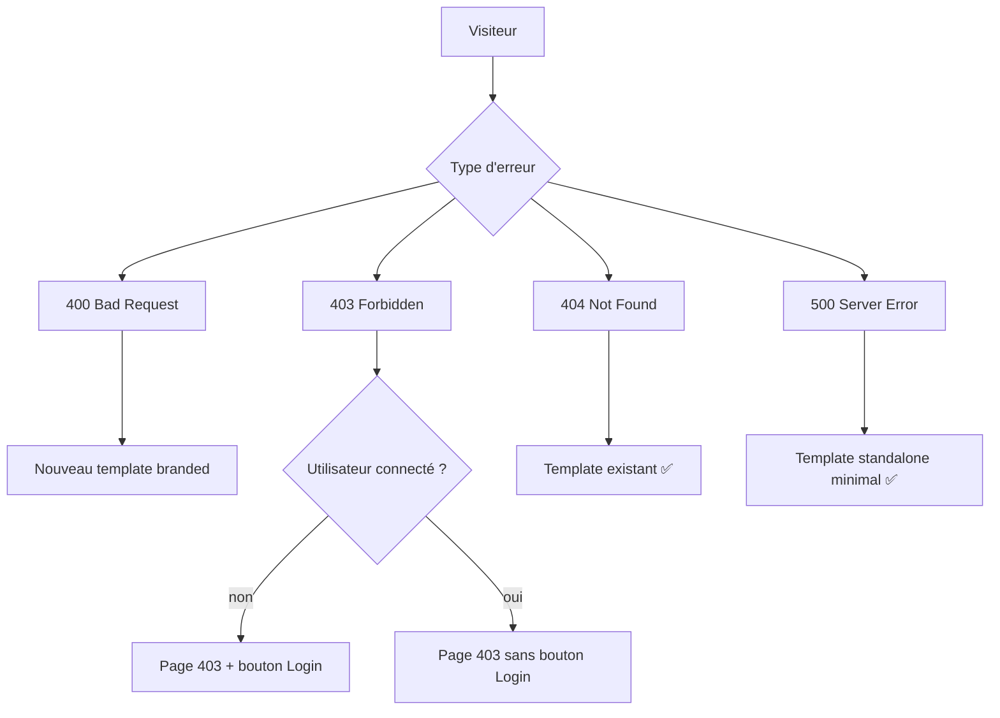

# Instruction: #70 — Pages d'erreur HTTP personnalisées

## Feature

- **Summary**: Fix the 403 page to show the login button only when the user is not authenticated, and add a missing 400 page following the same design as 403/404.
- **Stack**: `Django 5.x, UnoCSS, django-allauth`
- **Branch name**: `fix/error-pages`
- **Parent Plan**: `none`
- **Sequence**: `standalone`
- Confidence: 10/10
- Time to implement: ~20min

## Existing files

- @templates/403.html
- @templates/404.html
- @templates/500.html

### New files to create

- `templates/400.html`

## User Journey

## Implementation phases

### Phase 1 — Fix 403 + ajout 400

> Corriger le bouton Login conditionnel sur 403, créer 400.html.

1. Dans `templates/403.html`, entourer le bouton "Log in" d'un `...`
2. Créer `templates/400.html` en suivant exactement le même pattern que `403.html` et `404.html` :
   - ``
   - ``
   - Icône : `i-lucide-triangle-alert`
   - Titre : ``
   - Message : ``
   - Bouton : `` (un seul bouton suffit)
3. Ajouter les traductions manquantes dans `locale/fr/LC_MESSAGES/django.po` pour les nouvelles chaînes de `400.html`, puis recompiler le `.mo`

## Validation flow

1. `make check` passe
2. En développement, simuler une 403 → le bouton "Log in" est absent si connecté
3. Simuler une 400 → la page branded s'affiche avec header/footer
4. Les traductions françaises des nouvelles chaînes sont présentes et non-fuzzy
