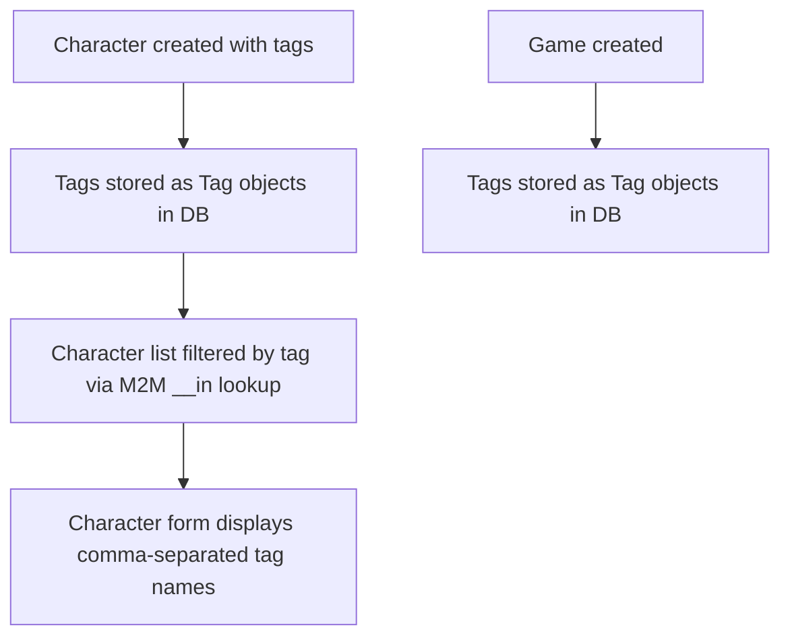

# Instruction: Migrate Character/Game tags to ManyToManyField

## Feature

- **Summary**: Replace `Character.tags` JSONField with a proper `ManyToManyField → core.Tag` (matching `Report.tags`), and add `Game.tags` M2M field. Includes data migration to preserve existing JSON tag data, and view/template updates.
- **Stack**: `Django 4.x`, `Python 3.12`, `pytest-django`
- **Branch name**: `feat/tags-character-game-m2m`
- **Parent Plan**: `none`
- **Sequence**: `standalone`
- Confidence: 9/10
- Time to implement: 1h

## Existing files

- @suddenly/characters/models.py
- @suddenly/characters/front_views.py
- @suddenly/characters/migrations/0006_character_tags.py
- @suddenly/games/models.py
- @suddenly/games/migrations/0007_gamesystem_alter_report_status_and_more.py
- @suddenly/core/models.py
- @templates/characters/character_form.html

### New files to create

- `suddenly/characters/migrations/0007_character_tags_add_m2m.py` — schema: add M2M table (JSONField kept)
- `suddenly/characters/migrations/0008_data_character_tags.py` — data: JSON → Tag objects via RunPython
- `suddenly/characters/migrations/0009_character_tags_remove_json.py` — schema: remove JSONField
- `suddenly/games/migrations/0008_game_tags.py` — schema: add M2M tags to Game

## User Journey

## Implementation phases

### Phase 1 — Migrate Character.tags: JSONField → M2M

> Replace JSONField with M2M, preserve existing data, fix view and template.

1. In `Character` model: add `tags_new = ManyToManyField("core.Tag", blank=True, related_name="characters")` alongside the existing `tags` JSONField
2. Run `makemigrations` → generates `0007_character_tags_add_m2m` (M2M table, JSONField untouched)
3. Write data migration `0008_data_character_tags` manually: `RunPython` — for each Character with non-empty JSON `tags`, `Tag.get_or_create` per name, populate `tags_new`
4. In `Character` model: remove `tags` JSONField, rename `tags_new` → `tags`
5. Run `makemigrations` → generates `0009_character_tags_remove_json` (removes JSONField, renames M2M column)
6. In `front_views.py`:
   - Tag collection: `values_list("tags__name", flat=True).distinct()` (M2M JOIN can produce duplicates)
   - Tag filter: `.filter(tags__name=tag)` instead of `tags__contains=[tag]`
7. In `character_form.html`: fix the `` branch only — preserve `form_data` logic:
   `{{ form_data.tags }}{{ character.tags.all|join:', ' }}`
8. In character edit view:
   - Remove `"tags"` from `update_fields` in `character.save()` (M2M fields are forbidden there)
   - After `character.save()`: split comma input → `Tag.get_or_create` per name → `character.tags.set(tag_objects)`

### Phase 2 — Add Game.tags M2M

> Straightforward new field addition.

1. In `Game` model: add `tags = ManyToManyField("core.Tag", blank=True, related_name="games")`
2. Create migration `0008_game_tags`

## Validation flow

1. Run `python manage.py migrate` — all migrations apply cleanly
2. Create a character with tags via the edit form → tags saved as Tag objects
3. Character list page filters correctly by tag
4. Existing characters with JSON tags (if any) keep their tags after data migration
5. `python manage.py shell` → `Game.objects.first().tags.all()` works without error
6. `make check` passes (lint + types + tests)
