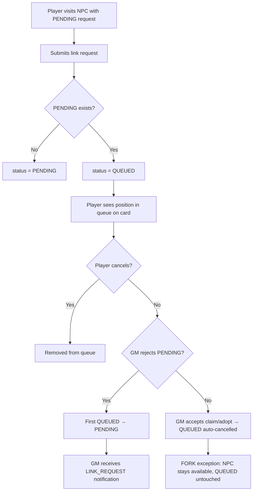

# Instruction: US-15 — Link Request Queue on Popular NPCs

## Feature

- **Summary**: Enable players to queue link requests on NPCs that already have a PENDING request. The queue is FIFO: subsequent requests get status QUEUED, auto-promoted to PENDING when the previous request is rejected, and can be voluntarily cancelled.
- **Stack**: `Django 4.x`, `Python 3.12`, `HTMX`, `pytest-django`
- **Branch name**: `feat/us-15-link-request-queue`
- **Parent Plan**: none
- **Sequence**: standalone
- Confidence: 9.5/10
- Time to implement: 3-4h
## Existing files

- @suddenly/characters/services.py
- @suddenly/characters/link_views.py
- @templates/components/link_request_card.html
- @suddenly/core/models.py

### New files to create

None

## User Journey

## Implementation phases

### Phase 1 — Auto-QUEUED at creation + cancel handling

> Fix `create_request()` and `cancel_request()` to handle the QUEUED status correctly.

1. In `LinkService.create_request()`: wrap in `@transaction.atomic`; lock the NPC row with `Character.objects.select_for_update().get(pk=target_character.pk)` as the transaction anchor (not the PENDING queryset — an empty queryset locks nothing in READ COMMITTED); then check for existing PENDING and set `status=QUEUED` if found, else `PENDING`
2. In `LinkService.cancel_request()`: allow cancellation when `status in [PENDING, QUEUED]`; if the cancelled request was `PENDING`, promote the first `QUEUED` request (same promotion logic as reject — extract into `_promote_next_queued()` private helper)
3. In `LinkService.accept_request()`: after creating the link, cancel all remaining `QUEUED` requests on the same `target_character` (bulk update to `CANCELLED`) — except for `FORK` type where the NPC remains available

### Phase 2 — Queue position in view context

> Pass `queue_position` to every context that renders a link request card or confirmation.

1. Add `LinkService.get_queue_position(request: LinkRequest) -> int | None`: counts `QUEUED` requests on same `target_character` with `created_at < request.created_at`, returns `None` if not QUEUED
2. In `link_request_form()`: pass `queue_position` and the created `link_request` to `link_request_sent.html` when status is `QUEUED`; update template to show queue position and correct message instead of "you will be notified of their decision"
3. In `link_requests_list()`: compute all positions in one pass — load all QUEUED requests for the relevant NPCs, group by `target_character_id`, sort by `created_at`, assign 1-indexed position in Python; no per-request query
4. In `link_request_card_partial()`: compute and pass `queue_position` for the single request

### Phase 3 — GM notification on QUEUED → PENDING promotion

> Notify the NPC creator when a queued request becomes their next active proposal.

1. Extract promotion logic from `reject_request()` into `_promote_next_queued(target_character: Character)` — the helper fetches `next_queued` with `select_related('requester')`; callers must ensure `target_character` has `creator` preloaded via `select_related('creator')` before calling
2. In `_promote_next_queued()`, after promoting, create a `Notification` using the passed `target_character` parameter directly (not `next_queued.target_character`):
   - `recipient = target_character.creator`
   - `type = NotificationType.LINK_REQUEST`
   - `actor = next_queued.requester`
   - `target = next_queued`
   - `message = f"{next_queued.requester} a une nouvelle demande en attente sur {target_character.name}"`
3. In `cancel_request()`: refresh `target_character` with `select_related('creator')` at the start of the method (`target_character = Character.objects.select_related('creator').get(pk=request.target_character_id)`); call `_promote_next_queued(target_character)` **only if** `request.status == PENDING` before updating status; also call from `reject_request()` as before (same `select_related` requirement)

## Validation flow

1. Create two player accounts (A and B) and one NPC owned by GM
2. Player A sends a link request → status `PENDING`, GM sees it in dashboard
3. Player B sends a link request on the same NPC → status `QUEUED`, card shows position #1
4. Player B's card shows the queue position and "will be processable after the previous request"
5. GM rejects Player A's request → Player B's request moves to `PENDING`
6. GM receives a `LINK_REQUEST` notification for Player B
7. Player B cancels their (now PENDING) request → status `CANCELLED`, Player C (if queued) promoted to PENDING
8. Player C queued, then cancels → removed cleanly, no promotion (still a PENDING above)
9. GM accepts Player A's request (adopt/claim) → all remaining QUEUED on same NPC auto-cancelled
10. Same test with a FORK → QUEUED requests NOT cancelled (NPC still available)
