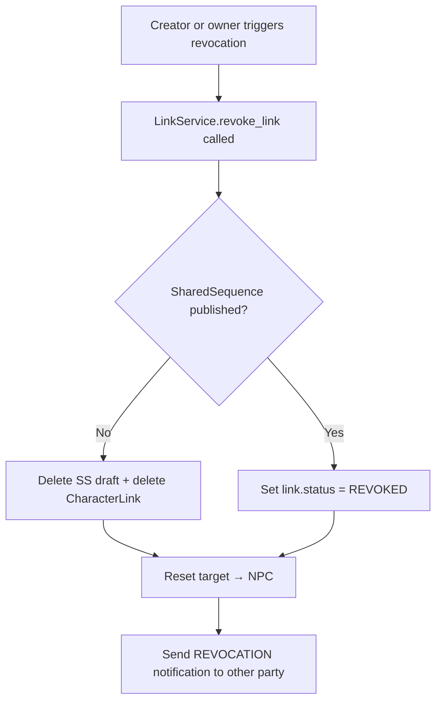

# Instruction: US-16 — Revoke Link — Part 1: Model + Service + Notification

## Feature

- **Summary**: Add a proper `status` field to CharacterLink (active/revoked), extract revocation logic from the view into `LinkService.revoke_link()`, and send a REVOCATION notification to the other party.
- **Stack**: `Django 4.x`, `Python 3.12`, `pytest-django`
- **Branch name**: `feat/us-16-revoke-link`
- **Parent Plan**: `2026_05_04-#18-revoke-link-master.md`
- **Sequence**: `1 of 2`
- Confidence: 9/10
- Time to implement: 2h

## Existing files

- @suddenly/characters/models.py
- @suddenly/characters/services.py
- @suddenly/characters/link_views.py
- @suddenly/core/models.py

### New files to create

None

## User Journey

## Implementation phases

### Phase 1 — CharacterLink status field + migration

> Add a queryable REVOKED state to CharacterLink instead of the current description-hack.

1. Add `CharacterLinkStatus` TextChoices enum to `models.py`: `ACTIVE = "active"`, `REVOKED = "revoked"`
2. Add `status = models.CharField(max_length=20, choices=CharacterLinkStatus.choices, default=CharacterLinkStatus.ACTIVE)` to `CharacterLink`
3. Add `Meta.indexes` entry for `["status"]`
4. Run `python manage.py makemigrations characters` and commit the generated file

### Phase 2 — LinkService.revoke_link() + notification

> Extract all POST logic from `link_revoke` view into the service layer.

1. Add `@classmethod @transaction.atomic LinkService.revoke_link(cls, link: CharacterLink, reason: str, actor: User) -> None`:
   - Fetch `ss = getattr(link, "shared_sequence", None)`
   - If `ss` and `ss.status == SharedSequenceStatus.PUBLISHED`: set `link.status = CharacterLinkStatus.REVOKED`, save with `update_fields=["status", "updated_at"]`
   - Else: delete `ss` if exists, then `link.delete()`
   - Reset `link.target`: `status = NPC`, `owner = None`, save
   - Determine `recipient`: `link.link_request.requester if actor == link.target.creator else link.target.creator` — use `link_request.requester` (always set) rather than `link.source.owner` (may be None for ADOPT links where source == target)
   - Create `Notification` with `type=NotificationType.REVOCATION`, `actor=actor`, `target_content_type` + `target_object_id` pointing to `link.target` (the character), `message=f"{actor} a révoqué le lien sur {link.target.name}"`
2. In `link_revoke` view POST handler: ensure `link` is fetched with `select_related("source", "target", "link_request", "shared_sequence")` before calling `LinkService.revoke_link(link, reason, request.user)`

### Phase 3 — Template REVOKED detection update

> Replace fragile string-matching with the proper status field.

1. In `link_revoke_form.html`: replace any `"REVOKED" in link.description` checks with `link.status == "revoked"`
2. In `link_revoked.html`: no change needed (already shows character name)
3. In any other template referencing `link.description` for REVOKED detection: update to use `link.status`

## Validation flow

1. Accept a link request (adopt) → CharacterLink created with `status=active`
2. Revoke via `/characters/links/{pk}/revoke/` (POST) when SS is DRAFT → CharacterLink deleted, NPC back to `status=npc`
3. Revoke when SS is PUBLISHED → CharacterLink stays with `status=revoked`, NPC back
4. Check that `Notification` of type `REVOCATION` was created for the other party
5. Run `make check`
