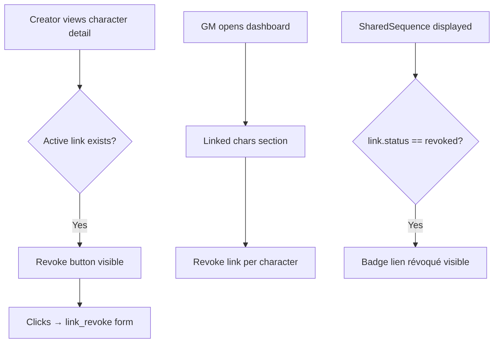

# Instruction: US-16 — Revoke Link — Part 2: UI Entry Points

## Feature

- **Summary**: Expose the revoke action in the UI — revoke button on character detail page and GM dashboard, plus "lien révoqué" badge on published SharedSequence display.
- **Stack**: `Django 4.x`, `Python 3.12`, `HTMX`, `UnoCSS`
- **Branch name**: `feat/us-16-revoke-link`
- **Parent Plan**: `2026_05_04-#18-revoke-link-master.md`
- **Sequence**: `2 of 2`
- Confidence: 9/10
- Time to implement: 1-2h

## Existing files

- @templates/characters/detail.html
- @templates/gmh/dashboard.html
- @suddenly/characters/front_views.py
- @suddenly/characters/gm_views.py

### New files to create

None

## User Journey

## Implementation phases

### Phase 1 — Revoke button on character detail

> Make revocation reachable without knowing the link UUID directly — for both creator and owner perspectives.

1. In `front_views.character_detail()`:
   - Fetch the active link where this character is the **target** (NPC side): `target_link = CharacterLink.objects.filter(target=character, status=CharacterLinkStatus.ACTIVE).select_related("source").first()`; pass as `target_link` in context
   - Fetch the active link where this character is the **source** (PC/adopter side): `source_link = CharacterLink.objects.filter(source=character, status=CharacterLinkStatus.ACTIVE).first()`; pass as `source_link` in context
2. In `templates/characters/detail.html`:
   - Show "Révoquer le lien" to `request.user == character.creator` when `target_link` is set → ``
   - Show "Renoncer au lien" to `request.user == character.owner` when `source_link` is set → ``

### Phase 2 — Revoke link on GM dashboard

> Let creators act directly from their dashboard.

1. In `gm_views.gm_dashboard()`: for the linked characters queryset, annotate/prefetch the active `CharacterLink` for each character — `prefetch_related(Prefetch("links_as_target", queryset=CharacterLink.objects.filter(status=CharacterLinkStatus.ACTIVE), to_attr="active_links"))`
2. In `templates/gmh/dashboard.html` (linked chars section): add a "Révoquer" action link per character when `character.active_links` is non-empty

### Phase 3 — "Lien révoqué" badge on SharedSequence

> Show revocation state wherever a published SharedSequence is rendered.

1. Locate the template(s) that render published `SharedSequence` content (search for `shared_sequence` in templates)
2. Add a visible badge/notice when `link.status == "revoked"` — e.g. `"Ce lien a été révoqué — la séquence est conservée à titre d'archive"`

## Validation flow

1. As NPC creator: visit character detail page → "Révoquer le lien" button visible when active link exists
2. As NPC creator: visit GM dashboard → revoke link reachable per linked character
3. As adopter (owner): visit character detail → "Renoncer au lien" visible on own PC
4. Revoke a link with PUBLISHED SS → detail page and SS display show the "révoqué" badge
5. Run `make check`
