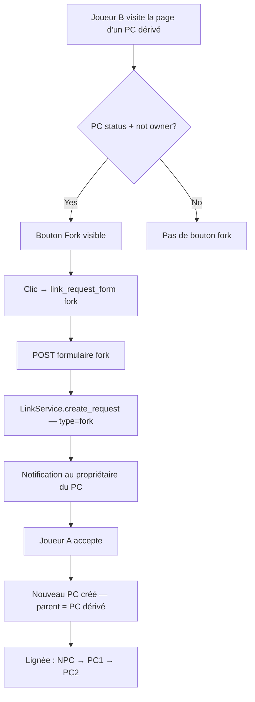

# Instruction: US-17 — Fork en chaîne

## Feature

- **Summary**: Allow forking a PC character that is itself a fork, enabling multi-level narrative lineages. Currently only NPCs can be forked (UI and view gate on `status=NPC`); this unlocks fork requests on any PC you don't own.
- **Stack**: `Django 4.x`, `Python 3.12`, `HTMX`, `pytest-django`
- **Branch name**: `feat/us-17-fork-chain`
- **Parent Plan**: `none`
- **Sequence**: `standalone`
- Confidence: 9/10
- Time to implement: 1h

## Existing files

- @suddenly/characters/link_views.py
- @suddenly/characters/services.py
- @templates/characters/detail.html
- @tests/test_services.py

### New files to create

None

## User Journey

## Implementation phases

### Phase 1 — Tests (service layer)

> Couvrir le fork-en-chaîne avant de modifier quoi que ce soit.

1. Dans `tests/test_services.py`, ajouter `test_fork_chain()` :
   - Accepter une première fork request sur un NPC → obtenir `forked1` (PC, `parent=npc`)
   - Créer une fork request sur `forked1` par un troisième user
   - Appeler `LinkService.accept_request()` → obtenir `forked2`
   - Assert `forked2.source.parent == forked1.source` (la source du premier lien)
   - Assert `forked2.source.status == CharacterStatus.PC`
   - Assert lignée : `forked2.source.parent.parent == npc`

### Phase 2 — Vue : autoriser PC comme target pour fork

> Lever le filtre `status=NPC` dans `link_request_form()` quand le type est fork.

1. Dans `link_views.link_request_form()` (ligne 51) : remplacer le `get_object_or_404` fixe par :
   - Si `link_type == LinkType.FORK` : `get_object_or_404(Character, slug=slug, status__in=[CharacterStatus.NPC, CharacterStatus.PC])`
   - Sinon (claim/adopt) : conserver `status=CharacterStatus.NPC`
2. Ajouter guard anti-auto-fork : si `character.owner == request.user`, retourner 403 (un joueur ne peut pas forker son propre PC)

### Phase 3 — Vue + Template : bouton Fork sur la page de détail d'un PC

> Exposer l'action sans passer par `link_choose_type` (qui reste réservé aux NPC). Tout PC que tu ne possèdes pas peut être forké.

1. Dans `front_views.character_detail()` : ajouter au contexte `pc_fork_request` quand `character.status == CharacterStatus.PC` :
   - `pc_fork_request = LinkRequest.objects.filter(requester=request.user, target_character=character, status__in=[LinkRequestStatus.PENDING, LinkRequestStatus.QUEUED]).first()` si `request.user.is_authenticated` else `None`
2. Dans `templates/characters/detail.html`, après le bloc `` existant, ajouter un bloc distinct :
   - Condition d'affichage : `character.status == 'pc' and request.user.is_authenticated and request.user != character.owner`
   - Si `pc_fork_request` : afficher une bannière "Demande de fork en cours" (même pattern que `pending_request` pour les NPC)
   - Sinon : bouton "Forker ce personnage" → ``

## Validation flow

1. Accepter un fork sur un NPC → le nouveau PC est créé avec `parent=npc`
2. Visiter la page de détail du nouveau PC en tant qu'autre joueur → bouton "Forker" visible
3. Soumettre une fork request → bannière "en cours" remplace le bouton ; notification créée pour le `owner` du PC
4. Accepter la fork request → un 2e PC dérivé créé avec `parent=pc1`, `parent.parent=npc`
5. Auto-fork : tenter de forker son propre PC → le bouton ne s'affiche pas (condition `!= owner`)
6. Claim/adopt sur un PC → 404 (le filtre `status=NPC` reste actif pour ces types)
7. Run `make check`
