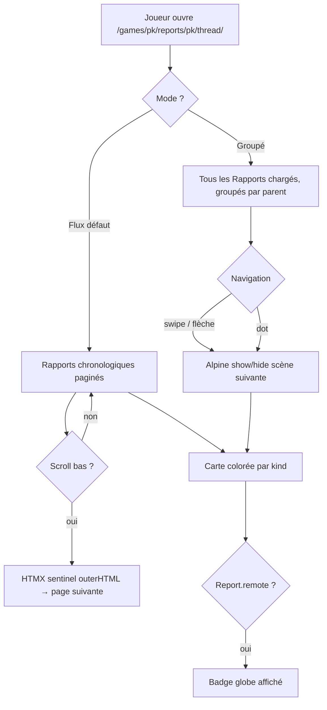

# Instruction: Thread view — Fil fédéré de lecture de compte-rendu (#67)

## Feature

- **Summary**: Add `/games/<pk>/reports/<pk>/thread/` with two reading modes — Flux (chronological, color-coded by Rapport.kind, HTMX infinite scroll) and Grouped (by parent Rapport, Alpine.js swipe navigation, client-side)
- **Stack**: `Django 4.x`, `HTMX`, `Alpine.js 3.x`, `UnoCSS`
- **Branch name**: `feat/67-thread-view`
- **Parent Plan**: `none`
- **Sequence**: `standalone`
- Confidence: 9/10
- Time to implement: 3-4h

## Existing files

- @suddenly/games/models.py — `Rapport`, `RapportKind`, `RapportLink`, `Report.remote`
- @suddenly/games/front_urls.py
- @suddenly/games/front_views.py
- @templates/games/partials/rapport_item.html — partial réutilisable
- @frontend/src/main.js — `Alpine.data('tabs', ...)` already registered

### New files to create

- `templates/games/thread.html`
- `templates/games/partials/thread_rapport_card.html`
- `templates/games/partials/thread_flux_page.html` (HTMX partial)
- `templates/games/partials/thread_group_view.html`

## User Journey

## Implementation phases

### Phase 1 — URL + View

> Endpoint dédié avec double logique de queryset

1. Ajouter URL `<uuid:game_pk>/reports/<uuid:pk>/thread/` → `report_thread` dans `front_urls.py`
2. Créer vue `report_thread()` dans `front_views.py` :
   - GET complet : récupérer `report`, valider `mode` par whitelist — `mode = request.GET.get('mode') if request.GET.get('mode') in ('flux', 'group') else 'flux'` — puis pré-rendre le bon contenu initial et passer `mode` au contexte, render `thread.html`
   - GET HTMX `?mode=flux&page=N` : retourner `thread_flux_page.html` (partial uniquement)
   - GET HTMX `?mode=group` : grouper les Rapports par parent en Python, retourner `thread_group_view.html`
   - Flux queryset : `report.rapports.select_related('actor').order_by('created_at')` + `Paginator` — `report.remote` lu depuis le contexte de vue, pas depuis les Rapports
   - Grouped queryset : `report.rapports.select_related('actor').prefetch_related('parent_links__parent_rapport').order_by('created_at')`, grouper en Python par `parent_rapport_id` du premier `parent_link` (MVP : un seul parent pris en compte) ; clé `None` = scène "Racine"
   - Cas limite : si aucun Rapport n'a de `parent_links`, le mode groupé affiche une seule scène "Racine" avec tous les Rapports
3. Vérifier permission : même logique que `report_detail` (visibilité + ownership)

### Phase 2 — Templates

> Thread.html + cartes réutilisables + partials HTMX

1. `thread.html` :
   - Breadcrumb `jeu > rapport > Fil`
   - Tabs bascule mode : `x-data="{ mode: '{{ mode }}' }"` — `mode` injecté depuis le contexte de vue (déjà calculé en Phase 1) pour synchroniser l'état Alpine avec le contenu initial, même sur refresh `?mode=group`
   - Boutons tab : `@click="mode = 'flux'"` pour le style actif + `hx-get="?mode=flux"` `hx-target="#thread-content"` `hx-push-url="true"` pour charger le partial serveur
   - Zone cible `id="thread-content"` rechargée par HTMX au changement de tab
2. `partials/thread_rapport_card.html` :
   - Card stylee par `kind` (classes UnoCSS per wireframe) :
     - `description` → `bg-indigo-50 border-l-4 border-indigo-400`
     - `discussion` → `bg-emerald-50 border-l-4 border-emerald-400`
     - `action` → `bg-amber-50 border-l-4 border-amber-400`
     - `narration` → `bg-violet-50 border-l-4 border-violet-400`
   - Badge globe `i-lucide-globe` si `report.remote` (depuis contexte de vue — tous les Rapports du thread partagent le même Report)
   - Affichage actor pour `discussion`
3. `partials/thread_flux_page.html` :
   - Boucle sur la page courante de Rapports → inclure `thread_rapport_card.html`
   - Sentinel infinite scroll en fin de partial (si `has_next`) : `
` — le sentinel est remplacé par le nouveau partial (nouvelles cartes + nouveau sentinel) à chaque page ; absent si `has_next=False`
4. `partials/thread_group_view.html` :
   - `x-data="threadGroup"` sur le conteneur
   - Boucle sur les groupes (scènes) : `data-scene` + `x-show="currentScene === {{ forloop.counter0 }}"`
   - En-tête scène : nom du parent Rapport (kind + début de contenu) ou "Racine"
   - Dots de navigation + boutons `[<]` `[>]`
   - Responsive : flèches visibles `sm:flex` uniquement

### Phase 3 — Alpine.js threadGroup

> Composant swipe + clavier dans main.js

1. Ajouter `Alpine.data('threadGroup', ...)` dans `frontend/src/main.js` avant `Alpine.start()`
2. Implémenter :
   - `currentScene: 0`, `totalScenes: 0`
   - `init()` : `this.totalScenes = this.$el.querySelectorAll('[data-scene]').length`
   - `next()` / `prev()` avec bounds check
   - `onTouchStart(e)` / `onTouchEnd(e)` : delta > 50px → prev/next
   - Les méthodes `prev()` / `next()` sont appelées depuis des directives template : `@keydown.left.window="prev()"` / `@keydown.right.window="next()"` sur l'élément `x-data` — le composant JS n'expose que les méthodes
3. Pas de `destroy()` nécessaire (pas de timer)

## Validation flow

1. Naviguer vers `/games/<pk>/reports/<pk>/thread/`
2. Mode Flux : Rapports affichés dans l'ordre chronologique, colorés par kind
3. Scroller en bas → page suivante chargée via HTMX sans rechargement
4. Cliquer sur "Groupé" → switch HTMX, Rapports regroupés par scène, pas de rechargement de page
5. Sur mobile : swipe gauche/droite → navigation entre scènes
6. Sur desktop : flèches `[<]` `[>]` + touches clavier → navigation entre scènes
7. Rapport d'une instance distante (`Report.remote=True`) → badge globe affiché
8. Rapport de type `discussion` → nom du personnage (actor) affiché

## Confidence: 9/10

✅ Tous les champs modèle nécessaires existent (`Rapport.kind`, `RapportLink`, `Report.remote`)
✅ `Alpine.data('tabs')` existant non utilisé ici (incompatible HTMX swap) — `x-data="{ mode }"` inline suffit
✅ `partials/rapport_item.html` existant peut servir de référence de style
✅ Pattern HTMX infinite scroll déjà utilisé dans le projet
✅ Pattern `threads` côté Vue bien défini (queryset + groupage Python)

❌ Risque mineur : le groupage Python en mode groupé peut être coûteux si un Report a > 500 Rapports — acceptable pour le MVP, à paginer ultérieurement si besoin
❌ Risque mineur : `Report.remote` est un flag sur le Report conteneur, pas sur le Rapport individuel — le badge globe s'affiche donc pour TOUS les Rapports d'un Report distant, ce qui est le comportement attendu mais à confirmer
